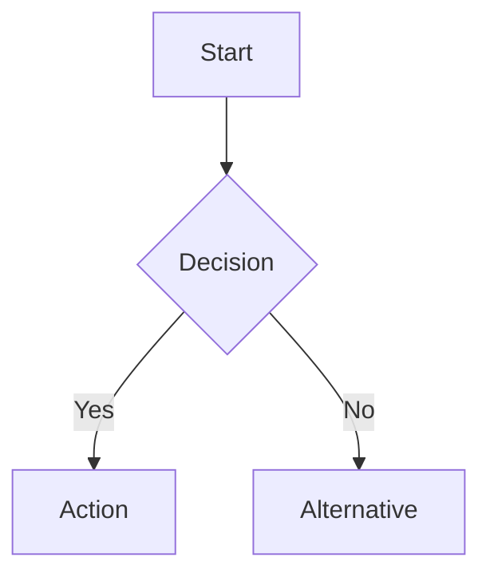

# Clarity Report v{VERSION}

## Summary
- **Project**: {PROJECT_NAME}
- **Date**: {DATE}
- **Clarity Score**: {SCORE}% ({CLEAR_COUNT} / {TOTAL_COUNT}) — weighted by impact
- **Status**: {STATUS_EMOJI} {STATUS_TEXT}
- **Round**: #{ITERATION}

---

## Domains / Modules Identified

| # | Domain | Description | Requirements | Clear | Unclear |
|---|--------|------------|-------------|-------|---------|
| 1 | {DOMAIN} | {DESC} | {TOTAL} | {CLEAR} | {UNCLEAR} |

---

## Scope Assumptions (do not ask client)

| # | Assumption | Rationale |
|---|-----------|-----------|
| SA-001 | {assumption} | {why assumed} |

---

## Key Flows

2–3 Mermaid diagrams max: Happy Path, Critical Alternative, and any high-risk flow.

- Use `flowchart TD` for step-by-step processes
- Use `graph LR` for actor↔system interactions



---

## Confirmed Requirements ({CLEAR_COUNT})

| # | ID | Requirement | Domain | Source |
|---|----|-------------|--------|--------|
| 1 | R-001 | {requirement text} | {domain} | {input / clarification vN} |

---

## Unclear Points ({UNCLEAR_COUNT})

### {CATEGORY_CODE}-{NUMBER} | {Title}
- **Domain**: {domain}
- **Original text**: > "{quoted from raw input}"
- **Issue**: {why this is unclear, specific impact on development}
- **Impact**: {🔴 High / 🟡 Medium / 🟢 Low} — {reason}
- **Suggested answer**: {recommendation based on best practices + reasoning}
- **Ask client**:
  > Hi, regarding {topic} — we'd like to clarify the following:
  >
  > {Professional, concise question. Provide context so client understands why it matters.}
  >
  > Our recommendation would be: {suggested approach}. Could you please confirm or let us know if you'd prefer a different approach?

---

## TODO — Pending Clarification

| # | ID | Question | Impact | Suggested Default |
|---|----|----------|--------|-------------------|
| 1 | {ID} | {question} | {🔴/🟡/🟢} | {suggested default} |

---

## Recommended Actions

### High priority (ask immediately)
1. {ID}: {question} — {why urgent}

### Batch together (same stakeholder / topic)
- **{Domain A}**: {ID-1}, {ID-2}, {ID-3}
- **{Domain B}**: {ID-4}, {ID-5}

### Safe to auto-confirm (high-confidence suggestions)
- {ID}: Suggested "{answer}" — {reasoning}

---

## How to respond

Reply with any format:
```
{ID}: {answer}
skip {ID}
assume {ID}
```
Or reply naturally — the agent will map answers to the relevant unclear points.

---

## Changelog
| Version | Date | Changes |
|---------|------|---------|
| v1 | {date} | Initial analysis |
