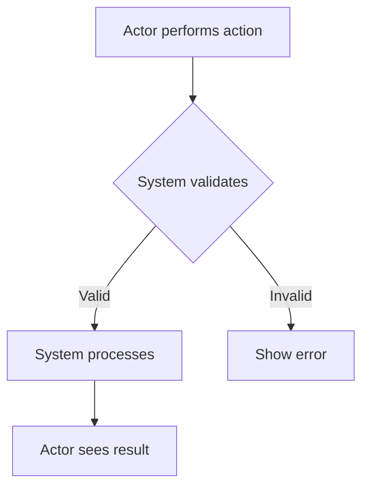

# Module: {MODULE_NAME}

> {One-line description}

## 1. Purpose

{What business problem this module solves, who it serves, which domain it belongs to}

## 2. Actors

| Actor | Role | Permissions |
|-------|------|-------------|
| {actor} | {role description} | {what they can do in this module} |

## 3. User Stories

### US-{MODULE_PREFIX}-{ID}: {Title}

**As a** {actor}
**I want to** {action}
**So that** {benefit}

#### Acceptance Criteria (EARS)

- **WHEN** {trigger event}, **THE SYSTEM SHALL** {expected behavior}
- **WHILE** {ongoing state}, **THE SYSTEM SHALL** {expected behavior}
- **IF** {optional condition}, **THEN THE SYSTEM SHALL** {conditional behavior}
- **THE SYSTEM SHALL** {universal behavior}

#### Test Scenarios (Gherkin)

```gherkin
Scenario: {scenario name}
  Given {context}
  When {action}
  Then {expected result}

Scenario: {error scenario}
  Given {context}
  When {invalid action}
  Then {error handling}
```

#### Business Rules
- **BR-{ID}**: {rule description}

#### Edge Cases
- **EC-{ID}**: {scenario} → {expected handling}

---

## 4. Flows

### 4.1 Happy Path



1. {Actor} {does action}
2. System {validates/processes}
3. {Actor} {sees result}

### 4.2 Alternative Flows

**ALT-{ID}: {Title}**
- **Branching point**: Step {N} of Happy Path
- **Condition**: {when this happens}
1. {step}
2. {step}
- **Merges back at**: Step {N} / Ends

### 4.3 Error Flows

**ERR-{ID}: {Title}**
- **Trigger**: {what goes wrong}
- **User sees**: {error message / UI state}
- **Recovery**: {what user can do next}

---

## 5. Screens & Fields

### SCR-{ID}: {Screen Name} ({context: modal / page / sidebar})

**Actor**: {who sees this}
**Trigger**: {how user gets here}

| Field | Type | Required | Notes |
|-------|------|----------|-------|
| {Field name} | Text | Yes | Max 100 chars |
| {Field name} | Dropdown | Yes | Options: A, B, C |
| {Field name} | Upload | No | Max 2MB, jpg/png |

**Actions**: [{Save} → validate → redirect] [{Cancel} → back]

> Only document screens with complex forms or special logic.
> Simple screens (list views, detail views) can be inferred from the data.

---

## 6. Dependencies

| Dependency | Type | Description | Status |
|-----------|------|-------------|--------|
| {service/module} | Internal/External/3rd-party | {what it provides} | {confirmed/TBD} |

## 7. UI/UX Notes

{Wireframe refs, key screens, interaction patterns — if available}

## 8. Open Items

| # | Item | Impact | Notes |
|---|------|--------|-------|
| {if any items not yet 100% clear} | | | |

