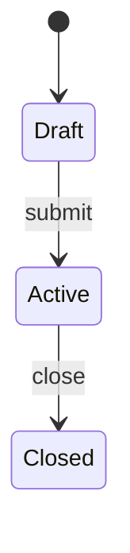

# {MODULE_NAME} — Data

> If this module owns no data: `n/a` + one line why.

## Entity: {ENTITY_NAME}

{1-line description, who creates it, lifecycle if relevant}

| Field | Type | Required | Validation |
|-------|------|----------|------------|
| {field} | Text | Yes | VAL-{MOD}-01 |
| {field} | Dropdown | Yes | Options: A, B, C |
| {field} | Upload | No | Max 2MB, jpg/png |

### State machine

| Status | Meaning | Transitions to |
|--------|---------|----------------|
| {status} | {meaning} | {next statuses} |

## Validation constraints

### VAL-{MOD}-01: {Title}
- **Constraint**: {precise rule — implementable without guessing}
- **Applies to**: {Entity}.{field}
- **On violation**: {message / behavior}

## Screens & fields (only screens with complex forms or special logic)

### {Screen Name} ({modal / page / sidebar})

**Actor**: {who} · **Trigger**: {how user gets here}

| Field | Type | Editable | Mandatory | Notes |
|-------|------|----------|-----------|-------|

**Actions**: [{Save} → validate → redirect] [{Cancel} → back]

> Simple list/detail screens are inferred from entity tables — don't document them.
