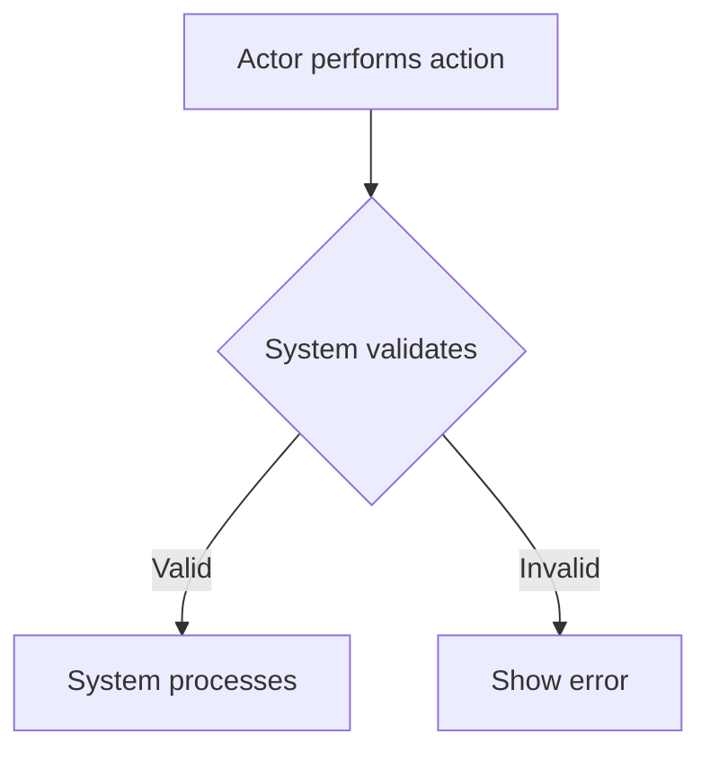

# {MODULE_NAME} — Requirements

> Shared catalogs/roles/constants/entities are referenced by their `registry/` ID (see this module's `index.md` → Shared references). Do not paste their values here.

> One `## REQ-*` section per user story / capability. Acceptance criteria in EARS.
> Rules and edge cases are referenced by ID only — defined once in `rules.md` / `edge-cases.md`.

## REQ-{MOD}-01: {Title}

**As a** {actor} **I want to** {action} **so that** {benefit}.

### Flow

1. {Actor} {does action}
2. System {validates/processes}
3. {Actor} {sees result}

**Alternative — ALT-{n}: {title}** (branches at step {N}, {condition})
1. {step}

**Error — ERR-{n}: {title}** — trigger: {what goes wrong} → user sees {message/state}, recovery: {next action}

### Acceptance Criteria (EARS)

- **WHEN** {trigger event}, **THE SYSTEM SHALL** {expected behavior}
- **IF** {condition}, **THEN THE SYSTEM SHALL** {conditional behavior}
- **THE SYSTEM SHALL** {universal behavior}

### References

- Applies: BR-{MOD}-{NN}, CBR-{NN}
- Edge cases: EC-{MOD}-{NN}
- Data: {Entity} (`data.md`)
