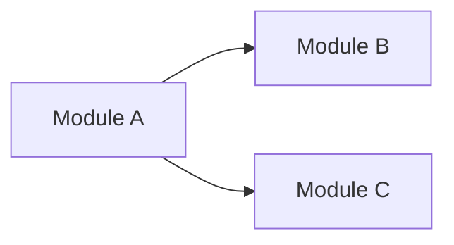

# {PROJECT_NAME} — Project Specification

> Generated by BA Clarity Agent | Clarity Score: {SCORE}% | {DATE}

## 1. Project Summary

- **Objective**: {1-2 sentences describing the main goal}
- **Target users**: {who are the end users}
- **Business context**: {brief business background}

### Scope

| In Scope | Out of Scope |
|----------|-------------|
| {feature/capability} | {explicitly excluded} |

---

## 2. Module Map

| # | Module | Description | Priority | Dependencies |
|---|--------|------------|----------|-------------|
| 1 | {module} | {1-line desc} | P0/P1/P2 | {deps} |

### Module Dependency Graph

---

## 3. User Roles & Permissions

| Role | Description | Key Permissions |
|------|-----------|-----------------|
| {role} | {who they are} | {what they can do} |

---

## 4. Cross-cutting Concerns

### 4.1 Authentication & Authorization
{Auth strategy, roles — if known}

### 4.2 Notifications
{When to send, to whom, via which channel}

### 4.3 Data Migration
{If migrating from existing system}

---

## 5. Assumptions & Decisions

| # | Type | Description | Confirmed by | Date |
|---|------|-------------|-------------|------|
| A-001 | Assumption | {description} | {client/BA} | {date} |
| D-001 | Decision | {description} | {client/BA} | {date} |

---

## 6. Risks & Mitigations

| # | Risk | Likelihood | Impact | Mitigation |
|---|------|-----------|--------|-----------|
| RISK-001 | {description} | H/M/L | H/M/L | {strategy} |

---

## 7. Spec Files Index

| File | Description |
|------|-------------|
| `overview.md` | This file |
| `glossary.md` | Business terminology |
| `business-rules.md` | All business rules |
| `edge-cases.md` | Edge cases & error scenarios |
| `modules/{name}.md` | Detailed module specifications |
| `clarification-log.md` | Full Q&A history with client |
