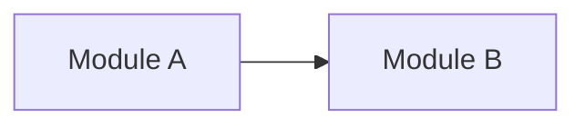

# {PROJECT_NAME} — Overview

> Thin index — every skill and reader loads this first, then opens only the module folder(s) they need.

## Summary

- **Objective**: {1-2 sentences describing the main goal}
- **Target users**: {who are the end users}
- **Business context**: {brief background}

## Scope

| In Scope | Out of Scope |
|----------|-------------|
| {feature/capability} | {explicitly excluded} |

### Scope Assumptions (do not ask client)

| # | Assumption | Rationale |
|---|-----------|-----------|
| SA-01 | {assumption} | {why assumed} |

## Module Map

| # | Module | Description | Owns entities | Priority | Depends on | Folder |
|---|--------|------------|---------------|----------|-----------|--------|
| 1 | {name} | {1-line, no "and"} | {entities — each owned by exactly one module} | P0/P1/P2 | {deps} | `modules/{slug}/` |

> Module status lives in each module's `index.md` frontmatter — not here. Scan frontmatter, don't duplicate it.

## User Roles & Permissions

| Role | Description | Key permissions |
|------|-----------|-----------------|
| {role} | {who they are} | {what they can do} |

## Cross-cutting concerns

{Auth strategy, notifications, integrations — 1-2 lines each; detailed rules go in `specs/rules.md` as CBR-*}

## Reading guide

| Path | Content |
|------|---------|
| `glossary.md` | Domain terms — read before any module |
| `rules.md` | Cross-cutting rules (CBR-*) |
| `edge-cases.md` | Global edge cases (EC-GLOBAL-*) |
| `modules/{slug}/index.md` | Module entry point → `requirements.md`, `data.md`, `rules.md`, `edge-cases.md`, `decisions.md` |
