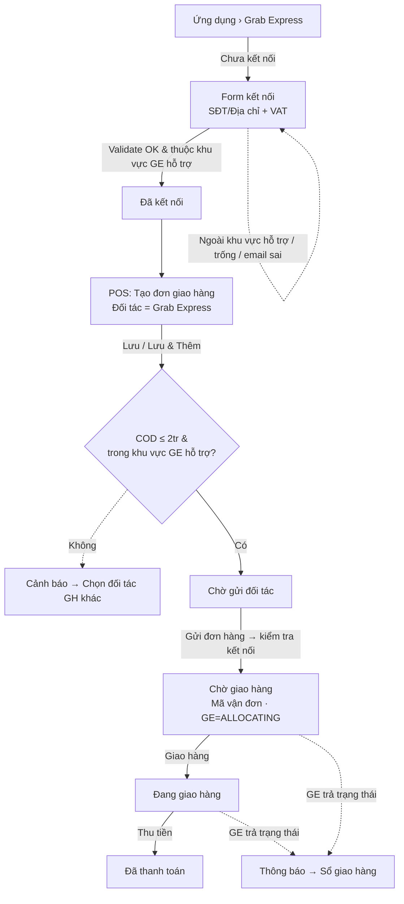
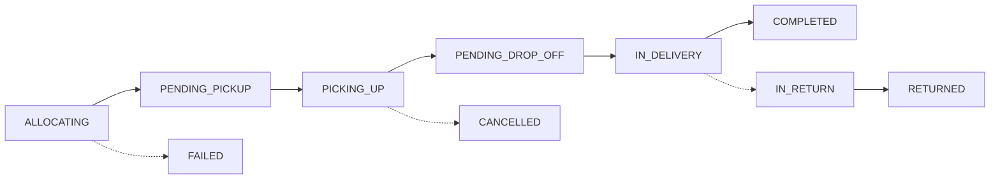

# CukCuk × Grab Express — Prototype luồng tích hợp (C86574)

Prototype tương tác mô phỏng **toàn bộ luồng tích hợp đối tác giao hàng Grab Express** vào MISA CukCuk,
dựng theo mindmap yêu cầu tại `../Luồng/*.jpg`. Khớp design system của 2 prototype tham khảo:

| | Tham khảo | Brand | Body |
|---|---|---|---|
| Web quản lý | `[hangpt]-kết-nối-cukcuk---shopeefood-2.0` | `#2563EB` | Inter 13px |
| POS bán hàng | `[tbhung]_onboarding_pos---v3` | `#076EFF` | Inter 13px |
| Grab (đối tác) | — | `#00B14F` | — |

Stack: **Vite 6 + React 19 + Tailwind v4 + lucide-react** (giống hệt 2 bản tham khảo). Brand đổi theo `data-surface` (web/pos).

## Chạy

```bash
cd "Cukcuk/grab-express-integration"
npm install
npm run dev            # http://localhost:3100
```

Thanh trên cùng chuyển 3 bề mặt: **Web quản lý · POS bán hàng · Sổ giao hàng**.
State kết nối / đơn hàng / thông báo dùng chung → luồng liền mạch (kết nối ở Web rồi tạo đơn ở POS, theo dõi ở Sổ GH).

## 3 bề mặt

### 1. Web quản lý — `Ứng dụng › Grab Express` (`src/surfaces/WebConnectSurface.tsx`)
- **Full shell MISA CukCuk**: header xanh (9-dot · logo MISA CukCuk · chọn nhà hàng/chi nhánh · ngôn ngữ/tải app/chuông/trợ giúp/thiết lập/avatar) + sidebar đầy đủ (Bàn làm việc … Ứng dụng) + lưới **ứng dụng logo thật**, mỗi card có badge *Đã kết nối*/**New** và link **Chi tiết**.
- Danh sách Ứng dụng đầy đủ: Hóa đơn điện tử · MISA AMIS–Kế toán · **Grab Express** (New) · **Grab Food** (đổi tên từ "Grab") · ShopeeFood (New) · MISA SME.NET 2020 · AMIS Accounting · SMS Marketing · AhaMove.
- Màn kết nối: form lấy sẵn thông tin từ *Thiết lập chung* (SĐT, Tỉnh/TP, Quận/Huyện, Phường/Xã, Địa chỉ).
- Checkbox **Yêu cầu xuất hóa đơn Phí vận chuyển (VAT)** (mặc định tắt) → hiện *Email xuất hóa đơn* (bắt buộc) + link đăng ký GG Form.
- **Kết nối** → validate: trống → *"Trường này không được để trống."*; email sai → *"Email chưa đúng định dạng…"*; địa chỉ ngoài **khu vực Grab Express hỗ trợ** → cảnh báo GE chỉ hỗ trợ Hà Nội, TP.HCM, Đà Nẵng, Quảng Ninh, Cần Thơ.
- Sau kết nối: nút đổi thành **Cập nhật** + **Hủy kết nối**.
- **Hủy kết nối** phân nhánh theo trạng thái đơn GE: đơn còn giao vận (≠ COMPLETED/RETURNED) → cảnh báo "đang có hóa đơn trong quá trình giao vận…"; ngược lại → cảnh báo thường. Có/Không.

### 2. POS bán hàng — Order & Giao hàng (`src/surfaces/PosOrderSurface.tsx`)
- **Full UI POS** dựng bám bản `[tbhung]_onboarding_pos---v3`: khung tablet, rail icon trái (Order/Bàn/Hóa đơn/Đặt chỗ/Hướng dẫn), màn **Order (trang chủ)** với header kênh *Giao hàng*, lưới món 5 cột (ảnh + badge giá), thanh nút màu chuẩn `Lưu #12B76A · Gửi bếp/bar #245FDF · Tính tiền #F79009 · Gửi đơn #1570EF`. Bỏ onboarding/auth/tour, vào thẳng màn trang chủ. Drawer & popup **đóng khung trong tablet** (`contained`), không trôi ra viewport.
- **Danh sách order** (đúng bản gốc): tab kênh **Tất cả / Tại bàn / Mang về / Giao hàng / Xác nhận đơn online** (kèm số đếm) · search + lọc trạng thái order + Tổng order/tiền · **2 dạng xem: Card ⟷ List** (toggle). Riêng tab **Giao hàng** có thêm 3 filter: **Trạng thái giao** (Chờ giao / Đang giao / Đã hoàn thành / Đã hủy) · **Đối tác** · **Nguồn đơn**.
- **Xác nhận đơn online** (tab): đơn từ Website/App chờ xác nhận → slide-out panel 2 tab (**Thông tin đơn hàng** / **Đối tác giao hàng**). Ở tab Đối tác chọn **Grab Express** → hiện Loại dịch vụ (khóa) · Phí GH trả đối tác · Phí GH thu khách + cảnh báo địa chỉ ngoài khu vực Grab Express hỗ trợ. Footer **Từ chối / Xác nhận & Giao hàng / Xác nhận** → tạo đơn **Chờ gửi đối tác** sang tab Giao hàng. Đơn Grab Express nằm ở tab **Giao hàng**, chỉ hiện **Chờ gửi đối tác** + **Chờ giao hàng** (ẩn Đang giao / Đã thanh toán), có chip Grab Express + trạng thái CukCuk + pill GE, nút **Gửi đơn hàng / Giao hàng / Hủy**.
- **Thông tin Order: Giao hàng** (modal giữa, đúng bản gốc): Ngày giao · Giờ giao · Khách hàng · Địa chỉ giao · Đặt cọc trước · **Hình thức giao** = dropdown nhiều đối tác (**Nhà hàng tự giao / Grab Express / AhaMove / ShopeeFood**). Chọn **Grab Express** mới hiện field GE: Loại dịch vụ *Siêu tốc - Thực phẩm* (khóa) · **Phí GH trả đối tác** (chỉ hiện khi đủ Tỉnh/Quận/Phường, ⓘ, không sửa) · **Phí GH thu khách** (mặc định = phí trả đối tác, sửa được) · Thu hộ COD. Chọn *Nhà hàng tự giao* → Mã đơn đối tác (N/A) + Phí giao hàng (sửa được).
- **Lưu / Lưu & Thêm**: mặc định đơn thu hộ **COD = Còn phải thu**; COD > **2.000.000đ** → cảnh báo "Chọn đối tác GH khác / Đóng"; địa chỉ ngoài khu vực Grab Express hỗ trợ → cảnh báo; không kết nối được → popup.
- **Gửi đơn hàng** (Chờ gửi đối tác) → màn Hóa đơn giao hàng hiển thị **thông tin gửi sang GE** → kiểm tra kết nối → chuyển **Chờ giao hàng** (sinh Mã vận đơn, GE = ALLOCATING).
- **Giao hàng** (Chờ giao hàng) → **Đang giao hàng**.

### 3. Sổ giao hàng — tab Grab Express (`src/surfaces/DeliveryBookSurface.tsx`)
- Tab **Grab Express** (cạnh Nhà hàng tự giao / AhaMove).
- Bộ lọc: khoảng ngày · Trạng thái CukCuk · **Trạng thái GE** (10 trạng thái) · tìm Mã vận đơn/Số HĐ/khách.
- Lưới: Mã vận đơn/Số HĐ · Khách hàng (tên + địa chỉ gộp 4 cấp) · Giờ hẹn trả · Phí thu khách · Phí trả đối tác · Tổng tiền · Trạng thái GE.
- Thao tác theo trạng thái: **Chờ gửi đối tác** → Gửi đơn/Hủy · **Chờ giao hàng** → Giao hàng/Hủy · **Đang giao hàng** → Thu tiền/Hủy · **Đã thanh toán** → icon.
- **Mô phỏng GE cập nhật** → đẩy trạng thái GE + sinh **thông báo** đúng format:
  *"Đơn hàng ‹Số HĐ/Order› (Mã vận đơn) của khách hàng ‹tên› đã được Grab Express cập nhật trạng thái ‹trạng thái›"* → click mở đúng dòng.
- Lưu ý: đơn đã chuyển đối tác → hệ thống **chỉ nhận** trạng thái GE, **không tự map/chuyển** trạng thái CukCuk.

## Sơ đồ luồng



### State machine Grab Express (do GE trả về)



`COMPLETED` / `RETURNED` = trạng thái kết thúc → cho phép Hủy kết nối không cảnh báo giao vận.

## Đối chiếu yêu cầu (mindmap `../Luồng`)

| Nhóm yêu cầu | Trạng thái |
|---|---|
| Ứng dụng: thêm Grab Express, đổi Grab → Grab Food | ✅ |
| Form kết nối + lấy thông tin Thiết lập chung | ✅ |
| Checkbox VAT + Email bắt buộc + link GG Form | ✅ |
| Validate trống / email sai / địa chỉ ngoài khu vực Grab Express hỗ trợ | ✅ |
| Kết nối → Cập nhật/Hủy; Hủy phân nhánh theo trạng thái đơn | ✅ |
| POS: Danh sách order (nhóm, chip GE, ẩn Đang giao/Đã TT) | ✅ |
| Thông tin giao hàng: dịch vụ khóa, phí trả đối tác/thu khách, ghi chú 255 | ✅ |
| Địa chỉ mặc định / lưu địa chỉ mới | ✅ |
| COD mặc định = còn phải thu, cảnh báo > 2tr | ✅ |
| Gửi đơn → kiểm tra kết nối → thông tin gửi sang GE | ✅ |
| Luồng trạng thái Chờ gửi → Chờ giao → Đang giao → Đã TT | ✅ |
| Sổ giao hàng: tab GE, bộ lọc, lưới, thao tác theo trạng thái | ✅ |
| 10 trạng thái GE + không auto-map | ✅ |
| Thông báo GE trả về + click mở đúng hóa đơn | ✅ |
| Xác nhận đơn online: chọn đối tác Grab Express → Xác nhận / Xác nhận & Giao hàng | ✅ |

## Cấu trúc mã

```
src/
├── App.tsx                       # shell + chuyển 3 bề mặt + state dùng chung
├── constants.ts                  # khu vực GE hỗ trợ, COD 2tr, message chuẩn, nhãn trạng thái, state machine
├── types.ts · data.ts            # domain types + mock (kết nối, khách, đơn nhiều trạng thái)
├── components/ui.tsx             # Modal, ConfirmDialog, AlertPopup, Field, Toast, GE pill, Grab mark
└── surfaces/
    ├── WebConnectSurface.tsx     # bề mặt 1
    ├── PosOrderSurface.tsx       # bề mặt 2
    └── DeliveryBookSurface.tsx   # bề mặt 3
```
