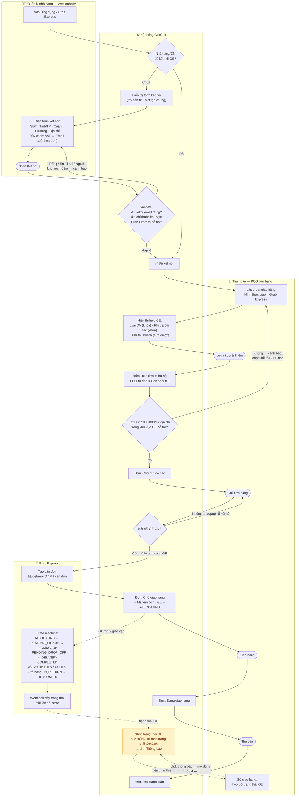
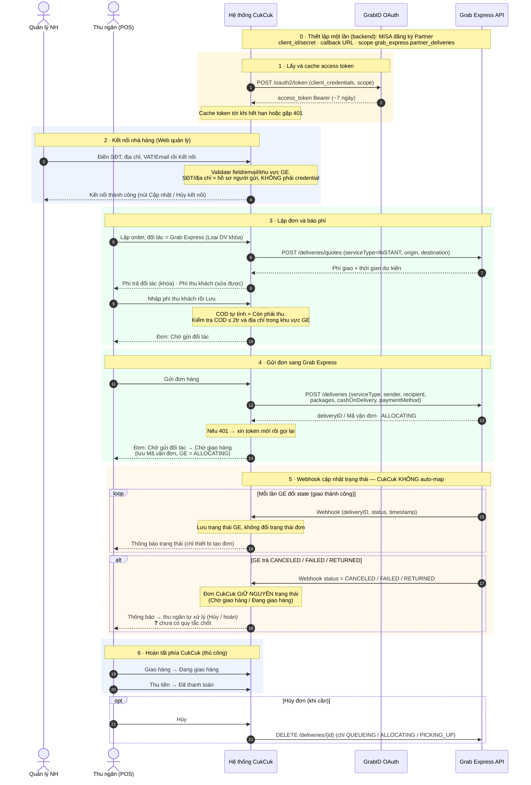
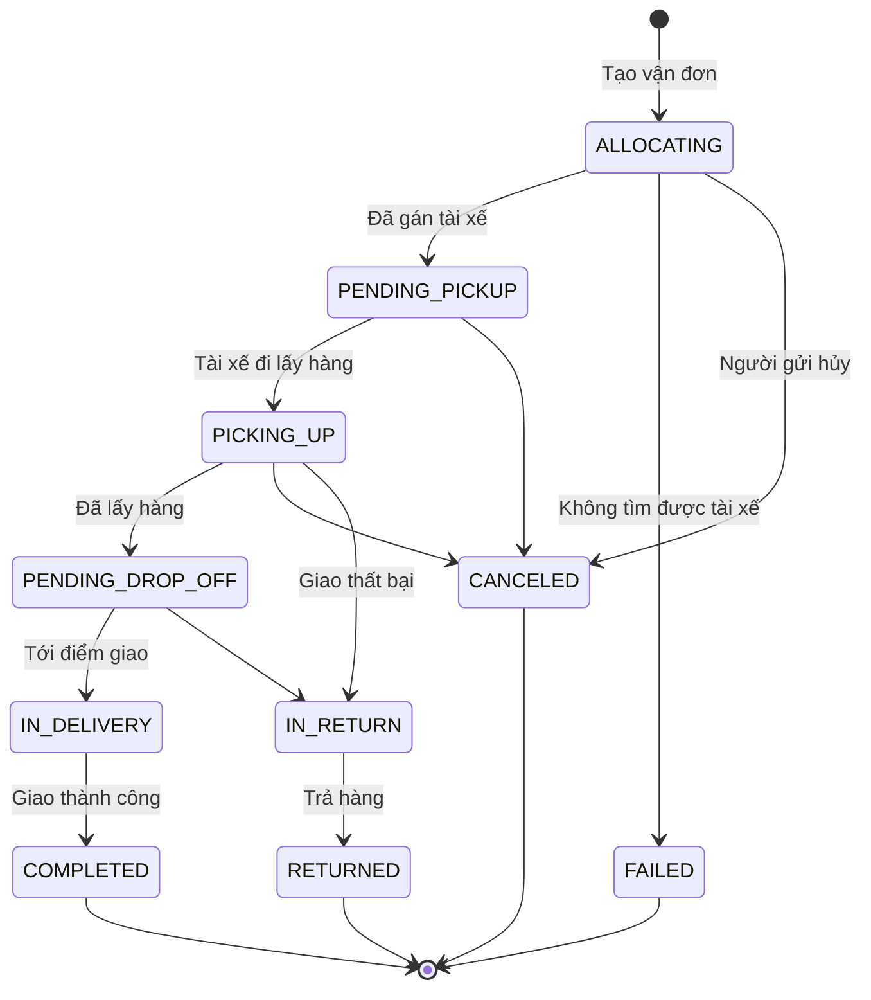

# Sơ đồ luồng — Tích hợp Grab Express vào MISA CukCuk (C86574)

Sơ đồ hóa từ file yêu cầu `Tích hợp Grab Express với CukCuk(C86574).xmind` (mindmap tại `../Luồng/*.jpg`),
đối chiếu tài liệu chính thức [Grab Express — Order State Machine](https://developer.grab.com/docs/grab-express/#order-state-machine)
và tham khảo cách [Sapo tích hợp Grab Express](https://support.sapo.vn/tich-hop-grab-express).

- **Swimlane** chia theo đối tượng tham gia quy trình: **Quản lý NH** · **Thu ngân (POS)** · **Hệ thống CukCuk** · **Grab Express**.
- Một sơ đồ tổng end-to-end: khai báo/kết nối ở Web quản lý → lập đơn ở POS → gửi đơn → giao đơn → theo dõi trạng thái.

> **Khu vực Grab Express hỗ trợ** (dùng trong các bước validate S3 · S6): hiện gồm **Hà Nội · TP. Hồ Chí Minh · Đà Nẵng · Quảng Ninh · Cần Thơ**. Danh sách này có thể thay đổi khi Grab mở rộng vùng phục vụ — sơ đồ dùng cách gọi theo nghiệp vụ thay vì cố định con số "5 tỉnh".

---

## 1. Sơ đồ quy trình (Swimlane end-to-end)

**Ghi chú các nhánh rẽ (business rules):**

| Điểm quyết định | Điều kiện | Xử lý |
|---|---|---|
| `S3` Validate kết nối | Trống field | *"Trường này không được để trống."* |
| | Email sai định dạng | *"Email chưa đúng định dạng, vui lòng kiểm tra lại."* |
| | Địa chỉ ngoài khu vực Grab Express hỗ trợ | Cảnh báo *"Grab Express chỉ hỗ trợ TP Hà Nội, TP HCM, Đà Nẵng, Quảng Ninh, Cần Thơ."* → giữ nguyên, không lưu kết nối |
| `S6` Lưu đơn | COD > 2.000.000đ | Cảnh báo *"GrabExpress chỉ hỗ trợ Thu hộ (COD) tối đa 2.000.000đ…"* → Chọn đối tác GH khác / Đóng |
| | Địa chỉ ngoài khu vực Grab Express hỗ trợ | Cảnh báo tương tự → chọn đối tác khác |
| `S8` Gửi đơn | Không kết nối được GE | Popup *"Chương trình không kết nối được với đối tác giao hàng Grab Express…"* |
| Hủy kết nối (từ `S4`) | Còn đơn ≠ COMPLETED/RETURNED | Cảnh báo *"đang có hóa đơn trong quá trình giao vận…"* → Có / Không |
| | Tất cả đơn = COMPLETED/RETURNED | Cảnh báo thường → Có / Không |

> **Lưu ý cốt lõi:** hai làn **Hệ thống CukCuk** (S9→S10→S12, do thu ngân thao tác thủ công) và **Grab Express** (G2→G3, do webhook) chạy **song song, độc lập**. CukCuk chỉ **nhận và lưu** trạng thái GE để hiển thị + sinh thông báo, **không tự động map/chuyển** trạng thái đơn trên CukCuk.

---

## 2. Sequence diagram — Toàn bộ luồng tích hợp

---

## 3. State machine Grab Express (tham chiếu)

| Trạng thái GE | Ý nghĩa | Kết thúc |
|---|---|---|
| `ALLOCATING` | Đang tìm tài xế | |
| `PENDING_PICKUP` | Đã tìm được tài xế | |
| `PICKING_UP` | Tài xế đang tới lấy hàng | |
| `PENDING_DROP_OFF` | Đã lấy hàng, đang giao | |
| `IN_DELIVERY` | Đơn đang được giao | |
| `COMPLETED` | Giao thành công | ✅ |
| `IN_RETURN` | Giao thất bại, đang hoàn hàng | |
| `RETURNED` | Đã trả hàng | ✅ |
| `CANCELED` | Hủy bởi tài xế/người gửi | ✅ |
| `FAILED` | Không tìm được tài xế | ✅ |

> `COMPLETED` / `RETURNED` là trạng thái kết thúc → cho phép **Hủy kết nối** không hiện cảnh báo giao vận.

---

## Nguồn
- Grab Express Developer — Order State Machine & API: https://developer.grab.com/docs/grab-express/#order-state-machine
- Sapo — Tích hợp Grab Express (tham khảo luồng nghiệp vụ): https://support.sapo.vn/tich-hop-grab-express
- File yêu cầu gốc: `Cukcuk/Luồng/*.jpg` (XMind C86574)
