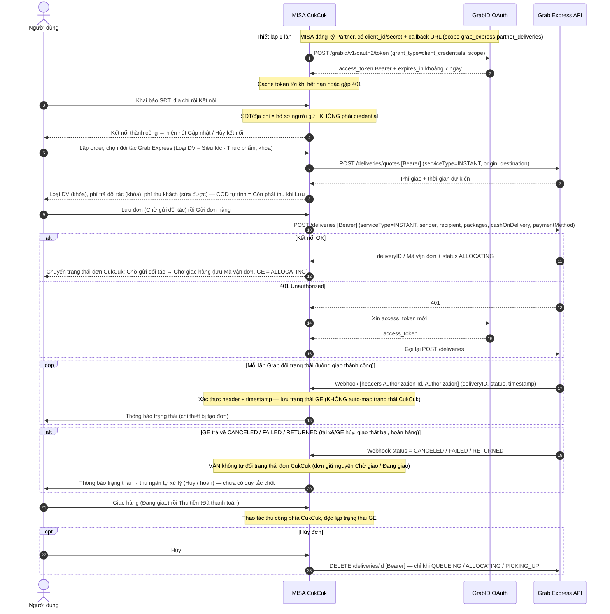

# Grab Express — Flows

## Flow: Tích hợp Grab Express (kết nối, lập đơn, giao đơn, cập nhật trạng thái)
**Trigger**: Nhà hàng dùng Grab Express làm đối tác giao hàng trong MISA CukCuk
**Related UC**: TBD
**Related FR**: TBD
**Related E**: TBD

