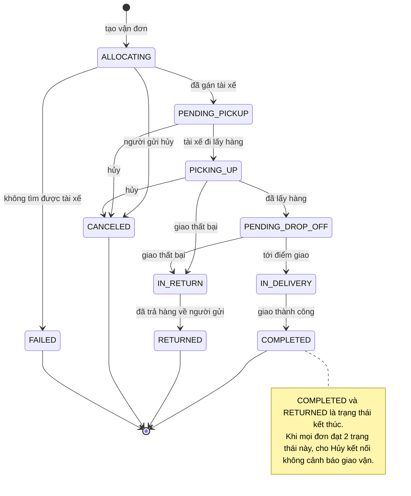

# Grab Express — States

## State: GrabExpressDelivery
**Related entity**: GrabExpressDelivery (vận đơn Grab Express)
**Related UC**: TBD
**Related BR**: TBD

> Trạng thái do Grab Express trả về qua webhook. MISA CukCuk chỉ **nhận & lưu** trạng thái này để hiển thị + sinh thông báo — **KHÔNG tự map** sang trạng thái đơn CukCuk (Chờ gửi đối tác / Chờ giao hàng / Đang giao hàng / Đã thanh toán).

### Invalid transitions
| From | To | Why not |
|---|---|---|
| COMPLETED | (bất kỳ) | Trạng thái kết thúc — giao thành công không quay lại |
| RETURNED | IN_DELIVERY | Đã trả hàng về người gửi, không giao lại trên cùng vận đơn |
| CANCELED / FAILED | ALLOCATING | Đơn đã hủy/thất bại không tự tái điều phối — phải tạo vận đơn mới |
| IN_DELIVERY | CANCELED | Grab chỉ cho hủy tới PICKING_UP; đã tới điểm giao không hủy được |
