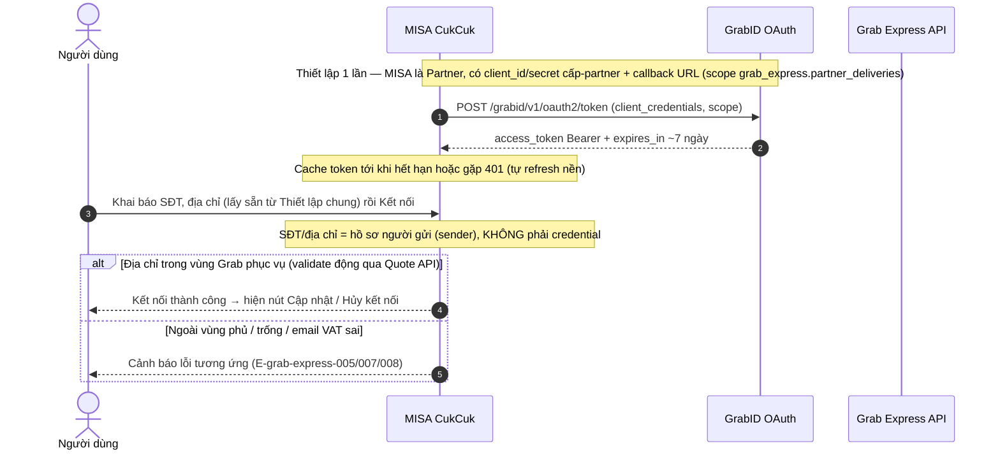
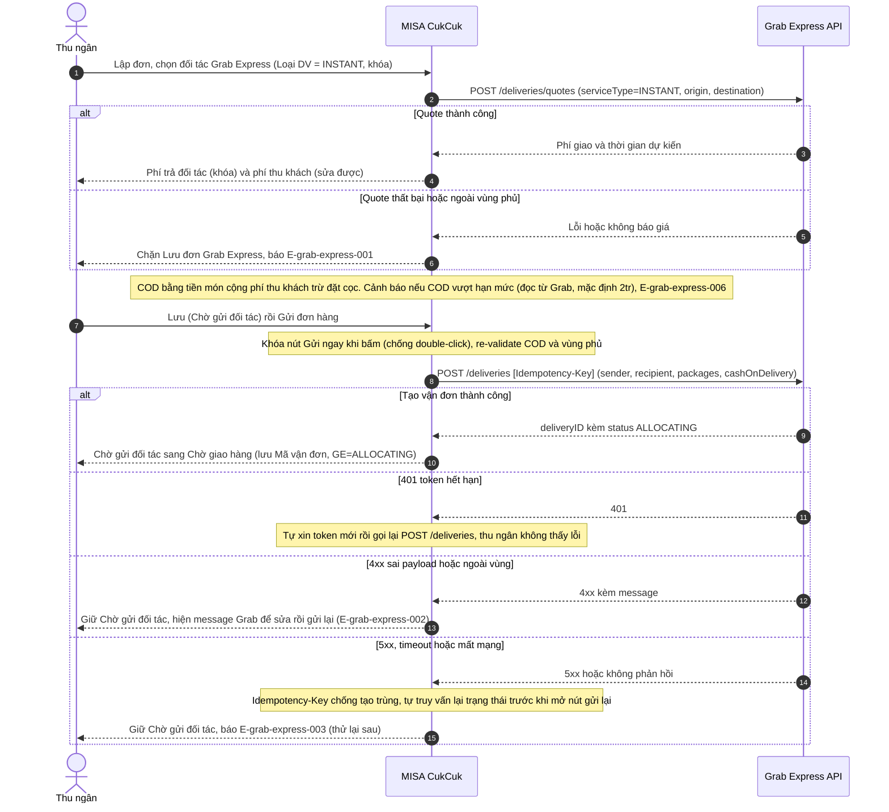
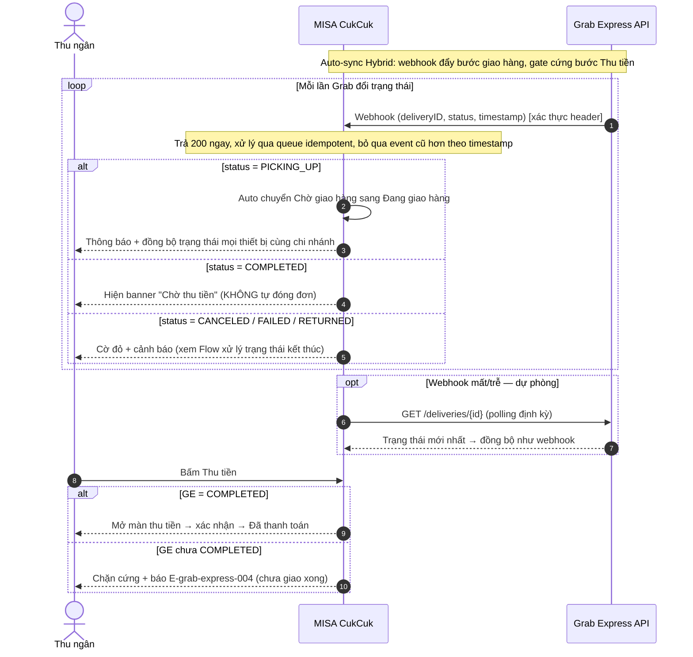
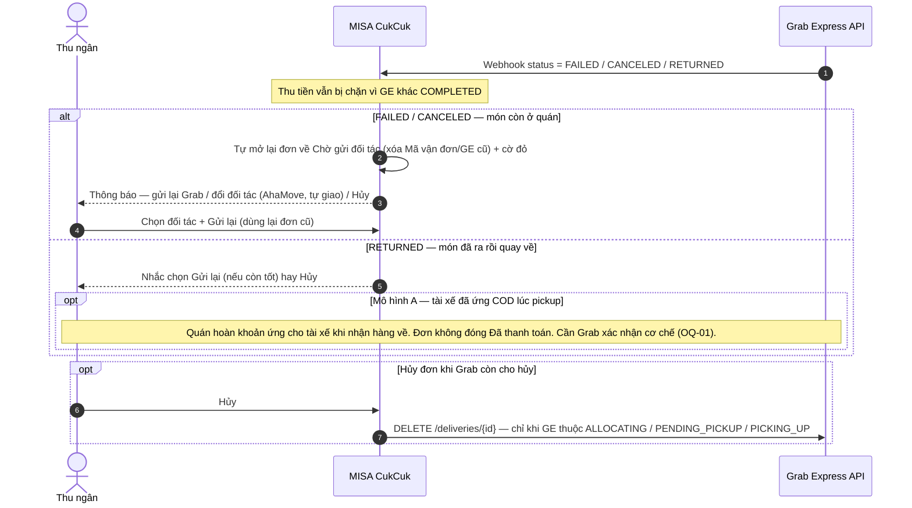

# Grab Express — Flows

## Flow: Kết nối đối tác Grab Express
**Trigger**: Nhà hàng khai báo hồ sơ người gửi và bấm Kết nối trong `Ứng dụng › Grab Express`
**Related UC**: TBD
**Related FR**: TBD
**Related E**: E-grab-express-005, E-grab-express-007, E-grab-express-008

---

## Flow: Lập đơn và gửi sang Grab Express (đủ nhánh lỗi)
**Trigger**: Thu ngân lập đơn giao hàng, chọn đối tác Grab Express rồi Gửi đơn hàng
**Related UC**: TBD
**Related FR**: TBD
**Related E**: E-grab-express-001, E-grab-express-002, E-grab-express-003, E-grab-express-006

---

## Flow: Đồng bộ trạng thái (Hybrid auto-sync) và Thu tiền
**Trigger**: Đơn ở Chờ giao hàng; Grab Express đẩy webhook trạng thái, thu ngân thu tiền khi giao xong
**Related UC**: TBD
**Related FR**: TBD
**Related E**: E-grab-express-004

---

## Flow: Xử lý trạng thái kết thúc xấu (CANCELED / FAILED / RETURNED)
**Trigger**: Grab Express trả trạng thái hủy/thất bại/hoàn hàng khi đơn CukCuk chưa đóng
**Related UC**: TBD
**Related FR**: TBD
**Related E**: —

