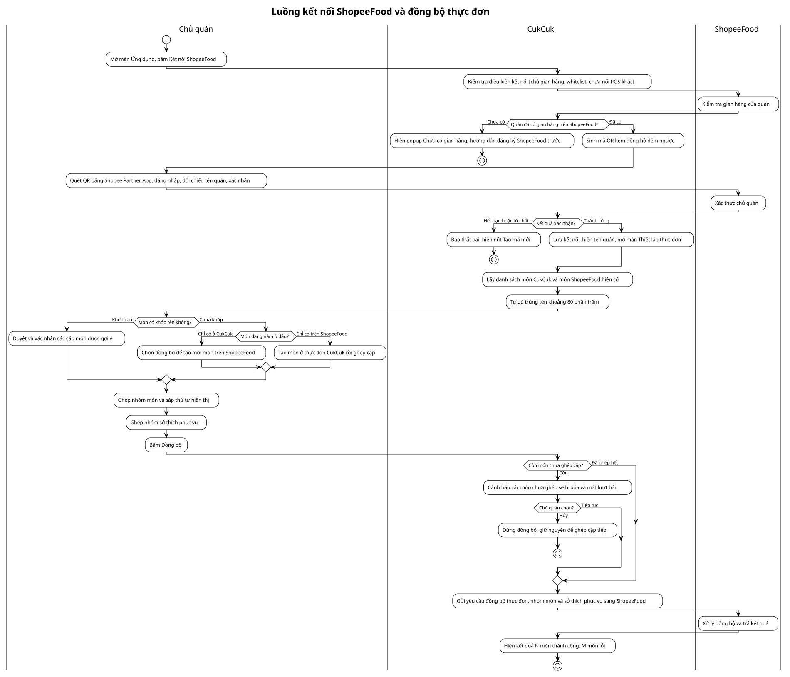
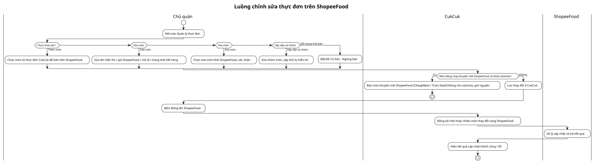
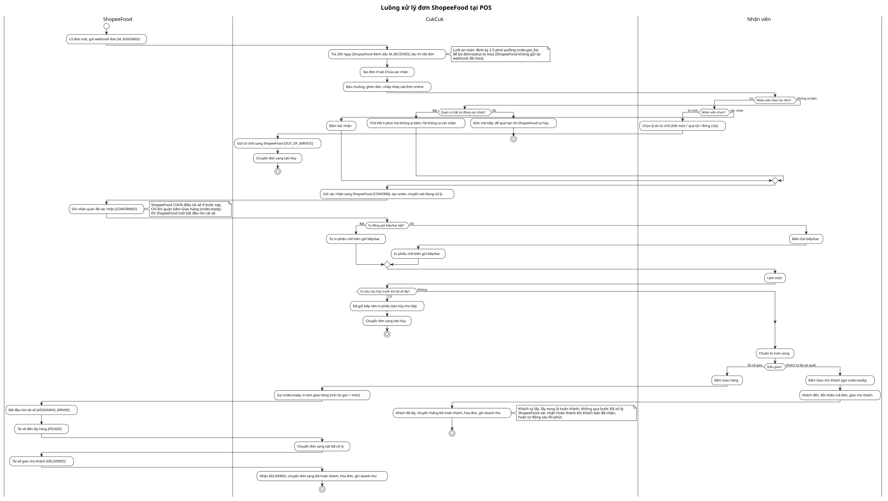

# Sơ đồ luồng chi tiết (Activity Swimlane) — CukCuk ↔ ShopeeFood

> Vẽ bằng PlantUML swimlane thật (mỗi vai trò 1 làn dọc cố định). Đọc theo mạch: **người dùng thao tác gì → CukCuk validate/hiển thị gì → gọi ShopeeFood khi nào**. Nguồn PlantUML `.puml` cạnh file này; sửa `.puml` rồi chạy `render.sh` để regen ảnh.

## Luồng kết nối ShopeeFood và đồng bộ thực đơn (Swimlane)
**Trigger**: Chủ quán bấm "Kết nối ShopeeFood" ở màn Ứng dụng.
**Phạm vi**: Kết nối (kiểm gian hàng → QR → xác thực) + đồng bộ thực đơn, nhóm món, nhóm sở thích phục vụ (topping) — chạy một mạch tới khi đồng bộ xong.
**Related module**: [[../modules/01-ket-noi.md]], [[../modules/02-dong-bo-menu.md]]

> Nguồn PlantUML: `01-ket-noi-dong-bo-menu-swimlane.puml`. Sửa .puml → chạy `diagram-skills-package/.../activity-swimlane/render.sh <file>.puml --png` để regen .svg + .png.

## Luồng chỉnh sửa thực đơn trên ShopeeFood (Swimlane)
**Trigger**: Chủ quán mở màn Quản lý thực đơn để thay đổi sau khi đã bán.
**Phạm vi**: Thêm món / sửa món / xóa món / sắp xếp & nhóm / đổi trạng thái bán — hội tụ về validate (món CheapMeal/Trùm Deal không sửa/xóa) → lưu CukCuk → Đăng lên ShopeeFood → kết quả.
**Related module**: [[../modules/02-dong-bo-menu.md]]

> Nguồn PlantUML: `03-chinh-sua-thuc-don-swimlane.puml`.

## Luồng thiết lập cài đặt chung (dạng bảng)
**Trigger**: Chủ quán mở tab Thiết lập (bất cứ lúc nào sau kết nối).
**Related module**: [[../modules/02-dong-bo-menu.md]]

> Các mục thiết lập độc lập nhau ("đặt từng mục rồi lưu"), nên trình bày dạng bảng thay cho sơ đồ luồng. Đã **bỏ** "Tự động in hóa đơn tạm tính".

| Mục thiết lập | Người dùng thao tác | Hệ thống CukCuk làm gì | Gọi ShopeeFood |
|---|---|---|---|
| **Giờ hoạt động + ngày lễ** | Đặt tối đa 3 khung giờ/ngày, chọn ngày nghỉ lễ | Lưu, trong giờ → mở nhận đơn, ngoài giờ → đóng | `set_operation_time_ranges` |
| **Tự động xác nhận đơn** | Bật/tắt; chọn *Tất cả đơn* / *Chỉ đơn đã thanh toán*; đặt **X phút** | Lưu, áp cho đơn sau; quá X phút chưa thao tác → tự xác nhận | — (nội bộ) |
| 🆕 **Tự động gửi bếp/bar** | Bật/tắt | Khi đơn xác nhận: bật → tự gửi bếp/bar + in tem bếp; tắt → hiện nút *Gửi bếp/bar* thủ công | — (nội bộ) |
| **Tạm ngừng nhận đơn** | Bấm Tạm ngừng, chọn lý do (hết món / quá tải / nghỉ) | Đóng nhận đơn tức thì (tối đa đến 5h sáng hôm sau) | `set_restaurant_busy` |
| **Ngắt kết nối** | Bấm Ngắt kết nối → quét/xác nhận trên Shopee Partner App | Hiện QR/deeplink; chờ Partner App gỡ; chuyển cửa hàng sang *Mất kết nối* | disconnect (deeplink/QR) |

## Luồng xử lý đơn ShopeeFood tại POS (Swimlane)
**Trigger**: ShopeeFood đẩy đơn mới về (webhook `M_ASSIGNED`).
**Phạm vi**: Nhận đơn → xác nhận/từ chối (thủ công hoặc tự xác nhận sau X phút) → gửi bếp/bar → làm món → bàn giao tài xế / khách tự lấy → hoàn thành. Gồm nhánh hủy (in phiếu báo hủy bếp) và lưới an toàn polling bù đơn miss.
**Trạng thái**: Chưa xác nhận → Đang xử lý → Đã hoàn thành / Hủy. Map ShopeeFood: `M_ASSIGNED→M_RECEIVED→CONFIRMED→(ASSIGNING_DRIVER/DRIVER_IN_CHARGED)→PICKED→DELIVERED`; hủy: `M_OUT_OF_SERVICE→CANCELLED`.
**Related module**: [[../modules/03-nhan-don-pos.md]]

> Nguồn PlantUML: `05-xu-ly-don-swimlane.puml`. Quy tắc đã chốt: bỏ "in tạm tính"; thêm "tự động gửi bếp/bar" (in tem bếp khi xác nhận); không có bước "đánh dấu đã thanh toán" (trạng thái trả tiền chỉ hiển thị theo `pay_to_merchant.status`).
