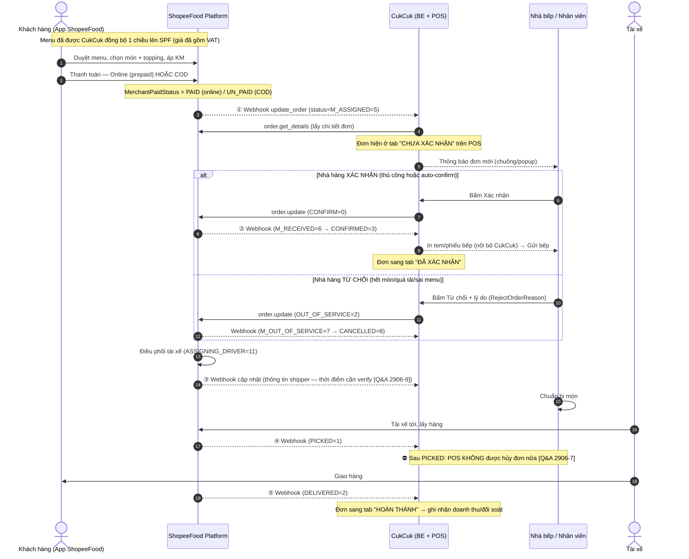

# Customer Journey Map — Đơn hàng ShopeeFood ↔ CukCuk

> Dựng từ `[API]` Order Status Machine + PaymentMethod/MerchantPaidStatus + `[Q&A]`.
> Mục tiêu: hiểu hành trình **khách hàng** trên ShopeeFood và **điểm chạm nào tác động đến thao tác trên POS CukCuk**.
> Ký hiệu trạng thái SPF: `M_ASSIGNED=5, M_RECEIVED=6, CONFIRMED=3, PICKED=1, DELIVERED=2, M_OUT_OF_SERVICE=7, CANCELLED=8, ASSIGNING_DRIVER=11`.

## 1. Sơ đồ luồng end-to-end

## 2. Bảng điểm chạm ↔ thao tác POS

| # | Sự kiện phía khách/SPF | Trạng thái SPF | Tác động tới POS CukCuk | Ràng buộc / lưu ý |
|---|---|---|---|---|
| ① | Khách đặt & thanh toán xong, SPF gán đơn cho quán | `M_ASSIGNED=5` | Webhook → get_details → đơn vào tab **Chưa xác nhận** + thông báo | ⚠️ **F3**: nếu rớt webhook, SPF không gửi lại → cần polling `order.get_list` bù đơn |
| ② | Quán xác nhận | `CONFIRM=0` → `M_RECEIVED=6`/`CONFIRMED=3` | Sang tab **Đã xác nhận**, in tem/gửi bếp | Auto-confirm: tất cả đơn / chỉ đơn đã thanh toán (cần chốt điều kiện) |
| — | Quán từ chối | `OUT_OF_SERVICE=2` → `CANCELLED=8` | Đơn vào tab **Hủy** | Lý do map `RejectOrderReason` |
| ③ | SPF gán tài xế | `ASSIGNING_DRIVER=11` | Hiển thị thông tin shipper (nếu có) | ❓ **Thời điểm shipper info về CukCuk chưa rõ** — đưa vào câu hỏi SPF |
| ④ | Tài xế lấy hàng | `PICKED=1` | Cập nhật trạng thái; **khóa nút Hủy** | ⛔ Sau mốc này POS không hủy được `[Q&A 2906-7]` |
| ⑤ | Giao xong | `DELIVERED=2` | Sang tab **Hoàn thành** → ghi nhận doanh thu, đối soát | HĐĐT xuất từ hệ thống CukCuk (SPF không hỗ trợ) |
| ✖ | Hủy giữa chừng (trước PICKED) | `M_OUT_OF_SERVICE=7` → `CANCELLED=8` | Đơn vào tab **Hủy** | order_detail **không đổi field** khi hủy, chỉ đổi status `[Q&A F.5]` |

## 3. Hai nhánh thanh toán (ảnh hưởng ngữ nghĩa "thu tiền" & đối soát)

| Nhánh | PaymentMethod | MerchantPaidStatus | Ai thu tiền của khách? | "Thu tiền" trên POS nghĩa là gì |
|---|---|---|---|---|
| **Online prepaid** | (BuyerPaymentMethod: VNPAY/AirPay/…) | `PAID=2` | Khách trả SPF trước | Chỉ **đánh dấu đã thanh toán** (SPF đối soát), quán không thực thu |
| **COD** | `COD=1` | `UN_PAID=1` | **Tài xế** thu hộ khi giao | Quán vẫn không thu từ khách; SPF/tài xế xử lý |

> ⚠️ **Hệ quả:** với đơn ShopeeFood, **nhà hàng gần như không trực tiếp thu tiền khách**. Trường **"Còn phải thu"** trong bản phác thảo đang tính *tiền khách phải trả* → cần tách thành 2 chỉ số. **Cả hai công thức đã được SPF xác nhận `[Q&A 22062026-Q5]` — KHÔNG cần hỏi lại:**
>
> - **(a) Tiền khách phải trả** = tiền món − khuyến mại + phí giao hàng + phí áp dụng + tip + một số phí khác của SPF (theo từng thời điểm). → hiển thị **tham khảo**.
> - **(b) Tiền nhà hàng thực nhận** = **tiền món − khuyến mại quán tài trợ − commission − thuế** (seller tax của cá nhân/hộ KD, SPF thu hộ & nộp hộ). → chỉ số **đối soát chính**.
>
> Các trường phục vụ tính (b) đều có trong `order.get_details`: `order_value`, `merchant_price` (đã trừ phần quán tài trợ cho món), `merchant_discount`/`total_merchant_discount` (tổng tiền giảm **quán chịu** cả đơn), `commission_amount`, seller tax. Phí giao/dịch vụ/KM-SPF-tài-trợ là **buyer-side (`customer_bill`)**, **không** trả cho merchant `[Q&A 22062026-Q1, 1206-F.7]` — nên **không đưa vào công thức (b)**.

## 4. Khoảng trống hành trình cần làm rõ (đã chuyển sang câu hỏi SPF)
- Thời điểm thông tin tài xế (tên/SĐT/biển số) thực sự về CukCuk.
- Khi khách **hủy đơn** từ phía app (không phải quán) — CukCuk nhận tín hiệu gì, ở trạng thái nào.
- Đơn **đổi/điều chỉnh** từ phía SPF (thêm/bớt món qua Partner App) — có webhook `UPDATE_ORDER=1` không và CukCuk xử lý ra sao.
- Xử lý khi đơn bị hủy **sau khi đã gửi bếp/đã nấu** (tồn kho, ghi nhận chi phí).
