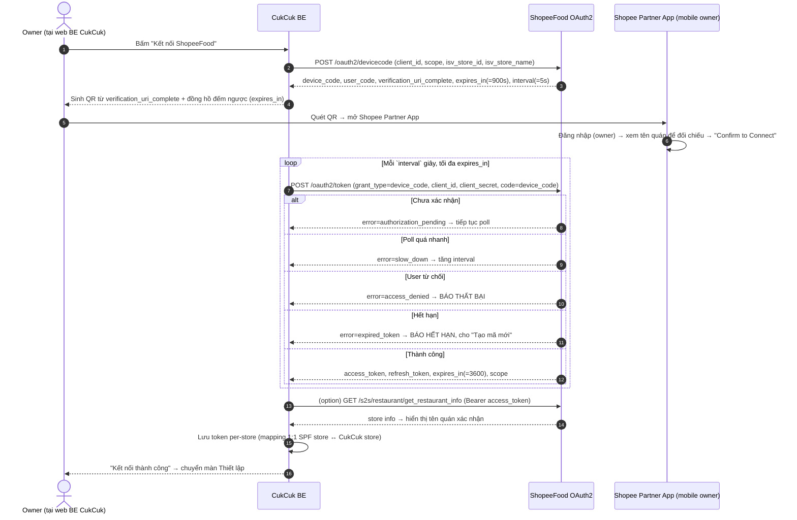
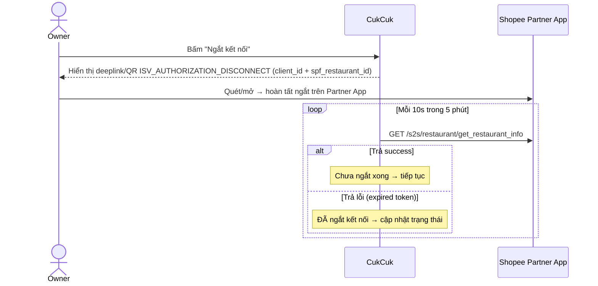

> # ⛔ FILE NÀY ĐÃ BỊ THAY THẾ (2026-07-29)
> **Dùng [`05-web-be-shopeefood.md`](05-web-be-shopeefood.md) §2 và §9.**
> Giữ file này chỉ để tra lịch sử quyết định. ⛔ **Không dùng để build** — nhiều mục ở đây đã lỗi thời so với `Tích hợp ShopeeFood với CukCuk.xmind` (28/07 23:39) và 6 quyết định chốt ngày 28–29/07.

# Module 01 — Kết nối / Authorization (CukCuk ↔ ShopeeFood)

> Vai trò: **ISV Partner** · Cơ chế: **OAuth2 Device Authorization** (`[API-Auth]`).
> Nguồn: `[API-Auth]` (chuẩn) + `[Q&A A.*]` + `[XMIND]` (nháp UI) + `[RESEARCH]` (UX).

## 0. ⚠️ CẬP NHẬT 2026-07-28

> Nguồn: phiên làm rõ với BA 28/07 + prototype Web BE `[PROTO-BE]`. Chi tiết: `../.clarity/webbe-prototype-map-2026-07-28.md`.

**✅ Spec này ĐÚNG — prototype mới là chỗ sai.** §5 (ngắt kết nối qua QR + dò 10s/5 phút) và §2 (poll device-code) đã khớp `[API-Auth]`. Prototype đang:
- bấm *Ngắt kết nối* là hiện luôn *"Đã ngắt kết nối với ShopeeFood!"* → **sai**, chủ quán tưởng đã ngắt trong khi vẫn đang kết nối
- có nút *"Xác nhận đã quét mã QR kết nối"* → **bỏ** (`WBE-D17`), hệ thống tự nhận biết cho nhất quán với luồng ngắt kết nối vốn cũng tự dò

**Bổ sung mới:**

| # | Rule |
|---|---|
| `BR-DISC-03` | Quá **5 phút** chưa xác nhận trên Partner App → **coi như chưa ngắt**, quay về *Đã kết nối*, báo *"Bạn chưa hoàn tất ngắt kết nối trên ứng dụng ShopeeFood Partner."* ⛔ Không được hiện "đã ngắt" khi chưa chắc |
| `BR-DISC-04` | Chủ quán có thể **ngắt thẳng trên Partner App** không qua CukCuk ⇒ CukCuk chỉ phát hiện khi mất hiệu lực truy cập → **phải** hiện chỉ báo *"Mất kết nối ShopeeFood"* (`SG-05`, `TK6`), không im lặng |
| `BR-DISC-05` | **Ngắt rồi nối lại CÙNG gian hàng** → **giữ nguyên toàn bộ dữ liệu ghép nối**, không phải ghép lại từ đầu (`WBE-D10`) |
| `BR-DISC-08` | **Nối sang gian hàng ShopeeFood KHÁC** → **XÓA dữ liệu ghép nối cũ** (chốt 28/07, theo XMind cũ). Phải cảnh báo trước, nguyên văn: *"Bạn có chắc chắn muốn kết nối với 1 Merchant ID gian hàng ShopeeFood khác không? Nếu kết nối mới dữ liệu gian hàng hiện tại trên Cukcuk sẽ bị xóa"* — nút **Đồng ý** / **Không đồng ý** · Đồng ý → sau khi kết nối thành công, hiển thị lại **màn liên kết thực đơn từ ShopeeFood về CukCuk** · Không đồng ý → không có gì thay đổi |
| `BR-DISC-06` | ⚠️ **Giả định cần SPF xác nhận (`Q-DISC-01`):** ngắt kết nối chỉ thu hồi quyền truy cập — **gian hàng và thực đơn trên ShopeeFood vẫn còn, khách vẫn đặt được**, chỉ là đơn không chảy về CukCuk nữa |
| `BR-DISC-07` | **Chặn ngắt kết nối khi còn đơn ShopeeFood chưa hoàn thành** (`WBE-D13`): *"Còn {n} đơn ShopeeFood chưa hoàn thành. Xử lý xong rồi mới ngắt kết nối được."* |
| `WBE-D14` | **Mã QR hết hạn** → làm **mờ mã + nút "Tạo mã mới"**. Không đóng modal, không tự sinh mã mới |
| `WBE-D15` | **Gian hàng đã liên kết nhà hàng CukCuk khác** → báo **rõ tên**: *"Gian hàng ShopeeFood này đã liên kết với nhà hàng **{tên quán}** trên MISA CukCuk. Ngắt kết nối ở quán đó trước rồi thực hiện lại."* |
| `WBE-D24` | **Ẩn** *Mã cấu hình Endpoint (Webhook)* và *Phạm vi truy cập quyền dữ liệu (Scopes)* khỏi panel chi tiết ứng dụng — chủ quán không cấu hình 2 thứ này. Panel chỉ giữ: tên nhà cung cấp · phiên bản tích hợp · trạng thái kết nối · tài khoản đang kết nối |

**Đóng điểm mở:** đồng hồ **900 giây** ở màn QR là **đúng** — đó là hạn của **mã QR**; `3600s` là hạn của **quyền truy cập** sau khi kết nối xong. Hai thứ khác nhau, không mâu thuẫn (`WBE-D`/`WBE-Q-B1`).

⛔ **ĐÍNH CHÍNH (28/07):** modal *"Bạn đã có gian hàng trên ShopeeFood chưa?"* **KHÔNG có trong thiết kế** — BA xác nhận đã bỏ. Câu chữ của nó vẫn còn trong file prototype nhưng là **code chết**: cờ bật modal chưa bao giờ được đặt thành bật, nên modal không mở được. Bản trước của mục này ghi nhầm là có ⇒ đã gỡ.
*(Bài học: trích được câu chữ trong prototype **không** chứng minh tính năng còn sống — phải kiểm tra có nút nào mở nó không. Rà đầy đủ: `../.clarity/deadcode-audit-2026-07-28.md`.)*

⇒ Điều kiện `P1` / `E5` (phải có gian hàng ShopeeFood trước) **vẫn đúng về nghiệp vụ**, chỉ là **không thể hiện bằng modal hỏi đầu luồng**.

## 1. Điều kiện tiên quyết (prerequisite)
| # | Điều kiện | Nguồn |
|---|---|---|
| P1 | Nhà hàng **đã có gian hàng trên ShopeeFood** (chưa có → không kết nối được) | `[Q&A A.7]` |
| P2 | IP server CukCuk đã được **whitelist** phía SPF | `[Q&A A.1]` |
| P3 | CukCuk đã cung cấp **webhook nhận đơn** + **endpoint menu** cho SPF | `[Q&A A.1]` |
| P4 | SPF đã cấp **client_id / client_secret** (khuyến nghị 1 client_id / 1 chuỗi-thương hiệu) | `[API-Auth]` |
| P5 | Người thao tác kết nối phải là **owner** gian hàng SPF | `[Q&A A.8]` |
| P6 | Nếu đang dùng POS cũ **Ocha** → phải liên hệ BI SPF gỡ kết nối Ocha trước | `[API-Auth §3]` |

## 2. Luồng kết nối (device-code)

## 3. Màn hình & thành phần UI
| Màn / thành phần | Nội dung | Ghi chú |
|---|---|---|
| Danh sách ứng dụng (Applications) | Thêm app **ShopeeFood** (title, mô tả, nút Kết nối) | `[XMIND]` |
| Popup QR kết nối | QR sinh từ `verification_uri_complete` + **đồng hồ đếm ngược theo `expires_in` thật** + nút **"Tạo mã mới"** | U6 — KHÔNG hardcode 15' |
| Trạng thái polling | "Đang chờ xác nhận trên Shopee Partner App…" | interval từ response |
| Thông báo kết quả | Thành công (hiện tên quán) / Thất bại (lý do) | `[XMIND]` |
| Màn quản lý kết nối | Trạng thái đã kết nối, tên/ID store SPF, nút **Ngắt kết nối** | `[XMIND]`, `[API-Auth §3]` |

## 4. Quản lý token
| Rule | Chi tiết | Nguồn |
|---|---|---|
| TK1 | Lưu **access_token + refresh_token riêng cho từng store** | `[API-Auth]` |
| TK2 | Token dài > 2048 bytes → cột lưu phải đủ rộng | `[API-Auth]` |
| TK3 | **Refresh định kỳ** trước khi hết hạn (`expires_in` mẫu 3600s) qua `grant_type=refresh_token` | `[API-Auth]` |
| TK4 | Header gọi API: `Authorization: Bearer <access_token>` | `[API-Auth §3]` |
| TK5 | ISV **bỏ qua** `restaurant_id` bắt buộc ở hầu hết endpoint (token đã định danh store) | `[API-Auth §3]` |
| TK6 | Refresh fail / token thu hồi → chuyển store về trạng thái **"Mất kết nối"**, yêu cầu kết nối lại | thiết kế (verify D1) |

## 5. Ngắt kết nối (disconnect)

- Link theo môi trường: UAT `partner.uat.shopee.vn`, Live `partner.shopee.vn` `[API-Auth §3]`.

## 6. Business rules
- BR-01: Mapping **1:1** — 1 SPF store chỉ nối 1 CukCuk store tại một thời điểm; 1 client_id nối nhiều store `[Q&A A.1]`, `[API-Auth §3]`.
- BR-02: SPF **không validate** việc user chọn đúng store CukCuk — dựa vào **owner tự đối chiếu tên quán** hiển thị trên Partner App `[Q&A A.4, A.8]`.
- BR-03: Không có chiều đẩy store info CukCuk→SPF; chỉ **get_restaurant_info** SPF→CukCuk `[Q&A A.2]`.
- BR-04: Sau kết nối thành công, SPF trả **token** (không chỉ merchantID) — bắt buộc lưu `[Q&A A.9]`.

## 7. Edge cases
| # | Tình huống | Xử lý |
|---|---|---|
| E1 | Quét QR đã hết hạn (`expired_token`) | Báo hết hạn + nút "Tạo mã mới" (gọi lại /devicecode) |
| E2 | Owner đăng nhập **nhầm account/quán** khác | Partner App hiển thị tên quán để tự nhận diện; nếu sai → đăng xuất, đăng nhập đúng, quét lại `[API Authen Flow]` |
| E3 | User bấm từ chối (`access_denied`) | Báo thất bại, cho thử lại |
| E4 | Poll quá nhanh (`slow_down`) | Tăng interval theo yêu cầu server |
| E5 | Chưa có gian hàng SPF | Chặn kết nối, hướng dẫn đăng ký SPF trước `[Q&A A.7]` |
| E6 | Đang kết nối Ocha | Chặn + hướng dẫn liên hệ BI gỡ Ocha `[API-Auth §3]` |
| E7 | Mất mạng giữa lúc poll | Giữ device_code, tiếp tục poll đến `expires_in`; quá hạn → E1 |

## 8. TODO chờ SPF
- `SPF-Q2` 🟡: refresh_token có rotate không; fail thì phải re-link?; có webhook báo disconnect không (hiện chỉ biết poll `get_restaurant_info` — cách này đã có trong `[API-Auth §3]`).
- `SPF-Q3` 🟡: cấp UAT (client_id/secret, domain) + timeline.

> Ngắt kết nối (§5) đã có đủ trong `[API-Auth §3]` — không phải câu hỏi mở, chỉ cần xác nhận có thêm webhook disconnect hay không (gộp vào Q2).
