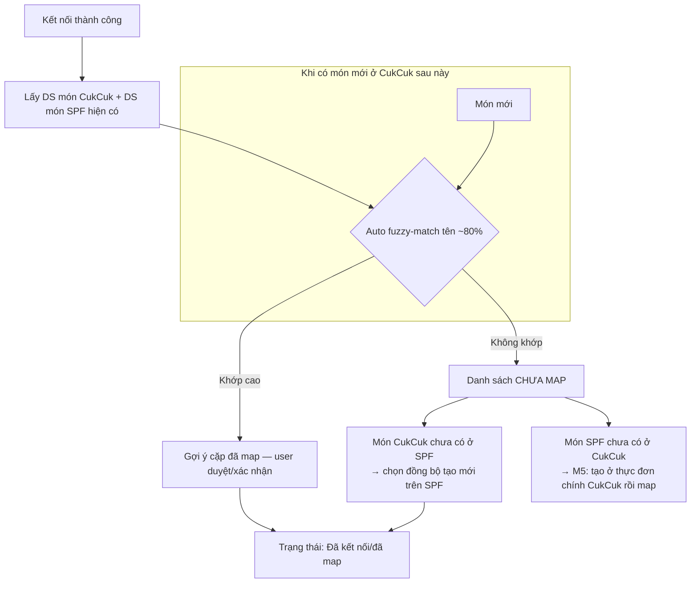

> # ⛔ FILE NÀY ĐÃ BỊ THAY THẾ (2026-07-29)
> **Dùng [`05-web-be-shopeefood.md`](05-web-be-shopeefood.md) §3–§8.**
> Giữ file này chỉ để tra lịch sử quyết định. ⛔ **Không dùng để build.** Các chỗ sai đã biết: §2 vẫn còn *fuzzy-match ~80%* (đã hủy bởi `WBE-D21`) · `WBE-D5` ghi *"không lấy về món khuyến mại"* (đã đính chính: **vẫn lấy về, chỉ không đồng bộ tên/giá**) · vẫn còn *Lịch bán món* (đã bỏ) · `WBE-D7` duyệt món (đã xác nhận **không có luồng này**).

# Module 02 — Thiết lập & Đồng bộ Menu (CukCuk → ShopeeFood)

> Chiều đồng bộ: **1 chiều CukCuk → SPF** (F1). Nguồn: `[MAP]` (chuẩn trường), `[Q&A B,C,2906]`, `[API §3.5 Menu/§3.2 Dish/§3.3 Topping]`, `[XMIND]`, `[RESEARCH]`.

## 0. ⚠️ CẬP NHẬT 2026-07-28 — các điểm bị thay đổi

> Nguồn: phiên làm rõ với BA ngày 28/07 + prototype Web BE `[PROTO-BE]`. Chi tiết đầy đủ: `../.clarity/webbe-prototype-map-2026-07-28.md`.

| Điểm | Trước | **Nay** |
|---|---|---|
| Cơ chế tự ghép | `DEC-MAP-01`: fuzzy-match ~80%, ngưỡng cấu hình được | 🔴 **Chỉ tự ghép khi TÊN TRÙNG KHỚP.** Không có %, không cho chỉnh độ chặt/lỏng. `BR-MAP-01` §2 viết lại (`WBE-D21`) |
| Ghép nối trước khi bán | cảnh báo rồi cho qua | 🔴 **Bắt buộc ghép 100%** mới sang bước tiếp và mới cho Đồng bộ lên SPF (`WBE-D2`) |
| Món khuyến mại SPF | ghép nhưng khóa sửa | 🔴 **Không lấy id món khuyến mại** khi lấy thực đơn về ⇒ không xuất hiện trong danh sách ghép (`WBE-D5`) — xem rủi ro `RR-01` |
| Ghép nhiều–nhiều | — | **Chỉ 1–1.** Combo bán trên SPF phải có 1 món combo tương ứng bên CukCuk (`WBE-D19`) |
| Auto-confirm 2 lựa chọn | `AC-02`: *Tất cả đơn* / *Chỉ đơn đã thanh toán* | ⛔ **BỎ** — chỉ còn ô số phút (`WBE-D11`) |
| Sửa giá bán ShopeeFood | (không nêu) | **Lưu nháp** — chỉ có hiệu lực khi bấm *Đồng bộ lên ShopeeFood*; màn hiện nhãn *"Có thay đổi chưa đồng bộ"* (`WBE-D12`) |
| Lịch bán món mặc định | (không nêu) | Món **không đặt lịch** thì **bán theo giờ mở cửa của quán** (`WBE-D23`) |
| Duyệt món mới | (không nêu) | **Không có bước chờ ShopeeFood duyệt** (`WBE-D7`) |
| Tên phân đoạn STPV | *Sở thích* / *Sở thích phục vụ* | **Nhóm STPV** / **STPV** — prototype đặt tên sai (`WBE-D18`) |
| Màn chỉnh sửa thực đơn | theo prototype | **Theo màn chỉnh sửa thực đơn hiện hành của MISA CukCuk**, không theo prototype (`WBE-D22`) |

**Bổ sung mới:**
- `WBE-D16` — chọn món CukCuk **chưa thuộc nhóm nào** để ghép → popup *"Món cần thuộc một nhóm thực đơn cụ thể trước khi ghép. Bạn có muốn cập nhật món ngay không?"* — nút **Để sau** / **Chỉnh sửa** (mở thẳng form sửa món). Có **chặn**.
- `WBE-D6` — kết quả đồng bộ: **toast + banner lỗi**, không làm panel lịch sử. Lỗi phải nêu **món nào gây lỗi**.
- `WBE-D20` — lỗi khi tải thực đơn về: *"Không tải được thực đơn từ ShopeeFood. Kiểm tra kết nối mạng và thử lại."* + nút **Thử lại**, **giữ nguyên kết nối** (không bắt quét QR lại).
- `WBE-D8` — **Lịch nghỉ lễ**: đặt trước cả năm theo từng ngày; đến ngày đó quán tự đóng nhận đơn trên ShopeeFood.
- `BR-BUSY-01…05` — **Tạm ngừng nhận đơn** bám UI Shopee Merchant, xem §3 Tab THIẾT LẬP.

## 1. Nguyên tắc nền tảng
| # | Nguyên tắc | Nguồn |
|---|---|---|
| M1 | Menu đồng bộ **1 chiều** CukCuk→SPF. Sửa trên Partner App **không** kéo về CukCuk. | `[Q&A C.1, C.5]` |
| M2 | ⚠️ **Full-sync (`menu.sync`) có tính HỦY DIỆT**: món trên SPF **không** mang id CukCuk sẽ **bị XÓA → mất lượt bán/lịch sử**. | `[Q&A C.6]` |
| M3 | **Phải mapping trước khi đồng bộ.** | `[Q&A C.6, 2906-5]` |
| M4 | Giá món **đã gồm toàn bộ thuế/VAT** — không đồng bộ thuế riêng. SPF tính seller_tax trên subtotal. | `[Q&A 2906-1,2]` |
| M5 | Món chỉ có ở SPF, chưa có ở CukCuk → **KHÔNG tự tạo** ở CukCuk (user tự tạo ở thực đơn chính rồi map). | `[Q&A C.3]` |
| M6 | **Không hỗ trợ combo**; không phân loại món đặc biệt (đóng gói/cồn). | `[Q&A 2906-3,4]` |
| M7 | API menu cho phép **sync 1 hoặc nhiều món**, hoặc **toàn bộ menu** (`menu.sync`). | `[Q&A C.2]` |
| M8 | Đối tượng cần mapping: **nhóm món, món, nhóm topping (STPV), topping**. | `[Q&A 2906-5]` |
| M9 | Rate limit **25 QPS/IP** → throttle khi sync menu lớn. | `[API]` |
| M11 | Món **Prepaid SKU (Trùm Deal)**: không sửa được; sync **fail** nếu cố update → đợi hết CTKM. Món **CheapMeal (Ăn Ngon Rẻ)**: không sửa giá/thông tin/xóa (chỉ đổi status); xóa/bỏ-mapping món thường liên quan CheapMeal → sync **fail**. | `[API §3.5 Warning]` |
| M12 | Endpoint CukCuk cung cấp cho SPF GET menu: `{domain}/shopeefoodvn/getMenu?storeCode={partner_store_id}` theo **JSON template SPF** (dpaste.com/BZT43338J). Đồng thời CukCuk chủ động đẩy bằng `menu.sync` (POST /s2s/menu/sync → trả `task_id`). | `[API §3.5]` |

**Schema menu (đã có trong `[API §3.5]` — không cần hỏi SPF):**
| Đối tượng | Trường |
|---|---|
| categories | id (partner_dish_group_id) · name · sequence · Available Status (AVAILABLE/UNAVAILABLE) · sort_type (1 theo lượt bán / 2 theo thứ tự) |
| items | id (partner_dish_id) · name · Available Status (UNAVAILABLE = hết món) · description (≤500 ký tự) · sequence · price · photo |
| Topping Group | id · name · sequence · status · selectionRangeMin (min_quantity) · selectionRangeMax (max_quantity) |
| Topping | id · name · sequence · status · price |

## 2. Cơ chế mapping (DEC-MAP-01: auto fuzzy-match + user xác nhận)

**3 case mapping** `[XMIND]`:
| Case | Tình huống | Xử lý |
|---|---|---|
| C-A | Món có ở SPF **và** có ở CukCuk | Auto-fuzzy gợi ý → user xác nhận map → "Đã kết nối" |
| C-B | Món ở CukCuk, **chưa** có ở SPF | Chọn đồng bộ → SPF tạo mới → "Đã kết nối" |
| C-C | Món ở SPF, **chưa** có ở CukCuk | Không auto tạo (M5); user tạo ở thực đơn chính CukCuk rồi map |

### BR-MAP-01 — Cơ chế tự ghép **theo tên trùng khớp** (viết lại 2026-07-28)

> ⚠️ Bản trước quy định fuzzy-match ngưỡng ~80% có cấu hình. **Đã bỏ** theo `WBE-D21` — BA chốt *"Không cho chỉnh, tự ghép trùng tên"*.
> Áp dụng khi: lấy thực đơn về lần đầu và mỗi khi có món mới. Áp dụng **tương tự** cho **nhóm thực đơn**, **nhóm STPV**, **STPV**.

1. **Chuẩn hóa tên trước khi so** (cả 2 phía, để không lệch vì lỗi vặt):
   về chữ thường · gộp khoảng trắng thừa về 1 · bỏ dấu câu và ký tự đặc biệt (`( ) - / , .` …) · **bỏ dấu tiếng Việt** (để *"Cà phê sữa"* khớp *"Ca phe sua"*).
2. **Chỉ tự ghép khi 2 tên đã chuẩn hóa TRÙNG KHỚP HOÀN TOÀN.** Không tính điểm phần trăm, **không** hiển thị mức độ giống, **không** cho chủ quán chỉnh độ chặt/lỏng.
3. Tên **không trùng** → để ở danh sách **Chưa ghép**, chủ quán tự chọn.
4. **Xử lý nhập nhằng:** nếu có **≥2 món cùng tên trùng khớp** → **KHÔNG** tự ghép, đưa vào *Chưa ghép* để chủ quán chọn.
5. Mỗi món chỉ thuộc **1 cặp (1–1)** (`WBE-D19`); đã ghép rồi không xét lại ở vòng sau.
6. **Bắt buộc ghép đủ 100%** mới cho sang bước tiếp và mới cho Đồng bộ lên ShopeeFood (`WBE-D2`).

### BR-MAP-04 — Màn ghép nối: thành phần & thao tác *(chuẩn theo ảnh BA gửi 28/07)*

**Hệ thống TỰ GHÉP — không có nút bấm để chạy tự ghép.** Chủ quán mở màn ra là đã thấy kết quả ghép sẵn.

**Bố cục bảng** (ví dụ bước 1 — *Thiết lập nhóm thực đơn*):

| Nhóm thực đơn ShopeeFood | Nhóm tương ứng trên MISA CukCuk | Trạng thái ghép nối | |
|---|---|---|---|
| Món chính | `[MC01] Món chính` 💡 | ● **Đã ghép nối** *(xanh)* | 🗑 |
| Món ăn nhẹ | `--` | ● **Chưa ghép** *(xám)* | 🗑 |
| Đồ uống lạnh | `[DU03] Đồ uống lạnh` 💡 | ● **Đã ghép nối** | 🗑 |
| Món chè | `--` | ● **Chưa ghép** | 🗑 |

- Tiêu đề màn kèm **`Tổng: {n}`** và dải cảnh báo vàng ⚠️ ***"Còn {n} nhóm thực đơn ShopeeFood chưa có nhóm tương ứng"***
- Mỗi cột có **ô lọc** riêng; cột trạng thái là danh sách chọn (*Tất cả* / …)
- Món CukCuk hiển thị dạng **`[Mã] Tên`**
- **Icon 💡** cạnh mục đã ghép = chỉ báo **hệ thống tự ghép** (để phân biệt với ghép tay)
- Chưa ghép hiển thị **`--`**, không để trống
- **🗑 (thùng rác)** = **xóa ghép nối của dòng đó** — đây là **cách duy nhất** để gỡ ghép

⛔ **KHÔNG có** các nút sau (BA xác nhận 28/07 — code chết trong prototype, phải gỡ):
| Bỏ | Lý do |
|---|---|
| Nút **Liên kết nhanh** / panel liên kết nhanh | Hệ thống tự ghép sẵn, không cần bấm |
| Nút **Sao chép sang MISA CukCuk** | Đã bỏ khỏi thiết kế |
| Nút **Hủy liên kết** (dạng nút riêng) | Thay bằng **🗑** trên từng dòng |
| Thao tác **hủy liên kết hàng loạt** | Nghiệp vụ không có case này |
| 4 hộp thoại *"Chọn … liên kết với MISA CukCuk"* | Thay bằng **ô chọn ngay trên dòng** |

**Còn giữ:** **Thêm mới trực tiếp trên MISA CukCuk** (4 loại: nhóm thực đơn · món · nhóm STPV · STPV) → nút **Lưu & Liên kết**.
**Chặn chuyển bước:** *"Còn {n} món chưa được ghép nối. Vui lòng ghép nối toàn bộ thực đơn để tiếp tục."*

### BR-MAP-02 — Món khuyến mại của ShopeeFood (`WBE-D5`)

**Khi lấy thực đơn từ ShopeeFood về, KHÔNG lấy id của các món thuộc chương trình khuyến mại** — *Trùm Deal (Prepaid SKU)* và *Ăn Ngon Rẻ (CheapMeal)*. Các món này không xuất hiện trong danh sách ghép nối.

⚠️ **Rủi ro `RR-01` phải theo dõi:** `[API §3.5]` cảnh báo lần đồng bộ sẽ **thất bại toàn bộ** nếu có *món thường **có liên quan** tới món Ăn Ngon Rẻ* bị bỏ ghép, hoặc có *món liên quan Trùm Deal* bị sửa. Bỏ qua **món khuyến mại** thì đúng, nhưng **món thường đang dính chương trình** vẫn phải ghép và phải khóa sửa — nếu không, chủ quán bấm Đồng bộ sẽ hỏng cả lần đồng bộ mà không hiểu vì sao. ⇒ Banner lỗi (`WBE-D6`) **phải nói được lý do này**.

### BR-MAP-03 — Đơn về mà có món chưa ghép (`WBE-D3`, `BR-UNMAP-*`)

Dù đã bắt buộc ghép 100%, vẫn còn **5 nguồn** làm phát sinh món chưa ghép. Rule xử lý và rule phòng ngừa: xem **Module 03 §4c** và `../.clarity/webbe-prototype-map-2026-07-28.md` §E1–E2.

## 3. Cấu trúc màn hình "Thiết lập" (sau kết nối)
### Tab MENU
Cột hiển thị DS món: **Tên món · Giá bán SPF · Nhóm thực đơn · Trạng thái hết món** `[XMIND]`.
- Giá bán SPF: món từ SPF về → giá SPF; món từ thực đơn CukCuk → giá thực đơn.
- Nút **"Đồng bộ"** → ⚠️ **cảnh báo đỏ mạnh**: *"Các món chưa được mapping sẽ bị XÓA khỏi ShopeeFood và mất toàn bộ lượt bán/lịch sử. Tiếp tục?"* (M2).

Chi tiết/Edit món `[MAP]`, `[XMIND]`:
| Trường | Hành vi |
|---|---|
| Tên món | Mặc định lấy tên thực đơn, **cho sửa** tên hiển thị SPF |
| Nhóm thực đơn | **Disable** không cho sửa |
| Giá bán (gốc CukCuk) | **Disable** |
| Giá bán ShopeeFood | **Cho sửa** |
| Mô tả | Đồng bộ mô tả từ Menu offline |
| Trạng thái hết hàng | Toggle out-of-stock (M10) |
| Sở thích phục vụ (STPV) | Lấy nhóm STPV bán ở SPF; **chỉ xem, không sửa** từng STPV |

### Tab NHÓM MÓN
- DS nhóm hiển thị; **cho sửa tên + mô tả**; **cho sắp xếp thứ tự** → đồng bộ thứ tự lên SPF qua trường `sequence` + `sort_type` của categories `[API §3.5]`.

### Tab SỞ THÍCH PHỤC VỤ (Topping / STPV)
Mapping nhóm STPV + STPV `[MAP]`:
| CukCuk | ShopeeFood |
|---|---|
| ID nhóm STPV | Mã topping group |
| Tên nhóm STPV | Tên (đẩy theo ngôn ngữ SPF: VN/EN) |
| Giới hạn STPV = False | Không bắt buộc = True, số lượng tùy chọn mặc định = 1 |
| Giới hạn STPV = True | Bắt buộc = True; khoảng Min=1, Max=[số tối đa CukCuk đẩy] |
| STPV item | Tên |
| Thu thêm | Giá |
> Mapping xong nhóm STPV thì **liên kết món ↔ topping map tương ứng** `[MAP]`.

### Tab LỊCH TRÌNH (khung giờ bán)
- Cột: **Tên khung giờ · Nhóm món bán trong khung** `[XMIND]`.
- Thêm/xóa khung giờ; tên bắt buộc (trống → cảnh báo đỏ "Không được để trống").
- Chọn khung giờ hoạt động (từ giờ hoạt động ở Thiết lập) + chọn nhóm món áp dụng; 1 nhóm có thể ở nhiều khung; thứ tự nhóm theo sắp xếp ở Tab Nhóm món.

### Tab THIẾT LẬP
- **Thời gian hoạt động** *(chuẩn theo ảnh BA gửi 28/07 — bám cách làm của Shopee Merchant)*:

| Thành phần | Chi tiết |
|---|---|
| Bố cục | **7 dòng theo thứ trong tuần**: `T2 · T3 · T4 · T5 · T6 · T7 · CN` |
| Mỗi ngày | Danh sách chọn **Mở cửa** / **Đóng cửa** · `Từ` **08:00** · `Đến` **22:00** · nút **+** để thêm khung giờ cho ngày đó |
| Mặc định | Mọi ngày *Mở cửa* **08:00–22:00** |
| Nút | **Thiết lập nhanh** — áp cùng cài đặt cho **tất cả các ngày** → *"Đã thiết lập nhanh thời gian hoạt động thành công cho tất cả các ngày!"* |
| Giới hạn | *"Tối đa 3 khung giờ hoạt động cho mỗi ngày!"* · *"Cần ít nhất 1 khung giờ hoạt động!"* — ⚠️ giới hạn 3 khung là **rule CukCuk tự đặt**, ShopeeFood không nêu |
| Ràng buộc | Các khung giờ trong cùng ngày **không được trùng nhau** |
| Toast | *"Đã lưu thiết lập thời gian hoạt động thành công!"* / *"Đã hủy bỏ thay đổi thời gian hoạt động"* |

⇒ Trong giờ → nhận đơn; ngoài giờ → đóng. **Có bật/tắt riêng từng ngày** (chọn *Đóng cửa* cho ngày quán nghỉ cố định hằng tuần) — khác với **Lịch nghỉ lễ** vốn dùng cho ngày nghỉ **không lặp lại**.
- **Cài đặt ngày lễ / Ngày nghỉ tạm thời** (`WBE-D8`): *"Thiết lập trước những ngày nhà hàng sẽ ngừng nhận đơn trên ShopeeFood trong năm (ngày nghỉ lễ, ngày bảo trì, Tết…)."*
  - Trường: `Tên kỳ nghỉ` (vd *Tết Nguyên Đán*) · `Từ ngày` · `Đến ngày`
  - Rỗng: *"Chưa thiết lập ngày nghỉ lễ nào. Vui lòng thêm bên dưới."*
  - ✅ Nghiệp vụ khả thi — đặt trước cả năm theo từng ngày; đến ngày đó quán tự đóng nhận đơn trên ShopeeFood.
- **Lịch bán món** (`WBE-D23`): món **không đặt lịch** thì **bán theo giờ mở cửa của quán** (*"24/24"* trong `[DOC-RULE]` nghĩa là *không giới hạn thêm ngoài giờ mở cửa*, **không phải** bán suốt ngày đêm).
- **Cài đặt đơn hàng** (chuyển sang Module 03):
  - ☑ **Tự động xác nhận Order** — DEC-CONFIRM-01: mặc định thủ công; nếu bật, đặt **X phút** (quá X phút chưa thao tác → tự xác nhận).
    - ⛔ **BỎ 2 lựa chọn *Tất cả đơn* / *Chỉ đơn đã thanh toán*** (`WBE-D11`) — đơn ShopeeFood gần như luôn đã thanh toán qua ví nên phân biệt không còn ý nghĩa.
    - Nội dung mô tả `[PROTO-BE]`: *"Hệ thống POS tự động phản hồi xác nhận đơn hàng khi nhận được Order đồng bộ từ ShopeeFood."* · *"Tự động xác nhận sau ___ phút nếu chưa được xác nhận thủ công"*
  - ☑ **Tự động gửi bếp/bar** (🆕 chốt 2026-07-24) — ngay khi đơn xác nhận → tự gửi bếp/bar + in tem bếp; tắt → nhân viên bấm *Gửi bếp/bar* thủ công.
  - ~~☑ Tự động in hóa đơn tạm tính~~ — **ĐÃ BỎ** (2026-07-24): tạm tính là nghiệp vụ đơn tại quán, không áp cho đơn ShopeeFood. Chi tiết: `specs/activity/activity-flows.md`.
- **🆕 Nút "Tạm ngừng nhận đơn"** (DEC-PAUSE-01, U4) — **thiết kế bám UI Shopee Merchant** (BA gửi ảnh 28/07, đóng `DR-Q4`):

| # | Rule |
|---|---|
| `BR-BUSY-01` | Bấm *Tạm ngừng nhận đơn* → hiện **lựa chọn nhanh**: `30 phút` · `60 phút` · `Hết hôm nay` · `Chọn thời gian` (bản Merchant còn có `15 phút` / `45 phút` / `1 giờ` — chốt bộ mốc khi dựng UI) |
| `BR-BUSY-02` | Chọn *Chọn thời gian* → hiện **Thời gian bắt đầu** và **Thời gian kết thúc** |
| `BR-BUSY-03` | Validation nguyên văn Merchant: ***"Vui lòng chọn thời gian bắt đầu sau thời gian hiện tại"*** |
| `BR-BUSY-04` | **Lý do (không bắt buộc)** — dropdown *Chọn lý do*: hết món · quá tải · mất điện. ⚠️ ShopeeFood **bắt buộc** phải có lý do ⇒ để trống thì CukCuk tự gán mặc định (**đề xuất: *quán quá tải***) — cần BA xác nhận |
| `BR-BUSY-05` | ⚠️ **Ràng buộc nghiệp vụ:** ShopeeFood **chỉ giữ trạng thái tạm ngưng tới 5h sáng hôm sau**, bất kể chọn mốc xa hơn. Nếu chọn quá mốc đó, UI **phải báo trước**: *"ShopeeFood sẽ tự mở nhận đơn lại từ 5h sáng mai theo giờ mở cửa của quán."* **Nghỉ dài ngày phải dùng Lịch nghỉ lễ**, không dùng Tạm ngừng |

Modal xác nhận `[PROTO-BE]`: *"Khi tạm ngừng nhận đơn, nhà hàng của bạn trên ứng dụng ShopeeFood sẽ chuyển sang trạng thái **Đóng cửa tạm thời**. Khách hàng sẽ không thể đặt món cho đến khi bạn bật lại nhận đơn. Bạn có chắc chắn muốn thực hiện?"*
Toast: *"Đã tạm ngừng nhận đơn trên ShopeeFood thành công!"* / bật lại → *"Đã mở nhận đơn trở lại trên ShopeeFood thành công!"*
- **Giờ hoạt động** dùng **`set_operation_time_ranges`** / `get_operation_time_ranges` `[API §3.4]` (theo `day_of_week` hoặc `custom_date`, `is_closed`, mảng `time_ranges` open_time/close_time). Endpoint đã có.

## 4. Đồng bộ & kết quả (menu sync task)
- Sau khi bấm Đồng bộ → gọi menu.sync (toàn bộ) hoặc sync theo món.
- SPF xử lý bất đồng bộ → gọi lại **Menu Webhook** `/s2s/menu/sync/task/callback` với `task_id`, `task_status` (Pending/Processing/Success/Failed/Retry), số lượng success/deleted theo dish/catalog/option_group/option, và `failed_items_detail` `[API §4.2]`.
- UI hiển thị: đang đồng bộ → kết quả (thành công N món / lỗi M món kèm lý do).

## 5. Hết món / tạm ngừng bán (out-of-stock)
- M10: Hết món ở mức **item** = đặt Available Status **UNAVAILABLE** trong menu `[API §3.5]` (DishStatus: AVAILABLE=1, OUT_OF_STOCK=2, INACTIVE=3). Hết món/tạm ngưng ở mức **cả quán** = `set_restaurant_busy` (reason=1) `[API §3.4]`. `[Q&A C.10]` xác nhận có hỗ trợ — endpoint đã rõ.

## 6. Edge cases
| # | Tình huống | Xử lý |
|---|---|---|
| E1 | Bấm Đồng bộ khi còn món chưa map | Cảnh báo hủy diệt (M2) trước khi cho tiếp tục |
| E2 | Auto-fuzzy match sai cặp | User có thể bỏ liên kết / map lại thủ công |
| E3 | Xóa món ở CukCuk rồi sync | SPF xóa món tương ứng (call xóa 1 món hoặc full sync) `[Q&A C.8]` |
| E4 | Xóa món ở SPF (Partner App) | Không ảnh hưởng CukCuk; lần sync sau tạo lại trên SPF `[Q&A C.9]` |
| E5 | Menu SPF & CukCuk khác nhau | Ưu tiên dữ liệu **CukCuk** theo cơ chế M2/C-A `[Q&A C.7]` |
| E6 | Sync menu lớn vượt 25 QPS | Throttle/queue phía CukCuk |

## 7. Trạng thái làm rõ
✅ Toàn bộ luồng Menu **đã đủ dữ liệu từ nguồn** (`[API §3.5, §3.4]` + `[Q&A B, C]`) — **không còn câu hỏi chặn cho SPF**.
- Cần lấy về: **JSON template menu** của SPF (dpaste.com/BZT43338J) để dựng đúng schema endpoint `getMenu`. (Tài nguyên cần fetch, không phải câu hỏi.)
- Non-destructive: dùng **sync theo món** (đồng bộ 1/nhiều món) thay `menu.sync` toàn bộ để tránh xóa nhầm — đã rõ từ `[Q&A C.2, C.8]`, không cần hỏi.
