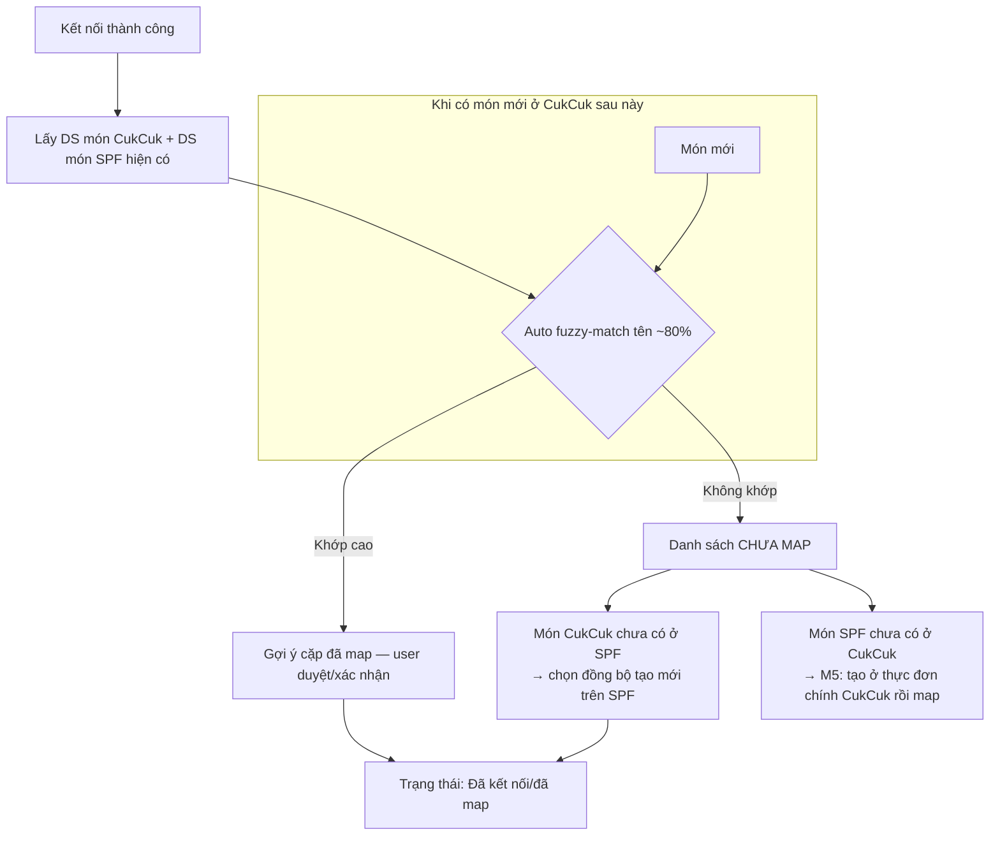

# Module 02 — Thiết lập & Đồng bộ Menu (CukCuk → ShopeeFood)

> Chiều đồng bộ: **1 chiều CukCuk → SPF** (F1). Nguồn: `[MAP]` (chuẩn trường), `[Q&A B,C,2906]`, `[API §3.5 Menu/§3.2 Dish/§3.3 Topping]`, `[XMIND]`, `[RESEARCH]`.

## 1. Nguyên tắc nền tảng
| # | Nguyên tắc | Nguồn |
|---|---|---|
| M1 | Menu đồng bộ **1 chiều** CukCuk→SPF. Sửa trên Partner App **không** kéo về CukCuk. | `[Q&A C.1, C.5]` |
| M2 | ⚠️ **Full-sync (`menu.sync`) có tính HỦY DIỆT**: món trên SPF **không** mang id CukCuk sẽ **bị XÓA → mất lượt bán/lịch sử**. | `[Q&A C.6]` |
| M3 | **Phải mapping trước khi đồng bộ.** | `[Q&A C.6, 2906-5]` |
| M4 | Giá món **đã gồm toàn bộ thuế/VAT** — không đồng bộ thuế riêng. SPF tính seller_tax trên subtotal. | `[Q&A 2906-1,2]` |
| M5 | Món chỉ có ở SPF, chưa có ở CukCuk → **KHÔNG tự tạo** ở CukCuk (user tự tạo ở thực đơn chính rồi map). | `[Q&A C.3]` |
| M6 | **Không hỗ trợ combo**; không phân loại món đặc biệt (đóng gói/cồn). | `[Q&A 2906-3,4]` |
| M7 | API menu cho phép **sync 1 hoặc nhiều món**, hoặc **toàn bộ menu** (`menu.sync`). | `[Q&A C.2]` |
| M8 | Đối tượng cần mapping: **nhóm món, món, nhóm topping (STPV), topping**. | `[Q&A 2906-5]` |
| M9 | Rate limit **25 QPS/IP** → throttle khi sync menu lớn. | `[API]` |
| M11 | Món **Prepaid SKU (Trùm Deal)**: không sửa được; sync **fail** nếu cố update → đợi hết CTKM. Món **CheapMeal (Ăn Ngon Rẻ)**: không sửa giá/thông tin/xóa (chỉ đổi status); xóa/bỏ-mapping món thường liên quan CheapMeal → sync **fail**. | `[API §3.5 Warning]` |
| M12 | Endpoint CukCuk cung cấp cho SPF GET menu: `{domain}/shopeefoodvn/getMenu?storeCode={partner_store_id}` theo **JSON template SPF** (dpaste.com/BZT43338J). Đồng thời CukCuk chủ động đẩy bằng `menu.sync` (POST /s2s/menu/sync → trả `task_id`). | `[API §3.5]` |

**Schema menu (đã có trong `[API §3.5]` — không cần hỏi SPF):**
| Đối tượng | Trường |
|---|---|
| categories | id (partner_dish_group_id) · name · sequence · Available Status (AVAILABLE/UNAVAILABLE) · sort_type (1 theo lượt bán / 2 theo thứ tự) |
| items | id (partner_dish_id) · name · Available Status (UNAVAILABLE = hết món) · description (≤500 ký tự) · sequence · price · photo |
| Topping Group | id · name · sequence · status · selectionRangeMin (min_quantity) · selectionRangeMax (max_quantity) |
| Topping | id · name · sequence · status · price |

## 2. Cơ chế mapping (DEC-MAP-01: auto fuzzy-match + user xác nhận)

**3 case mapping** `[XMIND]`:
| Case | Tình huống | Xử lý |
|---|---|---|
| C-A | Món có ở SPF **và** có ở CukCuk | Auto-fuzzy gợi ý → user xác nhận map → "Đã kết nối" |
| C-B | Món ở CukCuk, **chưa** có ở SPF | Chọn đồng bộ → SPF tạo mới → "Đã kết nối" |
| C-C | Món ở SPF, **chưa** có ở CukCuk | Không auto tạo (M5); user tạo ở thực đơn chính CukCuk rồi map |

### BR-MAP-01 — Cơ chế xác định "khớp ~80%" (auto fuzzy-match tên)

> Áp dụng khi: đồng bộ menu lần đầu và mỗi khi có món mới ở CukCuk. So khớp tên giữa DS món CukCuk ↔ DS món ShopeeFood. Áp dụng **tương tự** cho **nhóm món** và **nhóm sở thích phục vụ / topping**.

1. **Chuẩn hóa tên trước khi so** (cả 2 phía, để tránh lệch vặt):
   - Về chữ thường; gộp khoảng trắng thừa về 1; bỏ dấu câu và ký tự đặc biệt (`( ) - / , .` …); **bỏ dấu tiếng Việt** khi so (để "Cà phê sữa" khớp "Ca phe sua").
2. **Điểm giống** = độ tương đồng chuỗi giữa 2 tên đã chuẩn hóa, thang **0–100%**, **không phụ thuộc thứ tự từ** (so theo tập từ + ký tự). Thuật toán cụ thể (Levenshtein / token-set-ratio…) do dev chọn, miễn thỏa các case mục 4.
3. **Ngưỡng & hành vi:**
   - Điểm **≥ 80%** → **tự ghép cặp gợi ý** (trạng thái *Gợi ý — chờ chủ quán duyệt*).
   - Điểm **< 80%** → để món ở danh sách **Chưa map**.
4. **Xử lý nhập nhằng (bắt buộc):**
   - 1 món CukCuk khớp ≥80% với **nhiều** món SPF → chọn cặp **điểm cao nhất**.
   - Nếu có **≥2 cặp cùng điểm cao nhất** → **KHÔNG** tự ghép, đưa vào *Chưa map* cho chủ quán chọn (tránh ghép nhầm).
   - Mỗi món chỉ thuộc **1 cặp (1:1)**; đã ghép rồi không xét lại ở vòng sau.
5. **Bắt buộc chủ quán xác nhận:** gợi ý **không phải** chốt — chủ quán duyệt / bỏ / ghép lại thủ công. Chưa xác nhận thì **không đồng bộ** (gắn với cảnh báo hủy diệt M2).
6. **Ngưỡng 80% là cấu hình được** (mặc định 80%) — cho phép chỉnh khi vận hành thực tế thấy quá chặt/quá lỏng.

## 3. Cấu trúc màn hình "Thiết lập" (sau kết nối)
### Tab MENU
Cột hiển thị DS món: **Tên món · Giá bán SPF · Nhóm thực đơn · Trạng thái hết món** `[XMIND]`.
- Giá bán SPF: món từ SPF về → giá SPF; món từ thực đơn CukCuk → giá thực đơn.
- Nút **"Đồng bộ"** → ⚠️ **cảnh báo đỏ mạnh**: *"Các món chưa được mapping sẽ bị XÓA khỏi ShopeeFood và mất toàn bộ lượt bán/lịch sử. Tiếp tục?"* (M2).

Chi tiết/Edit món `[MAP]`, `[XMIND]`:
| Trường | Hành vi |
|---|---|
| Tên món | Mặc định lấy tên thực đơn, **cho sửa** tên hiển thị SPF |
| Nhóm thực đơn | **Disable** không cho sửa |
| Giá bán (gốc CukCuk) | **Disable** |
| Giá bán ShopeeFood | **Cho sửa** |
| Mô tả | Đồng bộ mô tả từ Menu offline |
| Trạng thái hết hàng | Toggle out-of-stock (M10) |
| Sở thích phục vụ (STPV) | Lấy nhóm STPV bán ở SPF; **chỉ xem, không sửa** từng STPV |

### Tab NHÓM MÓN
- DS nhóm hiển thị; **cho sửa tên + mô tả**; **cho sắp xếp thứ tự** → đồng bộ thứ tự lên SPF qua trường `sequence` + `sort_type` của categories `[API §3.5]`.

### Tab SỞ THÍCH PHỤC VỤ (Topping / STPV)
Mapping nhóm STPV + STPV `[MAP]`:
| CukCuk | ShopeeFood |
|---|---|
| ID nhóm STPV | Mã topping group |
| Tên nhóm STPV | Tên (đẩy theo ngôn ngữ SPF: VN/EN) |
| Giới hạn STPV = False | Không bắt buộc = True, số lượng tùy chọn mặc định = 1 |
| Giới hạn STPV = True | Bắt buộc = True; khoảng Min=1, Max=[số tối đa CukCuk đẩy] |
| STPV item | Tên |
| Thu thêm | Giá |
> Mapping xong nhóm STPV thì **liên kết món ↔ topping map tương ứng** `[MAP]`.

### Tab LỊCH TRÌNH (khung giờ bán)
- Cột: **Tên khung giờ · Nhóm món bán trong khung** `[XMIND]`.
- Thêm/xóa khung giờ; tên bắt buộc (trống → cảnh báo đỏ "Không được để trống").
- Chọn khung giờ hoạt động (từ giờ hoạt động ở Thiết lập) + chọn nhóm món áp dụng; 1 nhóm có thể ở nhiều khung; thứ tự nhóm theo sắp xếp ở Tab Nhóm món.

### Tab THIẾT LẬP
- **Giờ làm việc:** mặc định 08:00–22:00 mọi ngày; **tối đa 3 khung/ngày**, không trùng khoảng; "Cài đặt nhanh" áp 1 ngày cho cả tuần; trong giờ → đồng bộ mở cửa/nhận đơn, ngoài giờ → đóng `[XMIND]`.
- **Cài đặt ngày lễ:** mặc định off; bật → đặt trước ngày nghỉ `[XMIND]`.
- **Cài đặt đơn hàng** (chuyển sang Module 03):
  - ☑ **Tự động xác nhận Order** — DEC-CONFIRM-01: mặc định thủ công; nếu bật, đặt **X phút** (quá X phút chưa thao tác → tự xác nhận) + 2 lựa chọn: *Tất cả đơn* / *Chỉ đơn đã thanh toán*.
  - ☑ **Tự động gửi bếp/bar** (🆕 chốt 2026-07-24) — ngay khi đơn xác nhận → tự gửi bếp/bar + in tem bếp; tắt → nhân viên bấm *Gửi bếp/bar* thủ công.
  - ~~☑ Tự động in hóa đơn tạm tính~~ — **ĐÃ BỎ** (2026-07-24): tạm tính là nghiệp vụ đơn tại quán, không áp cho đơn ShopeeFood. Chi tiết: `specs/activity/activity-flows.md`.
- **🆕 Nút "Tạm ngưng bán online"** (DEC-PAUSE-01, U4): gọi **`set_restaurant_busy`** `[API §3.4]` (busy_reason_type: 1 hết món / 2 quá tải / 3 blackout) — đóng cửa tức thì, không đợi lịch. ⚠️ Lưu ý: SPF chỉ cho busy **tối đa đến 5h sáng hôm sau** bất kể start_date. Endpoint đã có, không cần hỏi SPF.
- **Giờ hoạt động** dùng **`set_operation_time_ranges`** / `get_operation_time_ranges` `[API §3.4]` (theo `day_of_week` hoặc `custom_date`, `is_closed`, mảng `time_ranges` open_time/close_time). Endpoint đã có.

## 4. Đồng bộ & kết quả (menu sync task)
- Sau khi bấm Đồng bộ → gọi menu.sync (toàn bộ) hoặc sync theo món.
- SPF xử lý bất đồng bộ → gọi lại **Menu Webhook** `/s2s/menu/sync/task/callback` với `task_id`, `task_status` (Pending/Processing/Success/Failed/Retry), số lượng success/deleted theo dish/catalog/option_group/option, và `failed_items_detail` `[API §4.2]`.
- UI hiển thị: đang đồng bộ → kết quả (thành công N món / lỗi M món kèm lý do).

## 5. Hết món / tạm ngừng bán (out-of-stock)
- M10: Hết món ở mức **item** = đặt Available Status **UNAVAILABLE** trong menu `[API §3.5]` (DishStatus: AVAILABLE=1, OUT_OF_STOCK=2, INACTIVE=3). Hết món/tạm ngưng ở mức **cả quán** = `set_restaurant_busy` (reason=1) `[API §3.4]`. `[Q&A C.10]` xác nhận có hỗ trợ — endpoint đã rõ.

## 6. Edge cases
| # | Tình huống | Xử lý |
|---|---|---|
| E1 | Bấm Đồng bộ khi còn món chưa map | Cảnh báo hủy diệt (M2) trước khi cho tiếp tục |
| E2 | Auto-fuzzy match sai cặp | User có thể bỏ liên kết / map lại thủ công |
| E3 | Xóa món ở CukCuk rồi sync | SPF xóa món tương ứng (call xóa 1 món hoặc full sync) `[Q&A C.8]` |
| E4 | Xóa món ở SPF (Partner App) | Không ảnh hưởng CukCuk; lần sync sau tạo lại trên SPF `[Q&A C.9]` |
| E5 | Menu SPF & CukCuk khác nhau | Ưu tiên dữ liệu **CukCuk** theo cơ chế M2/C-A `[Q&A C.7]` |
| E6 | Sync menu lớn vượt 25 QPS | Throttle/queue phía CukCuk |

## 7. Trạng thái làm rõ
✅ Toàn bộ luồng Menu **đã đủ dữ liệu từ nguồn** (`[API §3.5, §3.4]` + `[Q&A B, C]`) — **không còn câu hỏi chặn cho SPF**.
- Cần lấy về: **JSON template menu** của SPF (dpaste.com/BZT43338J) để dựng đúng schema endpoint `getMenu`. (Tài nguyên cần fetch, không phải câu hỏi.)
- Non-destructive: dùng **sync theo món** (đồng bộ 1/nhiều món) thay `menu.sync` toàn bộ để tránh xóa nhầm — đã rõ từ `[Q&A C.2, C.8]`, không cần hỏi.
