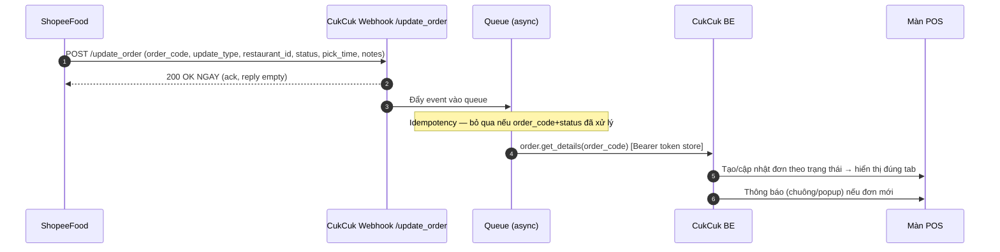
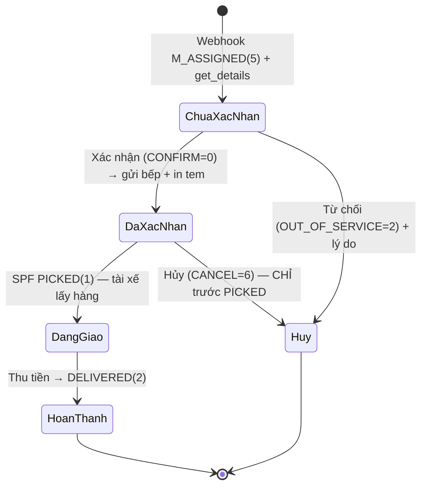

# Module 03 — Nhận & Xử lý Đơn tại POS (ShopeeFood → CukCuk)

> Nguồn: `[API §3.1 Order, §4.1 Order Webhook, §2 Status Machine]`, `[Q&A F, 2906-7]`, `[XMIND]` (luồng POS), `[RESEARCH]` (U2/U3/U5/U7).
> Enum tham chiếu:
> `OrderMerchantStatus` (SPF noti): M_ASSIGNED=5, M_RECEIVED=6, CONFIRMED=3, PICKED=1, DELIVERED=2, M_OUT_OF_SERVICE=7, CANCELLED=8, ASSIGNING_DRIVER=11.
> `OrderListStatus`: PROCESSING=1, COMPLETED=2, CANCELLED=3, CONFIRMED=4.
> `OrderUpdateStatus` (partner gửi): CONFIRM=0, OUT_OF_SERVICE=2, CANCEL=6.
> `RejectOrderReason`: WRONG_MENU=1, RESTAURANT_BUSY=2, RESTAURANT_CLOSES=3, WRONG_COMMISSION=4, CUSTOM=5.

## 1. Kiến trúc nhận tín hiệu (webhook → xử lý)

**Rule kiến trúc `[RESEARCH]` U3:**
- AR-01: **Ack 200 OK ngay**, xử lý nghiệp vụ **bất đồng bộ** qua queue (SPF `reply: empty`).
- AR-02: **Idempotency** — lưu (order_code + status) đã xử lý; SPF retry không tạo trùng.
- AR-03: **Trạng thái chỉ tiến, không lùi** — map một chiều theo status machine, chặn cập nhật ngược.
- AR-04: `update_type`: UPDATE_ORDER=1 (đổi bất kỳ field) / UPDATE_ORDER_STATUS=2 (chỉ đổi status). Cả 2 đều → gọi `order.get_details` lấy bản mới nhất.
- AR-05: Không gửi email báo đơn cho khách với đơn đồng bộ từ ShopeeFood `[XMIND]`.

## 2. Lưới an toàn — bù đơn miss (F3, bắt buộc)
Do SPF **không gửi lại** webhook đã miss `[Q&A F.9]`:
- SG-01: **Polling `order.get_list`** định kỳ **mỗi 2–5 phút** (theo status + khoảng thời gian; params `from_date`, `last_request`, `from_item_id`, `request_count`, `sort`).
- SG-02: Đối chiếu với đơn đã có trên POS; đơn nào SPF có mà POS chưa có → **tạo bù + cảnh báo thu ngân** (popup + log).
- SG-03: Tôn trọng rate limit **25 QPS/IP**.

## 3. Vòng đời đơn & màn hình POS

**4 tab danh sách** `[XMIND]`, `[API OrderListStatus]`:
| Tab | Gồm | Cột hiển thị |
|---|---|---|
| Chưa xác nhận | Đơn SPF mới về, chưa xác nhận | Mã ShopeeFood · Số món · Tổng tiền · Thời gian đặt |
| Đã xác nhận | Đơn đã xác nhận, đang xử lý (PROCESSING/CONFIRMED) | như trên |
| Hoàn thành | Đơn đã thu tiền / DELIVERED | như trên |
| Hủy | Đơn từ chối / hủy / SPF hủy | như trên + lý do |

- Màn thiết kế **unified có badge kênh "ShopeeFood"** (U7) — chừa khung mở rộng kênh, nhưng lần này chỉ ShopeeFood.
- Danh sách hiển thị bên trái, **chi tiết đơn bên phải** khi chọn dòng `[XMIND]`.

## 4. Chi tiết đơn & thao tác
**Thông tin đơn** `[XMIND]`, `[API order.get_details]`: Mã ShopeeFood, thời gian đặt, ghi chú; danh sách món (Tên · Đơn giá · SL · Thành tiền · ghi chú món), topping theo món.

**Thao tác theo trạng thái:**
| Trạng thái | Nút | Hành động |
|---|---|---|
| Chưa xác nhận | **Xác nhận** | CONFIRM=0 → sang Đã xác nhận, **gửi bếp + in tem/phiếu bếp (nội bộ)** |
| Chưa xác nhận | **Từ chối** | Popup lý do (RejectOrderReason) → OUT_OF_SERVICE → Hủy |
| Đã xác nhận | **Giao hàng** | In **phiếu giao nội bộ** (không phải bill SPF — F4). Chuyển nút thành "Thu tiền" |
| Đã xác nhận | **Hủy đơn** | ⛔ CHỈ bật khi **chưa PICKED** (F7); popup lý do |
| Đang giao | **Thu tiền** | Hình thức mặc định **ShopeeFood**; đánh dấu đã thanh toán (xem §6) |
| Sau thu tiền | — | Quy trình in hóa đơn/HĐĐT như đơn thường (hệ thống CukCuk) → Hoàn thành |

## 5. Auto-confirm & auto-print (DEC-CONFIRM-01)
- AC-01: Mặc định **thủ công**; nếu quá **~2 phút** không thao tác → **tự xác nhận** (fallback U2). Bật/tắt trong Cài đặt.
- AC-02: Nếu bật auto-confirm đầy đủ → 2 lựa chọn: **Tất cả đơn** / **Chỉ đơn đã thanh toán** `[XMIND]`.
- AP-01: **Tự động in hóa đơn tạm tính**: "Khi đơn xác nhận" (mặc định) / "Khi gửi bếp" `[XMIND]`.
- AP-02 (U5): Nhận **cancel event** → nếu đơn **đã in bếp** thì **tự in phiếu hủy** kèm mã đơn để bếp dừng nấu.

## 6. Thanh toán & "tiền" trên đơn ShopeeFood ⚠️
- PM-01: Đơn SPF — **nhà hàng gần như không trực tiếp thu tiền khách** (online: khách trả SPF trước, PAID; COD: tài xế thu hộ). Nút "Thu tiền" chỉ **đánh dấu đã thanh toán**, hình thức = ShopeeFood. Xem `customer-journey.md §3`.
- PM-02: Với đơn prepaid, lấy được **trạng thái đã thanh toán** để hiển thị `[Q&A 2206-6]`.
- PM-03: Trường "Còn phải thu" bản nháp đang tính **tiền khách phải trả** ≠ tiền nhà hàng nhận. **Cả 2 công thức đã được SPF xác nhận `[Q&A 22062026-Q5]` — không cần hỏi thêm:**
  - **(a) Tiền khách phải trả** = tiền món − KM + phí giao + phí áp dụng + tip + phí khác SPF → hiển thị **tham khảo**.
  - **(b) Tiền nhà hàng thực nhận** = **tiền món − KM quán tài trợ − commission − thuế (seller tax)** → chỉ số đối soát chính.
- PM-04: Nguồn field cho (b) trong `order.get_details`: `order_value`, `merchant_price` (đã trừ phần quán tài trợ món), `merchant_discount`/`total_merchant_discount` (tiền giảm **quán chịu** cả đơn), `commission_amount`, seller tax. **Không** dùng `customer_bill` (buyer-side, không trả cho merchant) `[Q&A 22062026-Q1, 1206-F.7]`.
- PM-05: Phí được trừ **trực tiếp trên từng đơn**, không đối soát riêng `[Q&A 1206-D.2]`. Field đối soát: Commission, Tax, KM gạch giá, Prepaid, CheapMeal `[Q&A 1206-D.6]`.

## 7. Thông báo
- NT-01: Đơn mới từ SPF → thông báo (chuông + popup) tương tự đơn Grab `[XMIND]`.
- NT-02: Bấm thông báo → mở chi tiết đơn đúng tab theo trạng thái hiện tại.

## 8. Edge cases
| # | Tình huống | Xử lý |
|---|---|---|
| E1 | Webhook đến nhưng get_details lỗi/timeout | Retry có backoff; nếu vẫn lỗi, polling (§2) sẽ bù |
| E2 | Nhận webhook trùng (SPF retry) | Idempotency AR-02 bỏ qua |
| E3 | Status về không đúng thứ tự | AR-03 chỉ tiến không lùi |
| E4 | Bấm Hủy sau khi tài xế đã PICKED | Nút bị disable (F7); nếu cần hủy → xử lý qua Partner App |
| E5 | SPF tự hủy (không tìm được tài xế / quán đóng cửa) | Đơn sang Hủy + AP-02 in phiếu hủy bếp |
| E6 | Đơn bị điều chỉnh phía SPF (B3) | Nếu có UPDATE_ORDER → get_details cập nhật lại (⚠️ chờ xác nhận B3) |
| E7 | POS sửa món trên đơn | Chỉ được sửa **tên món hiển thị cục bộ**; SL/giá/topping không sửa (F4, `[Q&A 2906-6]`) |

## 9. TODO chờ SPF (đã rút gọn sau khi rà kỹ nguồn)
- `SPF-B1` 🔴 **(mở thật)**: thời điểm thông tin tài xế về CukCuk — đã hỏi 29/06 nhưng SPF **chưa trả lời** → cần theo dõi để hiển thị shipper.

> Các mục trước đây liệt kê (A1, A2, B2, B3, B4, B5…) **đã có lời đáp** trong `[Q&A]`/`[API]` — xem PM-03/04/05, edit-order (E7), hủy (F7), polling (§2 dùng `order.get_list` sẵn có). Không hỏi lại.
