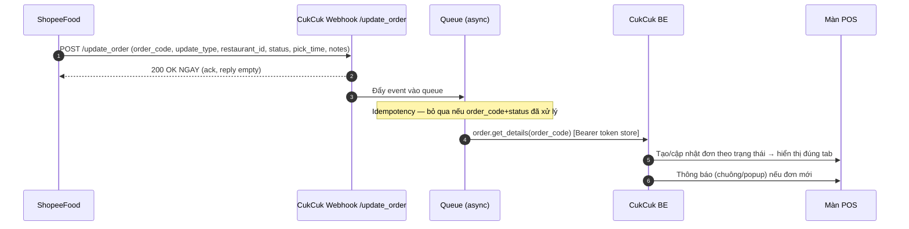

# Module 03 — Nhận & Xử lý Đơn tại POS (ShopeeFood → CukCuk)

> Nguồn: `[API §3.1 Order, §4.1 Order Webhook, §2 Status Machine]`, `[Q&A F, 2906-7]`, `[XMIND]` (luồng POS), `[RESEARCH]` (U2/U3/U5/U7).
> Enum tham chiếu (đã đối chiếu lại PDF `[API §2]` ngày 2026-07-25):
> `OrderMerchantStatus` (SPF noti): M_ASSIGNED=5, M_RECEIVED=6, CONFIRMED=3, PICKED=1, DELIVERED=2, M_OUT_OF_SERVICE=7, CANCELLED=8, ASSIGNING_DRIVER=11.
> **Status Machine (chuẩn API):** happy flow `M_ASSIGNED → M_RECEIVED → CONFIRMED → PICKED → DELIVERED`; hủy `M_ASSIGNED → M_RECEIVED → M_OUT_OF_SERVICE → CANCELLED`.
> `OrderListStatus`: PROCESSING=1, COMPLETED=2, CANCELLED=3, CONFIRMED=4.
> `OrderUpdateStatus` (partner gửi): CONFIRM=0, OUT_OF_SERVICE=2, CANCEL=6.
> `ConfirmMethod`: **MANUAL=1, AUTO=2** — bắt buộc gửi `AUTO=2` khi POS tự động xác nhận (AC-01).
> `ShippingMethod`: FOODY_DELIVERY=1, MERCHANT_DELIVERY=2, **CUSTOMER_PICKUP=3** (nhận diện đơn khách tự lấy).
> `MerchantPaidStatus`: UN_PAID=1, PAID=2, FAIL=3, REFUNDED=4.
>
> ⚠️ **ĐÍNH CHÍNH (2026-07-25)** — trước đây spec ghi nhầm "từ chối = 79/80/81". Thực tế là **hai bộ mã cho hai hành động khác nhau**:
> | Hành động | `status` gửi lên | Trường lý do | Giá trị hợp lệ |
> |---|---|---|---|
> | **Từ chối** đơn chưa xác nhận | `OUT_OF_SERVICE=2` | `reject_reasons.type` (`RejectOrderReason`) | WRONG_MENU=1 · RESTAURANT_BUSY=2 · RESTAURANT_CLOSES=3 · WRONG_COMMISSION=4 · CUSTOM=5 |
> | **Hủy** đơn đã xác nhận | `CANCEL=6` | `cancel_reasons.reason_ids[]` (lấy từ meta, **mảng**) | **79** Quán hết món · **80** Quán quá tải · **81** Quán đóng cửa |
>
> 🔴 UI draft `pos-order-shopeefood` đang dùng 79/80/81 cho **cả** màn Từ chối → **phải sửa**.

## 1. Kiến trúc nhận tín hiệu (webhook → xử lý)

**Rule kiến trúc `[RESEARCH]` U3:**
- AR-01: **Ack 200 OK ngay**, xử lý nghiệp vụ **bất đồng bộ** qua queue (SPF `reply: empty`).
- AR-02: **Idempotency** — lưu (order_code + status) đã xử lý; SPF retry không tạo trùng.
- AR-03: **Trạng thái chỉ tiến, không lùi** — map một chiều theo status machine, chặn cập nhật ngược.
- AR-04: `update_type`: UPDATE_ORDER=1 (đổi bất kỳ field) / UPDATE_ORDER_STATUS=2 (chỉ đổi status). Cả 2 đều → gọi `order.get_details` lấy bản mới nhất.
- AR-05: Không gửi email báo đơn cho khách với đơn đồng bộ từ ShopeeFood `[XMIND]`.

## 2. Lưới an toàn — bù đơn miss (F3, bắt buộc)
Do SPF **không gửi lại** webhook đã miss `[Q&A F.9]`:
- SG-01: **Polling `order.get_list`** định kỳ **mỗi 2–5 phút** (theo status + khoảng thời gian; params `from_date`, `last_request`, `from_item_id`, `request_count`, `sort`).
- SG-02: Đối chiếu với đơn đã có trên POS; đơn nào SPF có mà POS chưa có → **tạo bù + cảnh báo thu ngân** (popup + log).
- SG-03: Tôn trọng rate limit **25 QPS/IP**.
- 🆕 **SG-04 (UI)**: đơn được tạo bù phải gắn nhãn **"Đơn bù đồng bộ"** + popup cảnh báo thu ngân (không im lặng chèn vào danh sách).
- 🆕 **SG-05 (UI)**: POS hiển thị chỉ báo **"Mất kết nối ShopeeFood"** khi webhook/polling lỗi liên tiếp hoặc token bị thu hồi (TK6) — nếu không, nhân viên tưởng "hôm nay vắng đơn".

## 3. Vòng đời đơn & màn hình POS

```mermaid
stateDiagram-v2
    [*] --> ChuaXacNhan: Webhook M_ASSIGNED(5) + get_details
    ChuaXacNhan --> DangXuLy: Xác nhận (CONFIRM=0) → tạo order, tự gửi bếp/bar nếu bật + in tem
    ChuaXacNhan --> Huy: Từ chối (OUT_OF_SERVICE=2) + lý do (gồm hết món)
    DangXuLy --> Huy: Hủy (CANCEL=6) — CHỈ trước PICKED; đã gửi bếp → in phiếu hủy bếp
    DangXuLy --> DaXuLy: Đơn tài xế giao — tài xế lấy hàng (PICKED)
    DangXuLy --> HoanThanh: Đơn tự lấy — khách đến lấy tại quán = hoàn thành
    DaXuLy --> HoanThanh: Tài xế giao xong (DELIVERED) → hóa đơn + ghi doanh thu
    HoanThanh --> [*]
    Huy --> [*]
```

**5 tab danh sách** `[XMIND]`, `[API OrderListStatus]`:
| Tab | Gồm | Cột hiển thị |
|---|---|---|
| Chưa xác nhận | Đơn SPF mới về, chưa xác nhận (`M_ASSIGNED`) | Mã ShopeeFood · Số món · Tổng tiền · Thời gian đặt |
| Đang xử lý | Đã xác nhận, đang làm món (`CONFIRMED`) — gồm cả bước báo món xong | như trên |
| Đã xử lý | **Đơn tài xế giao** đã được tài xế lấy, đang giao (`PICKED`) | như trên |
| Hoàn thành | Đã giao xong (`DELIVERED`); đơn tự lấy: khách lấy xong vào thẳng đây | như trên |
| Hủy | Đơn từ chối / hủy / SPF hủy (`CANCELLED`) | như trên + lý do |

### 🆕 DEC-CHANNEL-01 — Tách kênh ShopeeFood (chốt 2026-07-25, BA)
> Thay cho phương án "unified 1 danh sách + badge kênh" (U7) trước đây.

- **Màn Order Online tách theo kênh**: ShopeeFood / Grab / (chừa khung kênh sau). Khớp chỉ đạo sếp `[Review #9]`.
- **Kênh ShopeeFood dùng bộ 5 tab riêng ở trên**, KHÔNG dùng chung bộ 3 tab (*Chưa xác nhận / Đã xác nhận / Đã hoàn thành*) của màn Order Online hiện hành — lý do: SPF có các trạng thái mà kênh cũ không có, đặc biệt:
  - `PICKED` (**tài xế đã lấy hàng**) — mốc **khóa nút Hủy** (F7), bắt buộc phải nhìn thấy được ở cấp tab chứ không chỉ badge trong dòng;
  - `CANCELLED` phải tách khỏi *Hoàn thành* vì cần hiển thị **lý do hủy** và kích hoạt **in phiếu hủy bếp** (AP-02).
- **Grab giữ nguyên 100% luồng + 3 tab cũ**, không đụng vào.
- Danh sách hiển thị bên trái, **chi tiết đơn bên phải** khi chọn dòng `[XMIND]`.
- **Không có tab "Đối tác giao hàng"** trong pane chi tiết đơn SPF (chốt 2026-07-25) — thông tin tài xế nhúng thẳng vào khối *Thông tin order*, kèm trạng thái **"Đang tìm tài xế"** khi SPF chưa gán (`ASSIGNING_DRIVER=11`).

## 4. Chi tiết đơn & thao tác
**Thông tin đơn** `[XMIND]`, `[API order.get_details]`: Mã ShopeeFood, thời gian đặt, ghi chú; danh sách món (Tên · Đơn giá · SL · Thành tiền · ghi chú món), topping theo món.

**Thao tác theo trạng thái:**
| Trạng thái | Nút | Hành động |
|---|---|---|
| Chưa xác nhận | **Xác nhận** | CONFIRM=0 → tạo order, sang **Đang xử lý**; nếu *tự động gửi bếp/bar* bật → tự **gửi bếp/bar + in tem** (tắt → nút *Gửi bếp/bar* thủ công) |
| Chưa xác nhận | **Từ chối** | `status=OUT_OF_SERVICE(2)` + `reject_reasons.type` ∈ **{1 sai thực đơn, 2 quán quá tải, 3 quán đóng cửa, 4 sai hoa hồng, 5 khác}** → sang **Hủy**. ⚠️ KHÔNG dùng 79/80/81 ở đây |
| Đang xử lý | **Bàn giao tài xế** / **Đã làm xong** | Món xong: đơn tài xế giao → *Bàn giao tài xế* (`order.ready` + in phiếu bàn giao mã rút gọn); đơn khách tự lấy → *Đã làm xong* (`order.ready`, khách đối chiếu mã) |
| Đang xử lý | **Hủy đơn** | ⛔ CHỈ bật khi **chưa PICKED** (F7). `status=CANCEL(6)` + `cancel_reasons.reason_ids[]` ∈ **{79 hết món, 80 quá tải, 81 đóng cửa}** (chọn được nhiều). Nếu có **79** → bắt buộc kèm `out_of_stock.dishes[]` (≥1 món + `from`/`to`). Đã gửi bếp → **in phiếu báo hủy bếp** (AP-02) |
| — | *(không có nút Thu tiền)* | Đơn ShopeeFood không thu tiền tại quầy. `DELIVERED` → **tự Hoàn thành + in hóa đơn/HĐĐT + ghi doanh thu**. Đơn tự lấy hoàn thành khi khách xác nhận / SPF auto sau ~60'. Trạng thái trả tiền chỉ hiển thị theo `pay_to_merchant.status`. |

### 🆕 BR-POS-01..04 — Khác biệt bắt buộc so với màn Order Online hiện hành
> Rút ra khi đối chiếu ảnh chụp sản phẩm thật (2026-07-24). Đây là **rule chặn**, không phải gợi ý.

| # | Rule | Lý do |
|---|---|---|
| BR-POS-01 | ⛔ **Ẩn/disable nút "Thêm món" và nút ✕ xóa món** trên chi tiết đơn ShopeeFood. POS chỉ được sửa **tên món hiển thị cục bộ**; SL/giá/topping **không** sửa | E7, F4, `[Q&A 2906-6]` |
| BR-POS-02 | ⛔ **Bỏ dòng "Còn phải thu"** với đơn SPF — con số này là *tiền khách trả SPF*, không phải tiền quán nhận → gây hiểu nhầm khi đối soát. Thay bằng **khối chỉ-đọc**: *Khách trả Shopee* / *Quán thực nhận (sau HH/thuế/KM)* + badge *Chờ đối soát / Đã nhận vào ví* | PM-01…PM-05 |
| BR-POS-03 | ⛔ **Ẩn nút "In tạm tính"** với đơn SPF — tạm tính là nghiệp vụ đơn tại quán | chốt 2026-07-24, `[Review T-B3]` |
| BR-POS-04 | POS **không có nút "Hoàn thành"** cho đơn khách tự lấy — hoàn thành do SPF chốt (khách xác nhận / auto ~60'). POS chỉ hiển thị trạng thái *Chờ khách đến lấy* + **Mã nhận đơn** | memory 2026-07-24 |

### 🆕 §4b — Hết món & các trường đi kèm `order.update`

> ⚠️ **ĐÍNH CHÍNH (2026-07-25)**: bản trước của mục này ghi *"Báo trễ = gửi `busy_info`, không đổi trạng thái đơn"* — **SAI**.
> Đọc lại schema `order.update`: `busy_info` là **object con của `reject_reasons`**, cùng cấp với `out_of_stock` / `price_updates` / `custom_note`.
> Nó là **chi tiết đi kèm khi TỪ CHỐI/HỦY** với lý do *quán quá tải*, **không phải** thao tác giữ đơn lại và báo khách chờ thêm.
> Nút "Báo trễ" đã bị **gỡ khỏi prototype POS**.

| Thao tác | Payload | Ghi chú UI |
|---|---|---|
| **Hết món** (là một nhánh của **Hủy đơn**, không phải nút riêng) | `cancel_reasons.reason_ids=[79]` + `out_of_stock.dishes[]` (mỗi món: `order_dish_id`, `dish_id`, **`from`**, **`to`**) và/hoặc `out_of_stock.toppings[]` | Chọn lý do *Quán hết món* trong màn Hủy đơn → hiện danh sách món + khoảng giờ hết. ⚠️ **Hủy CẢ đơn**, không bỏ được từng món |
| **(kèm theo khi hủy vì quá tải)** | `reject_reasons.busy_info` = `{ total_minute, from, to }` | Chỉ là mô tả "quán bận trong bao lâu" gửi kèm lý do hủy — không có UI riêng |
| **(tham khảo)** | `reject_reasons.price_updates` cho phép đề xuất **cập nhật giá** món/topping khi từ chối | Chưa đưa vào phạm vi lần này — ghi nhận để BPMN "khách đổi món/giá" |

**Không có endpoint nào cho nghiệp vụ "đơn này sẽ chậm, giữ đơn và báo khách chờ thêm".** Hai thứ gần nhất, đều khác việc:
| Thứ có thật | Là gì | Thuộc đâu |
|---|---|---|
| `pick_time` (trong `order.update`) | Giờ tài xế đến lấy hàng. Schema cho phép gửi, nhưng **tài liệu không nói merchant có quyền đẩy giờ mới** | → `SPF-B2` 🔴 câu hỏi mở |
| `restaurant.set_restaurant_busy` | Tạm ngưng nhận đơn **cả quán** (1 hết món / 2 quá tải / 3 mất điện), tối đa đến 5h sáng hôm sau | Màn Thiết lập bên web BE — Module 02, không phải thao tác trên 1 đơn |

## 5. Auto-confirm & auto-print (DEC-CONFIRM-01)
- AC-01: Mặc định **thủ công**; nếu bật *tự động xác nhận*, đặt **X phút** — quá X phút chưa thao tác → **tự xác nhận** (fallback U2). Tắt → chờ nhân viên xử lý.
- AC-02: Nếu bật auto-confirm → 2 lựa chọn: **Tất cả đơn** / **Chỉ đơn đã thanh toán** `[XMIND]`.
- AP-01: **🆕 Tự động gửi bếp/bar** (chốt 2026-07-24): ngay khi đơn xác nhận → tự gửi bếp/bar + in tem bếp; tắt → nhân viên bấm *Gửi bếp/bar*. (Thay cho ~~Tự động in hóa đơn tạm tính~~ — **đã bỏ**: tạm tính là nghiệp vụ đơn tại quán, không áp cho đơn ShopeeFood.)
- AP-02 (U5): Nhận **cancel event** → nếu đơn **đã gửi bếp (đã in tem)** thì **tự in phiếu hủy** kèm mã đơn để bếp dừng nấu.
- 🆕 **AC-03**: khi POS tự xác nhận → `order.update` phải gửi **`confirm_method = AUTO(2)`**; nhân viên bấm tay → **`MANUAL(1)`** (mặc định). Giúp SPF và báo cáo phân biệt được nguồn xác nhận.
- 🆕 **AC-04 (UI)**: bật auto-confirm → thẻ đơn ở tab *Chưa xác nhận* hiện **đồng hồ đếm ngược X phút**; hết giờ đơn tự chuyển sang *Đang xử lý* kèm badge **"Tự động xác nhận"** để thu ngân biết mình không bấm.
- 🆕 **AP-03 (UI)**: khi *Tự động gửi bếp/bar* **tắt** → chi tiết đơn phải có nút **"Gửi bếp/bar"** thủ công; sau khi gửi, đơn mang trạng thái **"Đã gửi bếp"** (đây là điều kiện kích hoạt AP-02 — không có trạng thái này thì không biết có phải in phiếu hủy hay không).

## 6. Thanh toán & "tiền" trên đơn ShopeeFood ⚠️
- PM-01: Đơn SPF — **nhà hàng gần như không trực tiếp thu tiền khách** (online: khách trả SPF trước, PAID; COD: tài xế thu hộ). Nút "Thu tiền" chỉ **đánh dấu đã thanh toán**, hình thức = ShopeeFood. Xem `customer-journey.md §3`.
- PM-02: Với đơn prepaid, lấy được **trạng thái đã thanh toán** để hiển thị `[Q&A 2206-6]`.
- PM-03: Trường "Còn phải thu" bản nháp đang tính **tiền khách phải trả** ≠ tiền nhà hàng nhận. **Cả 2 công thức đã được SPF xác nhận `[Q&A 22062026-Q5]` — không cần hỏi thêm:**
  - **(a) Tiền khách phải trả** = tiền món − KM + phí giao + phí áp dụng + tip + phí khác SPF → hiển thị **tham khảo**.
  - **(b) Tiền nhà hàng thực nhận** = **tiền món − KM quán tài trợ − commission − thuế (seller tax)** → chỉ số đối soát chính.
- PM-04: Nguồn field cho (b) trong `order.get_details`: `order_value`, `merchant_price` (đã trừ phần quán tài trợ món), `merchant_discount`/`total_merchant_discount` (tiền giảm **quán chịu** cả đơn), `commission_amount`, seller tax. **Không** dùng `customer_bill` (buyer-side, không trả cho merchant) `[Q&A 22062026-Q1, 1206-F.7]`.
- PM-05: Phí được trừ **trực tiếp trên từng đơn**, không đối soát riêng `[Q&A 1206-D.2]`. Field đối soát: Commission, Tax, KM gạch giá, Prepaid, CheapMeal `[Q&A 1206-D.6]`.

## 7. Thông báo
- NT-01: Đơn mới từ SPF → thông báo (chuông + popup) tương tự đơn Grab `[XMIND]`.
- NT-02: Bấm thông báo → mở chi tiết đơn đúng tab theo trạng thái hiện tại.
- 🆕 **NT-03 (T-B1/T-B2 — "không được miss đơn")**: còn đơn SPF chưa mở → **chuông kêu + tab *Chưa xác nhận* nhấp nháy liên tục**, kể cả khi nhân viên đang ở tab *Order* / *Sơ đồ*. Chỉ tắt khi đơn đó được mở ra xem.
- 🆕 **NT-04 (Review #10 — "focus vào Món")**: mở đơn từ thông báo → tự **cuộn tới danh sách Món + highlight ~2s**, vì việc đầu tiên của nhân viên là đọc món để làm, không phải đọc thông tin khách.

## 8. Edge cases
| # | Tình huống | Xử lý |
|---|---|---|
| E1 | Webhook đến nhưng get_details lỗi/timeout | Retry có backoff; nếu vẫn lỗi, polling (§2) sẽ bù |
| E2 | Nhận webhook trùng (SPF retry) | Idempotency AR-02 bỏ qua |
| E3 | Status về không đúng thứ tự | AR-03 chỉ tiến không lùi |
| E4 | Bấm Hủy sau khi tài xế đã PICKED | Nút bị disable (F7); nếu cần hủy → xử lý qua Partner App |
| E5 | SPF tự hủy (không tìm được tài xế / quán đóng cửa) | Đơn sang Hủy + AP-02 in phiếu hủy bếp |
| E6 | Đơn bị điều chỉnh phía SPF (B3) | Nếu có UPDATE_ORDER → get_details cập nhật lại (⚠️ chờ xác nhận B3) |
| E7 | POS sửa món trên đơn | Chỉ được sửa **tên món hiển thị cục bộ**; SL/giá/topping không sửa (F4, `[Q&A 2906-6]`) → ẩn "Thêm món"/✕ (BR-POS-01) |
| 🆕 E8 | Báo hết món nhưng chưa chọn món nào | Chặn gửi — API bắt buộc `out_of_stock.dishes[]` ≥1 khi `reason_id=79` |
| 🆕 E9 | `order.ready` gọi lại lần 2 / gọi khi đơn đã PICKED, DELIVERED, CANCELLED | API trả lỗi (*"Unable to update picked/delivered/canceled/ready orders"*) → disable nút sau lần bấm đầu, hiện thông báo thay vì retry |
| 🆕 E10 | Gọi API quá dày | `error_reach_notify_limit` / `error_wait_notify_delay` → throttle phía POS, không cho bấm liên tiếp |

## 9. TODO chờ SPF (đã rút gọn sau khi rà kỹ nguồn)
- `SPF-B1` 🔴 **(mở thật)**: thời điểm thông tin tài xế về CukCuk — đã hỏi 29/06 nhưng SPF **chưa trả lời** → cần theo dõi để hiển thị shipper.

> Các mục trước đây liệt kê (A1, A2, B2, B3, B4, B5…) **đã có lời đáp** trong `[Q&A]`/`[API]` — xem PM-03/04/05, edit-order (E7), hủy (F7), polling (§2 dùng `order.get_list` sẵn có). Không hỏi lại.
> ✅ Mâu thuẫn enum lý do từ chối/hủy **đã gỡ** ngày 2026-07-25 bằng cách tra thẳng `[API §2 + order.update]` — không phải câu hỏi cho SPF.

---

## 10. 🆕 Phạm vi prototype POS (chốt 2026-07-25)

**Bắt đầu từ lúc đơn ShopeeFood đổ về** — không dựng đăng nhập server / mở ca / order tại bàn / sơ đồ phòng bàn.

| Hạng mục | Quyết định |
|---|---|
| Nền dựng | Giữ `Docs/UI/pos-order-shopeefood` (màn Order Online đứng riêng) |
| Vẫn giữ | Dải header POS (**Order · Sơ đồ · Order Online**) — **bắt buộc**, vì cần nó để demo NT-03 (nhân viên đang ở tab khác, tab *Order Online* nhấp nháy) |
| Không dựng | `Docs/UI/remix_-[hangpt]-onboarding-pc-offline-3.0` (app POS đầy đủ: login → mở ca → order → tính tiền → HĐĐT). Tab *Order Online* của bản này đang rỗng — để dành cho lần ghép thật |
| Gỡ trước khi demo | Nút demo **"⚡ Giả lập Shopee sửa đơn"** → chuyển vào panel demo riêng, không nằm cùng hàng nút nghiệp vụ |

### Checklist gap phải vá trong prototype
| | Hạng mục | Rule |
|---|---|---|
| 🔴 | Tách kênh + 5 tab riêng cho ShopeeFood | DEC-CHANNEL-01 |
| 🔴 | Sửa mã lý do: Từ chối = 1–5, Hủy = 79/80/81 | §4 |
| 🔴 | Nút "Gửi bếp/bar" thủ công + trạng thái *Đã gửi bếp* | AP-03 |
| 🔴 | In phiếu hủy bếp khi hủy đơn đã gửi bếp | AP-02 |
| 🔴 | Đơn bù đồng bộ + cảnh báo thu ngân | SG-04 |
| 🟡 | Đếm ngược X phút + badge *Tự động xác nhận* | AC-04 |
| 🟡 | Khối tài xế trong *Thông tin order* + trạng thái *Đang tìm tài xế* | DEC-CHANNEL-01 |
| 🟡 | Bỏ "Thêm món"/✕, bỏ "Còn phải thu", ẩn "In tạm tính" | BR-POS-01…03 |
| 🟡 | Đơn tự lấy: *Chờ khách đến lấy* + Mã nhận đơn, không có nút Hoàn thành | BR-POS-04 |
| 🟡 | Chỉ báo *Mất kết nối ShopeeFood* | SG-05 |
| 🟢 | Đổi nhãn nút SPF **"GIAO HÀNG" → "Bàn giao tài xế"** (hành vi = `order.ready` + in tem bàn giao) | glossary |
| 🟢 | Thống nhất tên trạng thái: dùng **"Đang xử lý"** (không dùng "Đã xác nhận") | glossary, T-A4 |
| 🟢 | Báo hết món: bổ sung chọn khoảng thời gian `from`/`to` | §4b |
