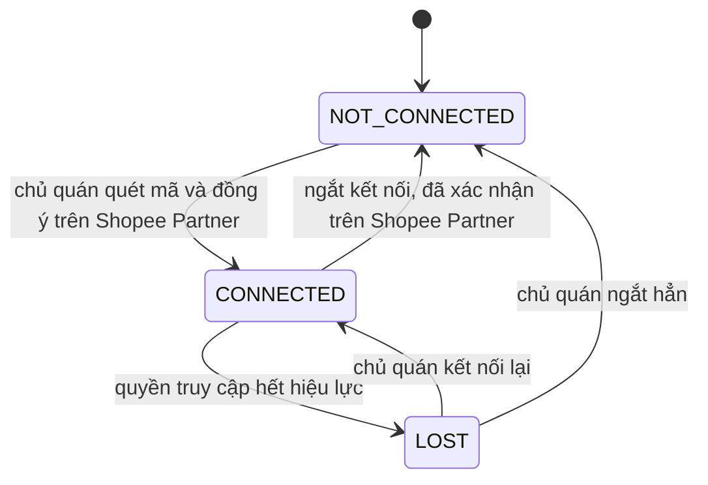

# Web BE — Tích hợp ShopeeFood — Dữ liệu

> Bảng mã, hằng số, vai trò dùng chung đã định nghĩa ở [`registry/`](../../registry/catalogs.md) — ⛔ không chép giá trị vào đây.

## Thực thể: StoreConnection

Liên kết giữa một nhà hàng CukCuk và một gian hàng ShopeeFood. Sinh ra khi chủ quán kết nối thành công; sống tới khi ngắt kết nối. Hợp đồng dùng chung: [`entities.md#StoreConnection`](../../registry/entities.md#StoreConnection).

| Trường | Kiểu | Bắt buộc | Kiểm tra hợp lệ |
|-------|------|----------|------------|
| `restaurantId` | Mã nhà hàng CukCuk | Có | VAL-WBE-01 |
| `shopeeStoreId` | Mã gian hàng ShopeeFood | Có | VAL-WBE-01 |
| `shopeeStoreName` | Chữ | Có | Lấy từ ShopeeFood, chỉ đọc |
| `accountName` | Chữ | Có | Tài khoản Shopee Partner đã cấp quyền |
| `status` | Danh sách chọn | Có | `NOT_CONNECTED` / `CONNECTED` / `LOST` |
| `connectedAt` | Ngày giờ | Không | Trống khi chưa kết nối |

### Máy trạng thái

| Trạng thái | Ý nghĩa | Chuyển tiếp sang |
|--------|---------|----------------|
| `NOT_CONNECTED` | Chưa kết nối gian hàng nào | `CONNECTED` |
| `CONNECTED` | Đang kết nối, đơn về bình thường | `NOT_CONNECTED`, `LOST` |
| `LOST` | Mất kết nối — đơn mới **không** về nữa, phải hiện chỉ báo | `CONNECTED`, `NOT_CONNECTED` |

## Thực thể: MenuMapping

Cặp ghép nối giữa một đối tượng ShopeeFood và một đối tượng CukCuk. Hợp đồng dùng chung: [`entities.md#MenuMapping`](../../registry/entities.md#MenuMapping).

| Trường | Kiểu | Bắt buộc | Kiểm tra hợp lệ |
|-------|------|----------|------------|
| `objectType` | Danh sách chọn | Có | Giá trị theo [CAT-MAP-OBJECT](../../registry/catalogs.md#CAT-MAP-OBJECT) |
| `shopeeObjectId` | Mã | Có | VAL-WBE-02 |
| `cukcukObjectId` | Mã | Không | Trống = chưa ghép |
| `matchedBySystem` | Đúng/Sai | Có | Đúng = hệ thống tự ghép, phải hiện dấu hiệu trên dòng |

| Trạng thái | Ý nghĩa | Chuyển tiếp sang |
|--------|---------|----------------|
| `UNMAPPED` | Chưa có đối tượng CukCuk tương ứng — hiển thị hai gạch ngang | `MAPPED` |
| `MAPPED` | Đã ghép | `UNMAPPED` (bấm nút xoá ghép nối trên dòng) |

## Thực thể: ShopeeDish

Món bán trên gian hàng ShopeeFood. Hợp đồng dùng chung: [`entities.md#ShopeeDish`](../../registry/entities.md#ShopeeDish).

| Trường | Kiểu | Bắt buộc | Kiểm tra hợp lệ |
|-------|------|----------|------------|
| `name` | Chữ | Có | VAL-WBE-03 |
| `dishGroup` | Danh sách chọn | Có | VAL-WBE-04 — lấy theo món đã chọn bên CukCuk |
| `unit` | Chữ | Không | Lấy theo món bên CukCuk, chỉ đọc |
| `basePrice` | Số tiền | Không | Giá bán tại quán, lấy theo món bên CukCuk, chỉ đọc |
| `shopeePrice` | Số tiền | **Có** | Giá bán riêng cho kênh ShopeeFood |
| `description` | Chữ dài | Không | VAL-WBE-06 |
| `status` | Danh sách chọn | Có | Giá trị theo [CAT-DISH-STATUS](../../registry/catalogs.md#CAT-DISH-STATUS) |
| `photo` | Tệp ảnh | Không | VAL-WBE-07 |
| `promoType` | Danh sách chọn | Không | Giá trị theo [CAT-PROMO-TYPE](../../registry/catalogs.md#CAT-PROMO-TYPE); trống = món thường |
| `hasUnsyncedChange` | Đúng/Sai | Có | Đúng → hiện dấu hiệu *Có thay đổi chưa đồng bộ* |

## Thực thể: ToppingGroup

Nhóm sở thích phục vụ đẩy lên ShopeeFood.

| Trường | Kiểu | Bắt buộc | Kiểm tra hợp lệ |
|-------|------|----------|------------|
| `name` | Chữ | Có | Không được để trống |
| `isRequired` | Danh sách chọn | Có | *Có* = khách bắt buộc phải chọn; *Không* = khách tuỳ chọn |
| `maxQuantity` | Danh sách chọn + Số | Có | VAL-WBE-08 |
| `status` | Danh sách chọn | Có | `Sử dụng` / `Ngừng sử dụng` / `Ẩn` |

> 📌 `isRequired` và `maxQuantity` đặt ở **cấp nhóm**, dùng chung cho mọi món. ShopeeFood cho phép đặt riêng theo từng món nhưng CukCuk **chủ động không dùng** — xem [D-WBE-10](decisions.md#D-WBE-10).

## Thực thể: OperatingHours

Giờ mở cửa của quán trên kênh ShopeeFood. Mỗi bản ghi là một ngày trong tuần.

| Trường | Kiểu | Bắt buộc | Kiểm tra hợp lệ |
|-------|------|----------|------------|
| `dayOfWeek` | Danh sách chọn | Có | Thứ 2 … Chủ nhật |
| `isOpen` | Danh sách chọn | Có | *Mở cửa* / *Đóng cửa* |
| `timeRanges` | Danh sách khoảng giờ | Có khi *Mở cửa* | VAL-WBE-09, VAL-WBE-10, VAL-WBE-11 |

Mặc định mọi ngày: *Mở cửa*, một khoảng `08:00–22:00`.

## Thực thể: HolidayPeriod

Kỳ nghỉ lễ / nghỉ tạm thời đặt trước theo ngày cụ thể. Dùng cho ngày nghỉ **không lặp lại**; nghỉ cố định hằng tuần thì đặt *Đóng cửa* ở `OperatingHours`.

| Trường | Kiểu | Bắt buộc | Kiểm tra hợp lệ |
|-------|------|----------|------------|
| `name` | Chữ | Có | Ví dụ: *Tết Nguyên Đán* |
| `fromDate` | Ngày | Có | VAL-WBE-12 |
| `toDate` | Ngày | Có | VAL-WBE-12 |

## Thực thể: BusyPeriod

Lượt tạm ngừng nhận đơn đang có hiệu lực.

| Trường | Kiểu | Bắt buộc | Kiểm tra hợp lệ |
|-------|------|----------|------------|
| `startAt` | Ngày giờ | Có | VAL-WBE-13 |
| `endAt` | Ngày giờ | Có | VAL-WBE-14 |
| `reason` | Danh sách chọn | Không với chủ quán, **có** với ShopeeFood | Giá trị theo [CAT-BUSY-REASON](../../registry/catalogs.md#CAT-BUSY-REASON); để trống thì hệ thống tự gán *Quán quá tải* |

## Ràng buộc kiểm tra hợp lệ

### VAL-WBE-01: Một gian hàng ↔ một nhà hàng
- **Constraint**: Cặp `restaurantId`–`shopeeStoreId` phải là 1–1. Gian hàng đã liên kết nhà hàng CukCuk khác thì không cho nối.
- **Applies to**: `StoreConnection.shopeeStoreId`
- **On violation**: `MSG_WBE_CONN_TAKEN` — *"Gian hàng ShopeeFood này đã liên kết với nhà hàng **{tên nhà hàng}** trên MISA CukCuk. Ngắt kết nối ở quán đó trước rồi thực hiện lại."*

### VAL-WBE-02: Ghép nối không được trùng đối tượng
- **Constraint**: Một `cukcukObjectId` chỉ được xuất hiện ở **đúng một** `MenuMapping` trong cùng `objectType`.
- **Applies to**: `MenuMapping.cukcukObjectId`
- **On violation**: `MSG_WBE_MAP_DUP` — *"Món này đã được ghép với **{tên món ShopeeFood}**. Mỗi món chỉ được ghép một lần."*

### VAL-WBE-03: Độ dài tên món
- **Constraint**: Bắt buộc nhập, tối đa [CONST-DISH-NAME-MAX](../../registry/catalogs.md#CONST-DISH-NAME-MAX).
- **Applies to**: `ShopeeDish.name`
- **On violation**: `MSG_WBE_MENU_NAME_LONG` — *"Tên món không được vượt quá 60 ký tự"*

### VAL-WBE-04: Món phải thuộc một nhóm thực đơn
- **Constraint**: `dishGroup` không được để trống. Món chưa thuộc nhóm nào thì bắt buộc chọn nhóm trước khi ghép nối và trước khi đồng bộ.
- **Applies to**: `ShopeeDish.dishGroup`
- **On violation**: `MSG_WBE_MAP_NO_GROUP` — *"Món cần thuộc một nhóm thực đơn cụ thể trước khi ghép. Bạn có muốn cập nhật món ngay không?"* — nút **Để sau** / **Chỉnh sửa**

### VAL-WBE-05: Định nghĩa món Không hợp lệ
- **Constraint**: Một món bị coi là **Không hợp lệ** nếu thoả **bất kỳ** điều nào: (a) chưa thuộc nhóm thực đơn nào; (b) có sở thích phục vụ chưa thuộc nhóm nào; (c) tên vượt [CONST-DISH-NAME-MAX](../../registry/catalogs.md#CONST-DISH-NAME-MAX) hoặc mô tả vượt [CONST-DISH-DESC-MAX](../../registry/catalogs.md#CONST-DISH-DESC-MAX).
- **Applies to**: `ShopeeDish` — dùng ở [BR-WBE-18](rules.md#BR-WBE-18)
- **On violation**: `MSG_WBE_SYNC_INVALID` — *"Bạn chỉ có thể đồng bộ lên ShopeeFood các món hợp lệ. Các món không hợp lệ vui lòng vào danh sách Thực đơn để chỉnh sửa. Bạn có muốn tiếp tục không?"* — nút **Có** / **Không**

### VAL-WBE-06: Độ dài mô tả món
- **Constraint**: Không bắt buộc nhập, tối đa [CONST-DISH-DESC-MAX](../../registry/catalogs.md#CONST-DISH-DESC-MAX).
- **Applies to**: `ShopeeDish.description`
- **On violation**: `MSG_WBE_MENU_DESC_LONG` — *"Mô tả món không được vượt quá 250 ký tự"*

### VAL-WBE-07: Định dạng ảnh món
- **Constraint**: Chỉ nhận tệp `.jpg` `.jpeg` `.png` `.gif`.
- **Applies to**: `ShopeeDish.photo`
- **On violation**: `MSG_WBE_MENU_PHOTO_TYPE` — *"Chỉ chọn được ảnh có định dạng .jpg, .jpeg, .png, .gif"*

### VAL-WBE-08: Số lượng sở thích phục vụ được chọn
- **Constraint**: Chọn *1 loại* hoặc *Nhiều loại*. Chọn *Nhiều loại* thì **bắt buộc nhập** số lượng tối đa, phải là số nguyên ≥ 2.
- **Applies to**: `ToppingGroup.maxQuantity`
- **On violation**: `MSG_WBE_MENU_MAXQTY` — *"Vui lòng nhập số lượng tối đa được chọn"*

### VAL-WBE-09: Số khung giờ tối đa mỗi ngày
- **Constraint**: Mỗi ngày tối đa [CONST-MAX-TIMERANGE](../../registry/catalogs.md#CONST-MAX-TIMERANGE) khung giờ.
- **Applies to**: `OperatingHours.timeRanges`
- **On violation**: `MSG_WBE_SET_MAX_RANGE` — *"Tối đa 3 khung giờ hoạt động cho mỗi ngày!"*

### VAL-WBE-10: Phải có ít nhất một khung giờ
- **Constraint**: Ngày đặt *Mở cửa* phải có ít nhất một khung giờ.
- **Applies to**: `OperatingHours.timeRanges`
- **On violation**: `MSG_WBE_SET_MIN_RANGE` — *"Cần ít nhất 1 khung giờ hoạt động!"*

### VAL-WBE-11: Khung giờ trong cùng ngày không được trùng nhau
- **Constraint**: Hai khung giờ của cùng một ngày ⛔ không được chồng lấn. Giờ kết thúc phải sau giờ bắt đầu.
- **Applies to**: `OperatingHours.timeRanges`
- **On violation**: `MSG_WBE_SET_OVERLAP` — *"Các khung giờ trong cùng một ngày không được trùng nhau"*

### VAL-WBE-12: Khoảng ngày của kỳ nghỉ
- **Constraint**: `toDate` phải ≥ `fromDate`. Tên kỳ nghỉ không được để trống.
- **Applies to**: `HolidayPeriod`
- **On violation**: `MSG_WBE_SET_HOLIDAY_RANGE` — *"Đến ngày phải sau hoặc bằng Từ ngày"*

### VAL-WBE-13: Thời gian bắt đầu tạm ngừng
- **Constraint**: `startAt` phải **sau** thời điểm hiện tại.
- **Applies to**: `BusyPeriod.startAt`
- **On violation**: `MSG_WBE_BUSY_PAST` — *"Vui lòng chọn thời gian bắt đầu sau thời gian hiện tại"*

### VAL-WBE-14: Thời gian kết thúc tạm ngừng
- **Constraint**: `endAt` vượt [CONST-BUSY-CUTOFF](../../registry/catalogs.md#CONST-BUSY-CUTOFF) thì **vẫn cho chọn** nhưng phải báo trước cho chủ quán biết là ShopeeFood sẽ tự mở lại sớm hơn.
- **Applies to**: `BusyPeriod.endAt`
- **On violation**: `MSG_WBE_BUSY_CUTOFF` — *"ShopeeFood sẽ tự mở nhận đơn lại từ 5 giờ sáng mai theo giờ mở cửa của quán."*

### VAL-WBE-15: Phải chọn dòng trước khi bấm Sửa
- **Ràng buộc**: Nút *Sửa* chỉ chạy khi đã chọn **đúng một** dòng trong bảng.
- **Áp cho**: màn Quản lý thực đơn, phần Thực đơn
- **Khi vi phạm**: `MSG_WBE_MENU_PICK_EDIT` — *"Vui lòng chọn 1 món để sửa"*

### VAL-WBE-16: Phải chọn dòng trước khi bấm Xoá
- **Ràng buộc**: Nút *Xoá* chỉ chạy khi đã chọn ít nhất một dòng.
- **Áp cho**: màn Quản lý thực đơn, phần Thực đơn
- **Khi vi phạm**: `MSG_WBE_MENU_PICK_DEL` — *"Vui lòng chọn món để xóa"*

### VAL-WBE-17: Dấu hiệu có thay đổi chưa đồng bộ
- **Ràng buộc**: Món có `hasUnsyncedChange` = Đúng thì màn Quản lý thực đơn **phải** hiện dấu hiệu, để chủ quán biết thay đổi chưa tới tay khách.
- **Áp cho**: `ShopeeDish.hasUnsyncedChange`
- **Khi vi phạm**: *(không phải lỗi — đây là chỉ báo)* `MSG_WBE_MENU_UNSYNCED` — *"Có thay đổi chưa đồng bộ"*

## Màn hình và trường dữ liệu

### Sửa Món ăn (màn phủ, 2 thẻ)

**Tác nhân**: [ROLE-OWNER](../../registry/rbac.md#ROLE-OWNER) · **Vào bằng**: nút *Sửa* trên màn Quản lý thực đơn, phần Thực đơn.

> 📌 Dùng chung màn chỉnh sửa thực đơn hiện hành của MISA CukCuk, ⛔ không dựng màn riêng.

**Thẻ *Thông tin chung***

| Trường | Kiểu | Sửa được | Bắt buộc | Ghi chú |
|-------|------|----------|-----------|-------|
| Tên món | Chữ | Có | **Có** | VAL-WBE-03 |
| Nhóm thực đơn | Danh sách chọn | Có | Có | VAL-WBE-04 |
| Đơn vị tính | Chữ | Không | — | Lấy theo món bên CukCuk |
| Giá bán | Số tiền | Không | — | Giá tại quán, lấy theo món bên CukCuk |
| Giá bán ShopeeFood | Số tiền | Có | **Có** | Lưu nháp — xem [BR-WBE-14](rules.md#BR-WBE-14) |
| Mô tả | Chữ dài | Có | Không | VAL-WBE-06 |
| Trạng thái món | Danh sách chọn | Có | Có | [CAT-DISH-STATUS](../../registry/catalogs.md#CAT-DISH-STATUS) — đúng 2 giá trị |
| Ảnh đại diện | Tệp ảnh | Có | Không | VAL-WBE-07 · nút chọn ảnh và nút xoá ảnh |

**Thẻ *Sở thích phục vụ*** — bảng 3 cột `Sở thích phục vụ` · `Nhóm sở thích phục vụ` · `Thu thêm`. Ba thông tin này lấy theo món đã chọn bên CukCuk: ⛔ không cho sửa nội dung, chỉ cho **thêm dòng** và **xoá dòng**. Món có sở thích phục vụ chưa thuộc nhóm nào thì bắt buộc phải chọn nhóm.

**Thao tác**: [**Lưu** → kiểm tra hợp lệ → đóng màn, đánh dấu *Có thay đổi chưa đồng bộ*] [**Hủy** → đóng màn, bỏ thay đổi]

### Tạm ngừng nhận đơn (màn phủ)

**Tác nhân**: [ROLE-OWNER](../../registry/rbac.md#ROLE-OWNER) · **Vào bằng**: nút *Tạm ngừng nhận đơn* trên màn quản lý gian hàng.

| Trường | Kiểu | Sửa được | Bắt buộc | Ghi chú |
|-------|------|----------|-----------|-------|
| Mốc chọn nhanh | Nút chọn | Có | Có | `30 phút` · `60 phút` · `Hết hôm nay` · `Chọn thời gian` |
| Thời gian bắt đầu | Ngày giờ | Có | Chỉ khi chọn *Chọn thời gian* | VAL-WBE-13 |
| Thời gian kết thúc | Ngày giờ | Có | Chỉ khi chọn *Chọn thời gian* | VAL-WBE-14 |
| Lý do | Danh sách chọn | Có | Không | [CAT-BUSY-REASON](../../registry/catalogs.md#CAT-BUSY-REASON) — trống thì tự gán *Quán quá tải* |

**Thao tác**: [**Tạm ngừng** → hiện `MSG_WBE_BUSY_CONFIRM` → xác nhận → `MSG_WBE_BUSY_OK`] [**Hủy** → đóng màn]

<!-- Điểm còn mở -->
[NEEDS-CLARIFICATION: Q-WBE-05 (low) — Giá đưa lên ShopeeFood đã bao gồm toàn bộ thuế, không đồng bộ thuế riêng. Có cần ghi chú câu đó ngay cạnh ô Giá bán ShopeeFood không, hay chủ quán tự biết? — suggested: có ghi chú, vì nhầm chỗ này là sai doanh thu cả kênh]
