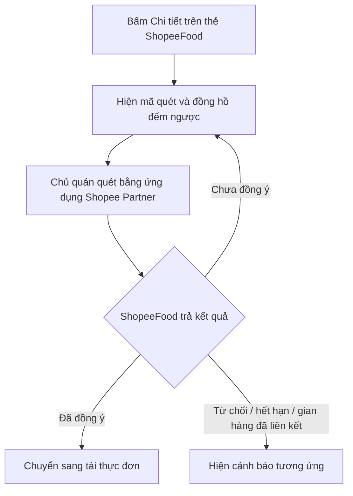
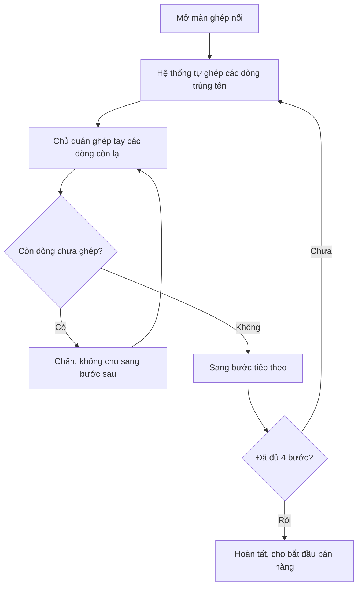
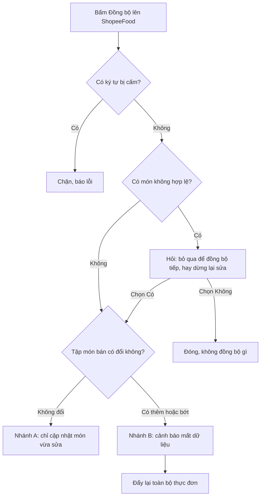

# Web BE — Tích hợp ShopeeFood — Yêu cầu

> Bảng mã / vai trò / hằng số / thực thể dùng chung được nhắc bằng mã trong [`registry/`](../../registry/catalogs.md) — ⛔ không chép giá trị vào đây.
> Rule và tình huống biên chỉ nhắc bằng mã — định nghĩa một lần ở `rules.md` / `edge-cases.md`.
> Tiêu chí chấp nhận viết theo mẫu **KHI … HỆ THỐNG PHẢI …** / **NẾU … THÌ HỆ THỐNG PHẢI …** / **HỆ THỐNG PHẢI …**

## REQ-WBE-01: Kết nối gian hàng ShopeeFood

**Là** chủ quán **tôi muốn** nối gian hàng ShopeeFood của mình vào CukCuk **để** quản lý thực đơn và nhận đơn ngay trong phần mềm đang dùng.

### Luồng

1. Chủ quán bấm **Chi tiết** trên thẻ ShopeeFood ở màn Ứng dụng
2. Hệ thống hiện mã quét, đồng hồ đếm ngược, và lưu ý `MSG_WBE_CONN_NOTE` — *"Mỗi gian hàng trên đối tác chỉ kết nối tương ứng với 1 nhà hàng trên MISA CukCuk. Bạn cần đăng nhập tài khoản admin và chọn đúng quán cần tích hợp trên Shopee Partner"*
3. Chủ quán quét mã bằng ứng dụng Shopee Partner, đối chiếu tên quán, bấm đồng ý
4. Hệ thống tự nhận biết, hiện `MSG_WBE_CONN_OK` — *"Kết nối thành công tài khoản ShopeeFood Partner!"* — rồi chuyển sang màn tải thực đơn

**Nhánh phụ — ALT-1: Chủ quán chưa bấm đồng ý** (rẽ ở bước 4) — hệ thống tiếp tục chờ, ⛔ không hiện thông báo gì cho tới khi mã hết hạn.

**Lỗi — ERR-1: Chủ quán bấm từ chối** → `MSG_WBE_CONN_DENIED`, cho **Thử lại**. Xem [EC-WBE-03](edge-cases.md#EC-WBE-03).
**Lỗi — ERR-2: Mã hết hạn** → xem [EC-WBE-01](edge-cases.md#EC-WBE-01).
**Lỗi — ERR-3: Gian hàng đã liên kết nhà hàng khác** → xem [EC-WBE-04](edge-cases.md#EC-WBE-04).
**Lỗi — ERR-4: Quán đang dùng phần mềm bán hàng khác** → xem [EC-WBE-05](edge-cases.md#EC-WBE-05).

### Tiêu chí chấp nhận

- **KHI** chủ quán mở màn kết nối, **HỆ THỐNG PHẢI** hiện mã quét kèm đồng hồ đếm ngược lấy theo thời hạn ShopeeFood trả về, ⛔ không ghi cứng con số.
- **HỆ THỐNG PHẢI** tự nhận biết việc chủ quán đã đồng ý, ⛔ không có nút xác nhận trên màn này.
- **NẾU** ShopeeFood báo chủ quán chưa đồng ý, **THÌ HỆ THỐNG PHẢI** tiếp tục chờ mà không hiện thông báo nào.
- **NẾU** ShopeeFood báo hỏi quá dày, **THÌ HỆ THỐNG PHẢI** giãn chu kỳ hỏi lại, ⛔ không hiện thông báo nào.
- **KHI** kết nối thành công, **HỆ THỐNG PHẢI** hiện `MSG_WBE_CONN_OK` và chuyển sang [REQ-WBE-02](#REQ-WBE-02).

### Tham chiếu

- Áp dụng: [BR-WBE-01](rules.md#BR-WBE-01), [BR-WBE-02](rules.md#BR-WBE-02), [BR-WBE-03](rules.md#BR-WBE-03)
- Tình huống biên: [EC-WBE-01](edge-cases.md#EC-WBE-01), [EC-WBE-03](edge-cases.md#EC-WBE-03), [EC-WBE-04](edge-cases.md#EC-WBE-04), [EC-WBE-05](edge-cases.md#EC-WBE-05)
- Dữ liệu: `StoreConnection` (`data.md`)

## REQ-WBE-02: Tải thực đơn từ ShopeeFood về

**Là** chủ quán **tôi muốn** hệ thống tự lấy thực đơn đang bán trên gian hàng về **để** không phải nhập tay lại từ đầu.

### Luồng

1. Ngay sau khi kết nối thành công, hệ thống tự chạy tiến trình 4 bước: kết nối cổng dịch vụ → tải danh sách món và giá bán → tải nhóm thực đơn và sở thích phục vụ → chuẩn bị dữ liệu ghép nối
2. Tải xong, hệ thống hiện tên cửa hàng, số tài khoản, trạng thái đồng bộ
3. Chủ quán bấm **Bắt đầu ghép nối dữ liệu bán hàng**

**Lỗi — ERR-1: Tải thất bại giữa chừng** → xem [EC-WBE-02](edge-cases.md#EC-WBE-02).

### Tiêu chí chấp nhận

- **HỆ THỐNG PHẢI** tải về **cả** món thuộc chương trình khuyến mại của ShopeeFood và đưa chúng vào danh sách ghép nối như mọi món khác.
- **NẾU** việc tải thất bại, **THÌ HỆ THỐNG PHẢI** giữ nguyên kết nối đã có và ⛔ không bắt chủ quán quét mã lại.

### Tham chiếu

- Áp dụng: [BR-WBE-04](rules.md#BR-WBE-04)
- Tình huống biên: [EC-WBE-02](edge-cases.md#EC-WBE-02), [EC-WBE-06](edge-cases.md#EC-WBE-06)
- Dữ liệu: `ShopeeDish`, `MenuMapping` (`data.md`)

## REQ-WBE-03: Ghép nối thực đơn hai bên

**Là** chủ quán **tôi muốn** ghép từng món trên ShopeeFood với món tương ứng trong thực đơn CukCuk **để** đơn về đúng món và báo cáo bán hàng không sai.

### Luồng

1. Hệ thống tự ghép sẵn các dòng trùng tên ngay khi mở màn
2. Chủ quán xem lại các dòng hệ thống tự ghép (có dấu hiệu nhận biết riêng), sửa nếu sai
3. Chủ quán ghép tay các dòng còn lại, hoặc bấm **Thêm mới trực tiếp trên MISA CukCuk** để vừa tạo vừa ghép
4. Bấm **Tiếp tục** sang bước sau; lặp cho đủ 4 bước theo [CAT-MAP-OBJECT](../../registry/catalogs.md#CAT-MAP-OBJECT)

**Nhánh phụ — ALT-1: Món CukCuk chưa thuộc nhóm nào** (rẽ ở bước 3) — hiện `MSG_WBE_MAP_NO_GROUP`; bấm **Chỉnh sửa** mở thẳng màn sửa món, bấm **Để sau** thì dòng đó vẫn chưa ghép.

**Lỗi — ERR-1: Còn dòng chưa ghép mà bấm Tiếp tục** → `MSG_WBE_MAP_INCOMPLETE`, ⛔ không cho sang bước sau.
**Lỗi — ERR-2: Chọn món CukCuk đã ghép cho dòng khác** → `MSG_WBE_MAP_DUP`.

### Tiêu chí chấp nhận

- **KHI** mở màn ghép nối, **HỆ THỐNG PHẢI** tự ghép sẵn, ⛔ không có nút chạy tự ghép.
- **HỆ THỐNG PHẢI** chỉ tự ghép khi tên hai bên trùng khớp hoàn toàn sau khi chuẩn hoá, ⛔ không hiển thị mức độ giống nhau.
- **NẾU** có từ hai dòng trở lên cùng tên trùng khớp, **THÌ HỆ THỐNG PHẢI** không tự ghép dòng nào.
- **HỆ THỐNG PHẢI** hiển thị dòng chưa ghép bằng hai gạch ngang, ⛔ không để trống.
- **HỆ THỐNG PHẢI** đánh dấu rõ dòng nào do hệ thống tự ghép.
- **NẾU** còn dòng chưa ghép, **THÌ HỆ THỐNG PHẢI** chặn không cho sang bước sau, áp cho cả bốn bước.
- **KHI** chủ quán thoát giữa chừng rồi quay lại, **HỆ THỐNG PHẢI** giữ nguyên tiến độ đã ghép.

### Tham chiếu

- Áp dụng: [BR-WBE-05](rules.md#BR-WBE-05), [BR-WBE-06](rules.md#BR-WBE-06), [BR-WBE-07](rules.md#BR-WBE-07), [BR-WBE-08](rules.md#BR-WBE-08), [BR-WBE-09](rules.md#BR-WBE-09), [BR-WBE-10](rules.md#BR-WBE-10), [BR-WBE-11](rules.md#BR-WBE-11), [BR-WBE-12](rules.md#BR-WBE-12)
- Tình huống biên: [EC-WBE-06](edge-cases.md#EC-WBE-06), [EC-WBE-07](edge-cases.md#EC-WBE-07)
- Dữ liệu: `MenuMapping` (`data.md`)

## REQ-WBE-04: Quản lý thực đơn bán trên ShopeeFood

**Là** chủ quán **tôi muốn** sửa tên, giá riêng, mô tả, ảnh và trạng thái của món bán trên ShopeeFood ngay trong CukCuk **để** không phải mở thêm ứng dụng Shopee Partner.

### Luồng

1. Màn Quản lý thực đơn có 4 phần theo thứ tự: Nhóm thực đơn → Thực đơn → Nhóm sở thích phục vụ → Sở thích phục vụ
2. Phần *Thực đơn* hiện bảng 6 cột: Ảnh · Món ăn/Đồ uống · Nhóm thực đơn · Đơn vị tính · Giá bán · Giá bán ShopeeFood. Lọc được mọi cột trừ cột Ảnh
3. Chủ quán bấm **Chọn món** để đưa thêm món từ thực đơn nhà hàng lên ShopeeFood, hoặc bấm **Sửa** để mở màn sửa món
4. Lưu xong, món mang dấu hiệu *Có thay đổi chưa đồng bộ*

**Lỗi — ERR-1: Bấm Sửa hoặc Xoá mà chưa chọn dòng nào** → `MSG_WBE_MENU_PICK_EDIT` / `MSG_WBE_MENU_PICK_DEL`.
**Lỗi — ERR-2: Xoá món đang bán trên ShopeeFood** → xem [EC-WBE-08](edge-cases.md#EC-WBE-08).

### Tiêu chí chấp nhận

- **HỆ THỐNG PHẢI** dùng chung màn chỉnh sửa thực đơn hiện hành của MISA CukCuk, ⛔ không dựng màn riêng.
- **KHI** chủ quán lưu thay đổi giá, **HỆ THỐNG PHẢI** chỉ lưu nháp và hiện dấu hiệu *Có thay đổi chưa đồng bộ*.
- **HỆ THỐNG PHẢI** cho chọn trạng thái món đúng hai giá trị *Có bán* và *Ngừng bán*.
- **NẾU** món còn ghép nối với ShopeeFood, **THÌ HỆ THỐNG PHẢI** chặn xoá.

### Tham chiếu

- Áp dụng: [BR-WBE-13](rules.md#BR-WBE-13), [BR-WBE-14](rules.md#BR-WBE-14), [BR-WBE-20](rules.md#BR-WBE-20)
- Tình huống biên: [EC-WBE-08](edge-cases.md#EC-WBE-08)
- Dữ liệu: `ShopeeDish`, `ToppingGroup` (`data.md`)

## REQ-WBE-05: Thiết lập giờ mở cửa và ngày nghỉ

**Là** chủ quán **tôi muốn** khai giờ bán và các ngày nghỉ trong năm **để** gian hàng tự đóng mở đúng lịch, khách không đặt vào lúc quán không làm.

### Luồng

1. Màn Thiết lập, phần *Thời gian hoạt động*: 7 dòng từ Thứ 2 đến Chủ nhật, mỗi ngày chọn *Mở cửa* / *Đóng cửa*, giờ Từ – Đến, nút thêm khung giờ
2. Chủ quán có thể bấm **Thiết lập nhanh** để áp cùng cài đặt cho tất cả các ngày
3. Phần *Cài đặt ngày lễ và ngày nghỉ tạm thời*: thêm từng kỳ nghỉ gồm Tên kỳ nghỉ, Từ ngày, Đến ngày
4. Đến ngày, gian hàng tự đóng nhận đơn; hết kỳ nghỉ tự mở lại

### Tiêu chí chấp nhận

- **HỆ THỐNG PHẢI** đặt mặc định mọi ngày *Mở cửa* từ `08:00` đến `22:00`.
- **NẾU** chủ quán thêm quá số khung giờ cho phép trong một ngày, **THÌ HỆ THỐNG PHẢI** chặn và hiện `MSG_WBE_SET_MAX_RANGE`.
- **NẾU** chủ quán xoá hết khung giờ của một ngày đang *Mở cửa*, **THÌ HỆ THỐNG PHẢI** chặn và hiện `MSG_WBE_SET_MIN_RANGE`.
- **NẾU** hai khung giờ trong cùng một ngày chồng lấn nhau, **THÌ HỆ THỐNG PHẢI** chặn và hiện `MSG_WBE_SET_OVERLAP`.
- **KHI** chưa có kỳ nghỉ nào, **HỆ THỐNG PHẢI** hiện `MSG_WBE_SET_NO_HOLIDAY` — *"Chưa thiết lập ngày nghỉ lễ nào. Vui lòng thêm bên dưới."*
- **KHI** chủ quán bấm *Thiết lập nhanh* xong, **HỆ THỐNG PHẢI** hiện `MSG_WBE_SET_QUICK_OK` — *"Đã thiết lập nhanh thời gian hoạt động thành công cho tất cả các ngày!"*
- **HỆ THỐNG PHẢI** dùng *Đóng cửa* trong Thời gian hoạt động cho ngày nghỉ **cố định hằng tuần**, và dùng Cài đặt ngày lễ cho ngày nghỉ **không lặp lại**.

### Tham chiếu

- Áp dụng: [BR-WBE-22](rules.md#BR-WBE-22)
- Tình huống biên: [EC-WBE-09](edge-cases.md#EC-WBE-09)
- Dữ liệu: `OperatingHours`, `HolidayPeriod` (`data.md`)

## REQ-WBE-06: Thiết lập tự động xác nhận đơn

**Là** chủ quán **tôi muốn** hệ thống tự xác nhận đơn khi nhân viên bận chưa kịp bấm **để** không bị ShopeeFood đánh giá là phản hồi chậm.

### Luồng

1. Màn Thiết lập, phần *Cài đặt đơn hàng*: ô bật *Tự động xác nhận đơn* và ô nhập số phút
2. Mặc định tắt. Bật thì đặt số phút
3. Quá số phút đó mà chưa ai bấm thì hệ thống tự xác nhận đơn

### Tiêu chí chấp nhận

- **HỆ THỐNG PHẢI** để mặc định tắt.
- **KHI** tự động xác nhận chạy, **HỆ THỐNG PHẢI** chỉ thay cú bấm *Xác nhận* — đơn chuyển sang *Chờ chuẩn bị đơn*, ⛔ **không** chuyển thẳng sang *Chờ giao hàng*.
- **HỆ THỐNG PHẢI** phân biệt được đơn nào do hệ thống tự xác nhận và đơn nào do nhân viên bấm tay khi báo sang ShopeeFood.
- **HỆ THỐNG PHẢI** ⛔ không có lựa chọn *Tất cả đơn* / *Chỉ đơn đã thanh toán*.

### Tham chiếu

- Áp dụng: —
- Tình huống biên: —
- Dữ liệu: —

<!-- Điểm còn mở -->
[NEEDS-CLARIFICATION: Q-WBE-04 (medium) — Ô nhập số phút của tự động xác nhận nên để mặc định bao nhiêu, và cho chỉnh trong khoảng nào? ShopeeFood có hạn phản hồi đơn, quá hạn thì đơn tự huỷ — cần biết con số đó để chặn không cho đặt vượt. — suggested: mặc định 2 phút, cho chỉnh 1–5 phút; hỏi ShopeeFood xác nhận hạn phản hồi]

## REQ-WBE-07: Đồng bộ thực đơn lên ShopeeFood

**Là** chủ quán **tôi muốn** đẩy thực đơn đã sửa lên gian hàng **để** khách thấy đúng món và đúng giá.

### Luồng

1. Chủ quán bấm **Đồng bộ lên ShopeeFood**
2. Hệ thống kiểm tra hợp lệ theo thứ tự: ký tự bị cấm → món không hợp lệ → tập món bán có thay đổi không
3. Chạy nhánh A hoặc nhánh B theo [BR-WBE-15](rules.md#BR-WBE-15)
4. Việc đẩy chạy nền; xong thì báo kết quả

**Lỗi — ERR-1: Thực đơn có ký tự bị ShopeeFood cấm** → `MSG_WBE_SYNC_BADCHAR`, chặn.
**Lỗi — ERR-2: Đồng bộ thất bại** → xem [EC-WBE-10](edge-cases.md#EC-WBE-10).

### Tiêu chí chấp nhận

- **HỆ THỐNG PHẢI** chỉ có **một** nút đồng bộ; việc phân biệt nhánh A và nhánh B là do hệ thống tự nhận biết, ⛔ không bắt chủ quán chọn.
- **NẾU** chỉ có thay đổi thuộc tính của đối tượng đã ghép và tập món bán không đổi, **THÌ HỆ THỐNG PHẢI** chỉ cập nhật đúng những đối tượng vừa sửa và ⛔ không hiện cảnh báo mất dữ liệu.
- **NẾU** có thêm hoặc bớt món khỏi danh sách bán, **THÌ HỆ THỐNG PHẢI** hiện `MSG_WBE_SYNC_DESTRUCTIVE` trước khi đẩy lại toàn bộ.
- **HỆ THỐNG PHẢI** ⛔ không đẩy tên và giá của món thuộc chương trình khuyến mại, ở cả hai nhánh; nhưng **PHẢI** vẫn đẩy được thay đổi trạng thái của chúng.
- **NẾU** có món không hợp lệ, **THÌ HỆ THỐNG PHẢI** hỏi chủ quán trước khi bỏ qua chúng.
- **KHI** đồng bộ thất bại, **HỆ THỐNG PHẢI** nêu đích danh món gây lỗi và lý do, kèm nút *Thử lại*.
- **HỆ THỐNG PHẢI** tôn trọng giới hạn tần suất gọi ở [CONST-RATE-LIMIT](../../registry/catalogs.md#CONST-RATE-LIMIT).

### Tham chiếu

- Áp dụng: [BR-WBE-15](rules.md#BR-WBE-15), [BR-WBE-16](rules.md#BR-WBE-16), [BR-WBE-17](rules.md#BR-WBE-17), [BR-WBE-18](rules.md#BR-WBE-18), [BR-WBE-19](rules.md#BR-WBE-19)
- Tình huống biên: [EC-WBE-10](edge-cases.md#EC-WBE-10), [EC-WBE-11](edge-cases.md#EC-WBE-11)
- Dữ liệu: `ShopeeDish` (`data.md`)

<!-- Điểm còn mở -->
[NEEDS-CLARIFICATION: Q-WBE-03 (medium) — Cảnh báo trước khi đẩy lại toàn bộ hiện đang là câu chung chung. Có nên liệt kê đích danh những món sắp bị xoá khỏi gian hàng không? Thao tác này không hoàn tác được và làm mất số lượt đã bán. — suggested: có, liệt kê tên món, vì câu cảnh báo chung sẽ bị bấm qua theo thói quen]

## REQ-WBE-08: Tạm ngừng nhận đơn

**Là** chủ quán **tôi muốn** tạm đóng gian hàng khi quán quá tải hoặc mất điện **để** không nhận thêm đơn mà không làm nổi.

### Luồng

1. Chủ quán bấm **Tạm ngừng nhận đơn**
2. Chọn mốc nhanh `30 phút` / `60 phút` / `Hết hôm nay`, hoặc `Chọn thời gian` rồi nhập giờ bắt đầu và kết thúc
3. Chọn lý do (không bắt buộc)
4. Hệ thống hiện `MSG_WBE_BUSY_CONFIRM` — *"Khi tạm ngừng nhận đơn, nhà hàng của bạn trên ứng dụng ShopeeFood sẽ chuyển sang trạng thái **Đóng cửa tạm thời**. Khách hàng sẽ không thể đặt món cho đến khi bạn bật lại nhận đơn. Các đơn đang xử lý vẫn hoàn tất bình thường. Bạn có chắc chắn muốn thực hiện?"* — chủ quán xác nhận
5. Gian hàng chuyển sang *Đóng cửa tạm thời* trên ứng dụng khách; hệ thống hiện `MSG_WBE_BUSY_OK` — *"Đã tạm ngừng nhận đơn trên ShopeeFood thành công!"*
6. Bật lại nhận đơn → `MSG_WBE_BUSY_RESUMED` — *"Đã mở nhận đơn trở lại trên ShopeeFood thành công!"*

### Tiêu chí chấp nhận

- **NẾU** chủ quán để trống lý do, **THÌ HỆ THỐNG PHẢI** tự gán *Quán quá tải* khi báo sang ShopeeFood.
- **NẾU** thời gian bắt đầu trước thời điểm hiện tại, **THÌ HỆ THỐNG PHẢI** chặn và hiện `MSG_WBE_BUSY_PAST`.
- **NẾU** thời gian kết thúc vượt mốc ShopeeFood cho phép, **THÌ HỆ THỐNG PHẢI** vẫn cho chọn nhưng **PHẢI** báo trước bằng `MSG_WBE_BUSY_CUTOFF`.
- **HỆ THỐNG PHẢI** ghi rõ trên màn xác nhận rằng đơn đang xử lý vẫn hoàn tất bình thường.

### Tham chiếu

- Áp dụng: [BR-WBE-21](rules.md#BR-WBE-21), [BR-WBE-22](rules.md#BR-WBE-22)
- Tình huống biên: [EC-WBE-12](edge-cases.md#EC-WBE-12)
- Dữ liệu: `BusyPeriod` (`data.md`)

## REQ-WBE-09: Ngắt kết nối gian hàng

**Là** chủ quán **tôi muốn** ngắt liên kết với gian hàng ShopeeFood **để** chuyển sang phần mềm khác hoặc nối sang gian hàng khác.

### Luồng

1. Chủ quán bấm **Ngắt kết nối**
2. Hệ thống kiểm tra còn đơn chưa hoàn thành không
3. Hệ thống hiện mã cho chủ quán quét và xác nhận ngắt trên ứng dụng Shopee Partner
4. Trong lúc chờ, hệ thống tự hỏi lại ShopeeFood theo chu kỳ, tối đa trong thời hạn cho phép
5. Xác nhận xong → `MSG_WBE_DISC_OK` — *"Đã ngắt kết nối tài khoản ShopeeFood Partner"* — quay về trạng thái chưa kết nối

**Lỗi — ERR-1: Còn đơn chưa hoàn thành** → `MSG_WBE_DISC_BLOCKED`, chặn.
**Lỗi — ERR-2: Chủ quán bỏ giữa chừng** → xem [EC-WBE-13](edge-cases.md#EC-WBE-13).

### Tiêu chí chấp nhận

- **NẾU** còn đơn ShopeeFood chưa hoàn thành, **THÌ HỆ THỐNG PHẢI** chặn ngắt kết nối.
- **HỆ THỐNG PHẢI** ⛔ tuyệt đối không hiển thị đã ngắt khi chưa nhận được xác nhận từ ShopeeFood.
- **KHI** hết thời hạn chờ mà chưa xác nhận, **HỆ THỐNG PHẢI** quay về trạng thái đã kết nối và hiện `MSG_WBE_DISC_INCOMPLETE`.
- **KHI** chủ quán nối lại **cùng** gian hàng, **HỆ THỐNG PHẢI** giữ nguyên toàn bộ dữ liệu ghép nối.
- **NẾU** chủ quán chọn nối sang gian hàng **khác**, **THÌ HỆ THỐNG PHẢI** hiện `MSG_WBE_DISC_SWITCH` và chỉ xoá dữ liệu ghép nối sau khi được đồng ý.
- **KHI** quyền truy cập mất hiệu lực vì bất kỳ lý do gì, **HỆ THỐNG PHẢI** hiện `MSG_WBE_DISC_LOST` kèm nút *Kết nối lại*.

### Tham chiếu

- Áp dụng: [BR-WBE-23](rules.md#BR-WBE-23), [BR-WBE-24](rules.md#BR-WBE-24), [BR-WBE-25](rules.md#BR-WBE-25)
- Tình huống biên: [EC-WBE-13](edge-cases.md#EC-WBE-13), [EC-WBE-14](edge-cases.md#EC-WBE-14)
- Dữ liệu: `StoreConnection` (`data.md`)

<!-- Điểm còn mở -->
[NEEDS-CLARIFICATION: Q-WBE-01 (medium) — Quán mới mở gian hàng ShopeeFood, thực đơn trên sàn còn trống chưa có món nào. Vào màn ghép nối thì không có gì để ghép. Cho đi thẳng sang luồng chọn món CukCuk đẩy lên, hay vẫn vào màn ghép nối rỗng kèm hướng dẫn? — suggested: đi thẳng sang chọn món đẩy lên, vì đây là kịch bản phổ biến với quán mới]
[NEEDS-CLARIFICATION: Q-WBE-02 (high) — Bắt ghép đủ 100% nhưng quán có 8 món đã ngừng bán từ lâu, không định bán trên ShopeeFood. Hiện chưa có lối thoát nào — chủ quán sẽ ghép bừa cho qua bước. Có cho đánh dấu "Không bán trên ShopeeFood" để món đó không tính vào bộ đếm chặn không? — suggested: có, và món đánh dấu như vậy được đặt Ngừng bán trên gian hàng]
