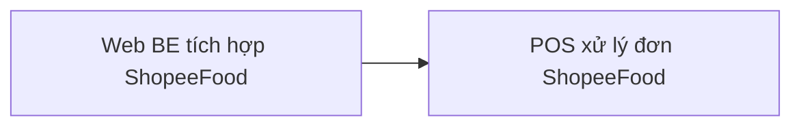

# Tích hợp MISA CukCuk ↔ ShopeeFood — Tổng quan

> Chỉ mục mỏng — mọi người đọc và mọi công cụ nạp file này trước, rồi chỉ mở đúng thư mục module cần dùng.

## Tóm tắt

- **Mục tiêu**: Cho phép nhà hàng dùng MISA CukCuk kết nối gian hàng ShopeeFood của mình, quản lý thực đơn bán trên ShopeeFood ngay trong CukCuk, và nhận — xử lý đơn ShopeeFood ngay trên máy bán hàng, không phải mở thêm ứng dụng nào khác.
- **Người dùng**: chủ quán / quản lý nhà hàng (thiết lập trên Web quản lý) và thu ngân (xử lý đơn trên máy bán hàng).
- **Bối cảnh**: CukCuk tham gia với vai trò **đối tác phần mềm** của ShopeeFood. Một gian hàng ShopeeFood chỉ được nối với **một** phần mềm bán hàng tại một thời điểm.

## Phạm vi

| Trong phạm vi | Ngoài phạm vi |
|----------|-------------|
| Kết nối / ngắt kết nối gian hàng ShopeeFood | Đăng ký mở gian hàng ShopeeFood (quán tự làm bên ShopeeFood) |
| Tải thực đơn ShopeeFood về và ghép nối với thực đơn CukCuk | Ghép nối nhiều món CukCuk vào một món ShopeeFood |
| Quản lý món bán trên ShopeeFood: tên, giá riêng, mô tả, ảnh, trạng thái | Lịch bán món theo khung giờ *(ShopeeFood không hỗ trợ — xem [D-WBE-04](modules/web-be-shopeefood/decisions.md#D-WBE-04))* |
| Thiết lập giờ mở cửa, ngày nghỉ lễ, tự động xác nhận đơn | Màn Tổng quan: doanh thu, đánh giá sao, món bán chạy |
| Đồng bộ thực đơn lên ShopeeFood | Đặt chương trình khuyến mại lên ShopeeFood |
| Tạm ngừng nhận đơn | Áp một thay đổi cho nhiều chi nhánh cùng lúc |
| Nhận, xác nhận, từ chối, huỷ, giao, thu tiền đơn ShopeeFood tại máy bán hàng | Kênh Grab — giữ nguyên luồng cũ, không đụng tới |

### Giả định về phạm vi (không hỏi khách hàng)

| # | Giả định | Lý do |
|---|-----------|-------|
| SA-01 | Một nhà hàng CukCuk nối **một** gian hàng ShopeeFood. Chuỗi nhiều chi nhánh vẫn dùng được — mỗi chi nhánh nối gian hàng riêng của nó. | ShopeeFood ràng buộc 1–1; chủ đầu tư chốt 28/07 |
| SA-02 | Thực đơn đi **một chiều** từ CukCuk sang ShopeeFood. Sửa bên ứng dụng Shopee Partner sẽ bị ghi đè ở lần đồng bộ sau. | CukCuk là bản gốc của thực đơn; chủ đầu tư chốt 28/07 |
| SA-03 | Đơn ShopeeFood khách đã trả tiền cho Shopee, quán không thu tiền mặt của khách. | Bản chất kênh giao đồ ăn |
| SA-04 | Thay đổi thực đơn có hiệu lực ngay, **không** có bước chờ ShopeeFood duyệt. | Chủ đầu tư khẳng định 28/07 — xem [D-WBE-01](modules/web-be-shopeefood/decisions.md#D-WBE-01) |

## Bản đồ module

| # | Module | Mô tả | Sở hữu thực thể | Ưu tiên | Phụ thuộc | Thư mục |
|---|--------|------------|---------------|----------|-----------|--------|
| 1 | Web BE tích hợp ShopeeFood | Kết nối gian hàng, ghép nối và quản lý thực đơn, thiết lập, đồng bộ | `StoreConnection`, `MenuMapping`, `ShopeeDish`, `ToppingGroup`, `OperatingHours`, `HolidayPeriod`, `BusyPeriod` | P0 | — | `modules/web-be-shopeefood/` |
| 2 | POS xử lý đơn ShopeeFood | Nhận đơn, xác nhận, từ chối, huỷ, giao hàng, thu tiền | `ShopeeOrder` | P0 | web-be-shopeefood | `modules/pos-shopeefood/` *(chưa viết)* |

> Trạng thái từng module nằm ở frontmatter `index.md` của module đó — ⛔ không chép lại ở đây.

### Tài liệu cũ theo bố cục phẳng

`modules/01-ket-noi.md` · `modules/02-dong-bo-menu.md` · `modules/05-web-be-shopeefood.md` — **đã bị `modules/web-be-shopeefood/` thay thế**.
`modules/03-nhan-don-pos.md` · `modules/04-thanh-toan-doi-soat.md` — còn dùng cho phần POS **cho tới khi** `modules/pos-shopeefood/` được viết.
⛔ Không dùng nhóm file phẳng để build khi đã có thư mục module tương ứng.

## Vai trò người dùng

Danh sách vai trò và ma trận quyền là SSOT ở [`registry/rbac.md`](registry/rbac.md) — ⛔ không chép lại ở đây.

| Vai trò | Mô tả |
|------|-----------|
| [ROLE-OWNER](registry/rbac.md#ROLE-OWNER) | Chủ quán / quản lý nhà hàng |
| [ROLE-CASHIER](registry/rbac.md#ROLE-CASHIER) | Thu ngân trực ca |

## Vấn đề xuyên suốt

- **Xác thực với ShopeeFood**: chủ quán quét mã trên ứng dụng Shopee Partner để cấp quyền. Quyền có hạn sử dụng, CukCuk phải tự gia hạn định kỳ; hết hạn thì đơn ngừng về và phải báo cho quán biết.
- **Thực đơn một chiều**: CukCuk là bản gốc (SA-02).
- **Ràng buộc tần suất gọi**: xem [CONST-RATE-LIMIT](registry/catalogs.md#CONST-RATE-LIMIT).
- **Mất kết nối**: mọi màn hình liên quan đều phải hiện chỉ báo, ⛔ không được im lặng.

## Hướng dẫn đọc

| Đường dẫn | Nội dung |
|------|---------|
| `glossary.md` | Từ điển thuật ngữ — đọc trước mọi module |
| `rules.md` | Rule xuyên suốt nhiều module (`CBR-*`) |
| `edge-cases.md` | Tình huống biên toàn hệ thống (`EC-GLOBAL-*`) |
| `registry/` | Thực thể, bảng mã, vai trò, tiền tố thông báo — SSOT dùng chung |
| `modules/{slug}/index.md` | Cửa vào module → `requirements.md`, `data.md`, `rules.md`, `edge-cases.md`, `decisions.md` |
| `.clarity/reconcile-2026-07-28.md` | Nhật ký rà chéo: vì sao các tài liệu cũ mâu thuẫn nhau |
