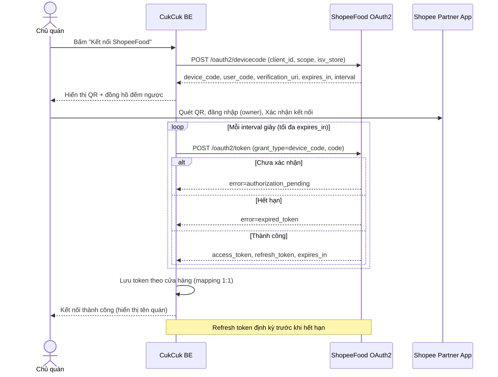
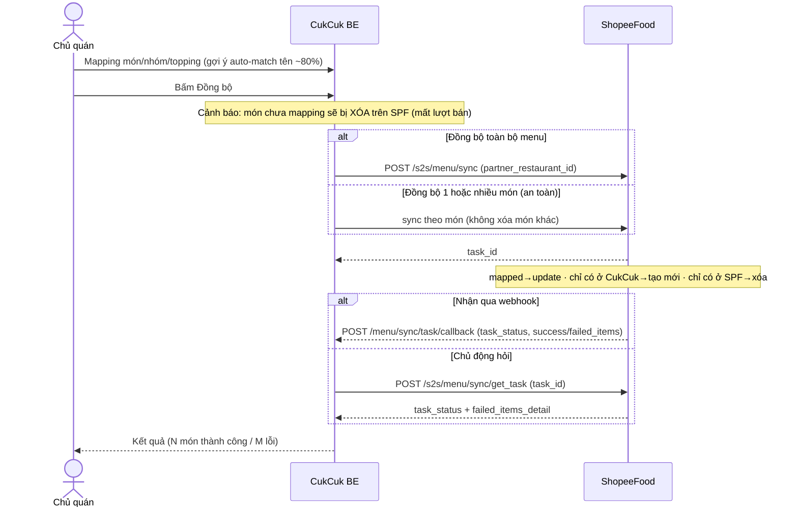
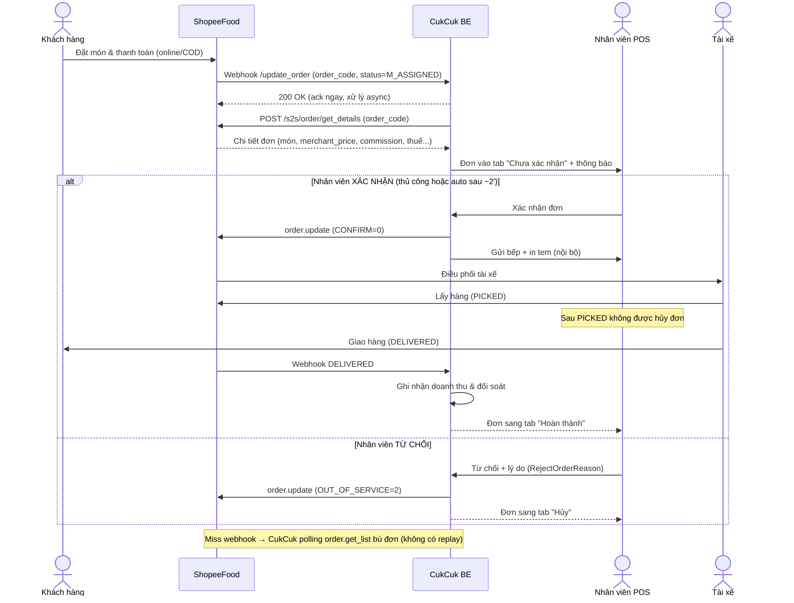
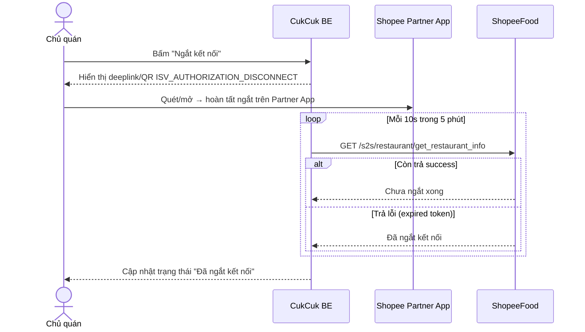

# CukCuk ↔ ShopeeFood — Sequence Flows

> Grounded theo `[API]` (Foody External + Authorization) + `[Q&A]`. Quy ước: `->>` = gọi/request, `-->>` = kết quả/response.

## Flow 1: Kết nối (OAuth2 Device Authorization)
**Trigger**: Chủ quán bấm "Kết nối ShopeeFood" trên web BE CukCuk.

## Flow 2: Thiết lập & Đồng bộ Menu (1 chiều CukCuk → SPF)
**Trigger**: Sau kết nối, chủ quán mapping món rồi bấm Đồng bộ.

## Flow 3: Nhận & Xử lý Đơn tại POS
**Trigger**: Khách đặt món trên app ShopeeFood.

## Flow 4: Ngắt kết nối
**Trigger**: Chủ quán bấm "Ngắt kết nối".

