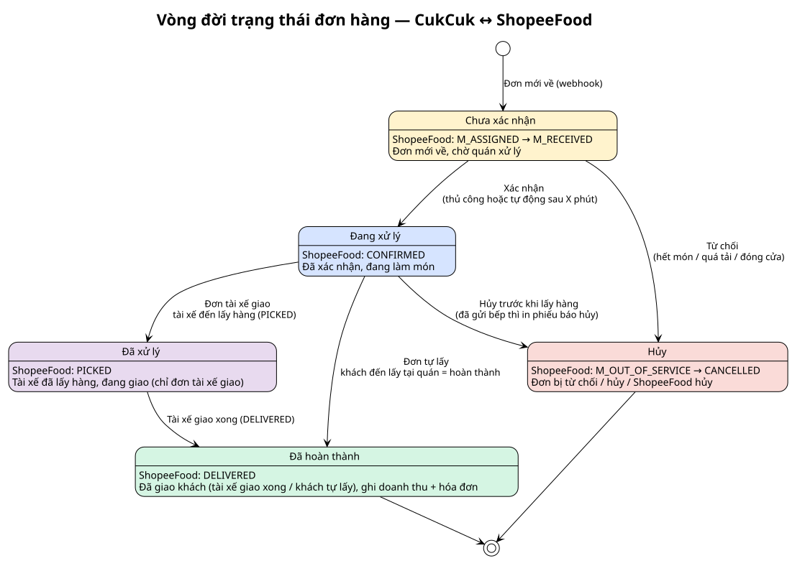

# Vòng đời trạng thái đơn hàng — CukCuk ↔ ShopeeFood

> Sơ đồ hợp nhất cho lãnh đạo: **5 trạng thái tab của CukCuk** làm trục; mỗi trạng thái ghi kèm **status kỹ thuật của ShopeeFood** tương ứng; mũi tên là **sự kiện** chuyển trạng thái.

| Trạng thái CukCuk | Status ShopeeFood | Khi nào |
|---|---|---|
| **Chưa xác nhận** | `M_ASSIGNED → M_RECEIVED` | Đơn mới về qua webhook |
| **Đang xử lý** | `CONFIRMED` | Đã xác nhận, đang làm món (gồm cả bước báo món xong) |
| **Đã xử lý** | `PICKED` | **Đơn tài xế giao**: tài xế đã lấy hàng, đang giao |
| **Đã hoàn thành** | `DELIVERED` | Tài xế giao xong; **đơn tự lấy**: khách đến lấy = hoàn thành luôn |
| **Hủy** | `M_OUT_OF_SERVICE → CANCELLED` | Từ chối / hủy trước PICKED / ShopeeFood hủy |

> Nguồn PlantUML: `order-lifecycle-state.puml`. Sửa .puml → chạy `render.sh <file>.puml --png` để regen. Trạng thái map theo `[API §2 Order Status Machine]`.
