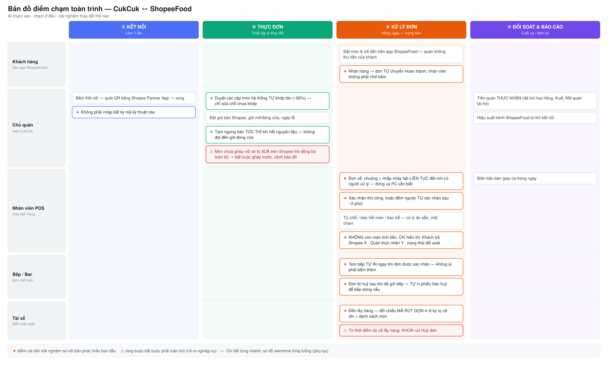
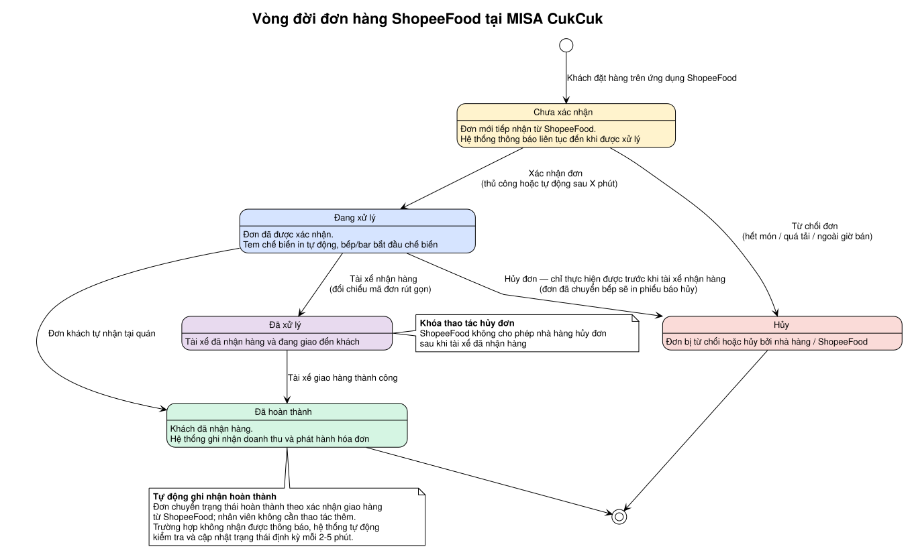

# Bộ sơ đồ trình bày với sếp — CukCuk ↔ ShopeeFood

> Dùng đúng **2 sơ đồ** này để nói, rồi vào thẳng prototype. Các swimlane chi tiết giữ làm phụ lục, chỉ mở khi sếp hỏi sâu.

## 1. Bản đồ điểm chạm toàn trình (sơ đồ chính — nói ~8 phút)



Nguồn: `ban-do-diem-cham.svg` / `.png`. Sinh lại bằng script `gen_touchpoint.py` (xem §Regen).

**Cách dẫn:** đi từ trái sang phải theo 4 chặng, mỗi chặng chỉ vào làn của vai đang chạm.
- ① Kết nối — chủ quán làm **1 lần**, quét QR là xong.
- ② Thực đơn — máy tự khớp tên món ~80%, chủ quán chỉ duyệt. Dừng lại ở ô ⚠ đỏ: **món chưa ghép nối sẽ bị xoá trên Shopee** → đây là guardrail bắt buộc.
- ③ Xử lý đơn — **ở lại lâu nhất**. Đọc dọc 5 làn để thấy một đơn chạm vào những ai. 7 dấu ★ chính là phần trải nghiệm được cải tiến so với bản phác thảo.
- ④ Đối soát — chốt bằng con số quán **thực nhận**, không phải tiền khách trả.

**Câu chốt:** *"Bản phác thảo đang bê nguyên luồng đơn tại quán áp cho đơn Shopee. Các dấu ★ là chỗ nghiệp vụ thật sự khác."*

## 2. Vòng đời một đơn (sơ đồ phụ — nói ~3 phút)



Nguồn: `../states/vong-doi-don.puml` → `.svg` / `.png`.

Bản này đã **lược bỏ mã trạng thái kỹ thuật**, chỉ dùng ngôn ngữ nghiệp vụ. Hai điểm phải nói:
- **Khóa thao tác hủy đơn** từ khi tài xế nhận hàng — ràng buộc của ShopeeFood, không phải lựa chọn của mình.
- **Tự động ghi nhận hoàn thành** — đơn chuyển trạng thái theo xác nhận giao hàng từ ShopeeFood; nếu không nhận được thông báo, hệ thống tự kiểm tra và cập nhật định kỳ 2-5 phút.

> Bản đầy đủ kèm mã trạng thái ShopeeFood: `../states/order-lifecycle-state.svg` — để phụ lục.

## Phụ lục (không trình bày, chỉ mở khi bị hỏi sâu)
| Nội dung | File |
|---|---|
| Chi tiết luồng kết nối + đồng bộ thực đơn | `../activity/01-ket-noi-dong-bo-menu-swimlane.svg` |
| Chi tiết luồng chỉnh sửa thực đơn | `../activity/03-chinh-sua-thuc-don-swimlane.svg` |
| Chi tiết luồng xử lý đơn (đầy đủ nhánh) | `../activity/05-xu-ly-don-swimlane.svg` |
| Vòng đời đơn kèm mã trạng thái SPF | `../states/order-lifecycle-state.svg` |
| Danh mục 60+ case nghiệp vụ | `../business-cases-catalog.md` |
| 5 điểm còn mở cần sếp/SPF chốt | `../business-cases-catalog.md` §Điểm CÒN MỞ |

> ⚠️ BPMN tổng quan (`../bpmn/tong-quan-tich-hop.png`) **không dùng để trình bày** — chữ quá nhỏ, khổ dọc hẹp, không đọc được khi chiếu.

## Regen

> ⚠️ PNG **bắt buộc** dùng `--force-device-scale-factor=3`. Không có cờ này Chrome chụp đúng 1:1 pixel,
> ảnh sẽ mờ khi chiếu hoặc khi zoom trong slide. Trình bày thì ưu tiên dùng **SVG** (vector, luôn nét).

```bash
CHROME="/Applications/Google Chrome.app/Contents/MacOS/Google Chrome"

# Hành trình đơn hàng — sửa nội dung trong STEPS của script rồi chạy lại
python3 gen_hanhtrinh.py hanh-trinh-don-hang.svg
"$CHROME" --headless --disable-gpu --force-device-scale-factor=3 \
  --screenshot=hanh-trinh-don-hang.png --window-size=1936,434 \
  --default-background-color=FFFFFFFF --hide-scrollbars "file://$PWD/hanh-trinh-don-hang.svg"

# Bản đồ điểm chạm — sửa nội dung trong CELLS của script rồi chạy lại
python3 gen_touchpoint.py ban-do-diem-cham.svg
"$CHROME" --headless --disable-gpu --force-device-scale-factor=3 \
  --screenshot=ban-do-diem-cham.png --window-size=1854,1120 \
  --default-background-color=FFFFFFFF --hide-scrollbars "file://$PWD/ban-do-diem-cham.svg"

# Vòng đời đơn (PlantUML) — độ nét chỉnh bằng `skinparam dpi` trong file .puml (hiện 220)
bash ../../diagram-skills-package/claude-code/.claude/skills/activity-swimlane/render.sh \
  ../states/vong-doi-don.puml --png
```

> Kích thước `--window-size` phải khớp với dòng `OK ... <W>x<H>` mà script in ra, làm tròn lên số nguyên.
